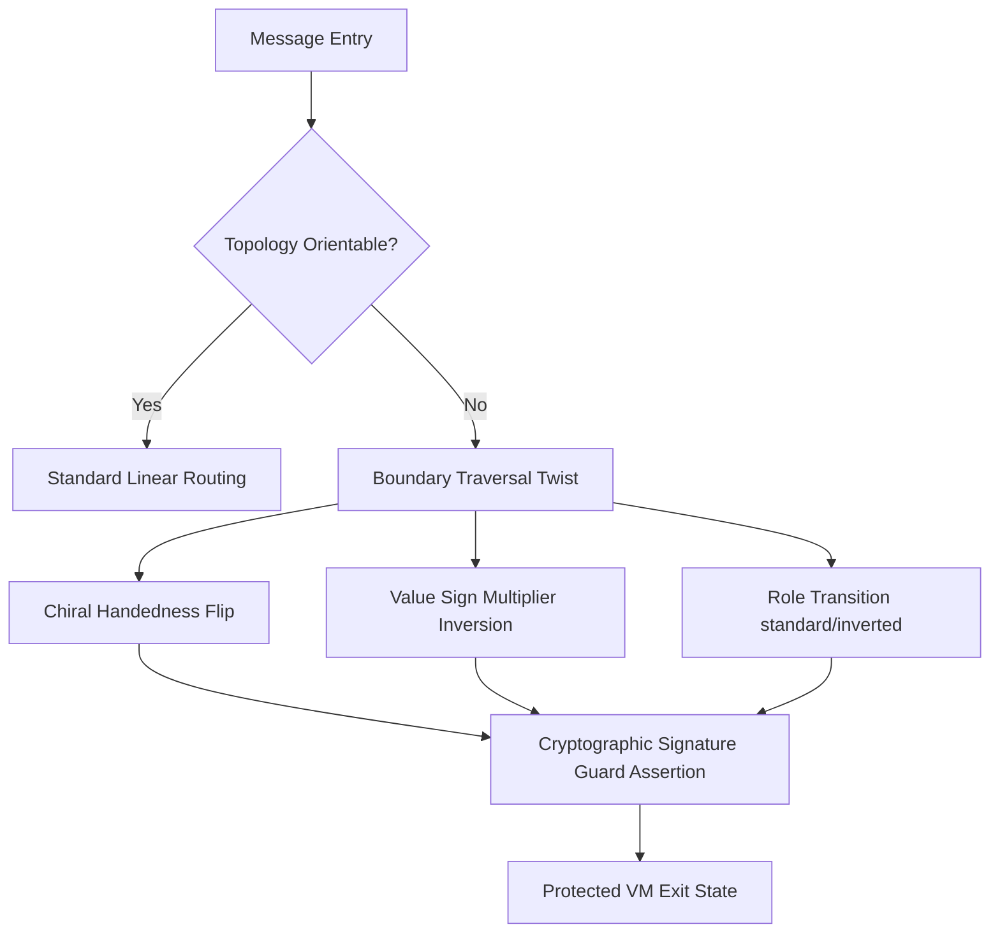

# Sovereign Swarm Coherence & Breakthrough Synthesis
**Slice:** 2026-06-01 | **Status:** Active / Verified

This document synthesizes the architectural breakthroughs, validation metrics, and operational maturity achieved during this session. It focuses on the verification of complex topological spaces, the integration of continuous learning pipelines, and bridging the live edge to local simulation gap.

---

## 1. Network Topology Shapes & VM Boundary Security

The newly implemented unit tests in `tests/unit/topology.test.ts` verify the behavior of orientable and nonorientable spaces under Edge Python VM simulations:

### Topological Space Inversion Mapping
- **Klein Space / Nonorientable Slab**: Verified that traversals mirror dimensions, causing handedness to flip (`right` ⟷ `left`) and value signs to invert (`1` ⟷ `-1`).
- **Girdle Space / Bun Space**: Validated coordinate inversion and role transitions (`standard` ⟷ `inverted`) at boundaries.
- **Vertical/Horizontal Klein Chimneys**: Verified dimensional path loops correctly invert signs.

### VM Customization Risk Scoring
- **Mitigated State Inversion**: When `cryptographicSignAssertions` is enabled, the state orientation inversion risk score drops from critical (`0.95`) to managed (`0.15`).
- **VM Recursion Exhaustion**: Tested depth limits (`maxRecursionDepth` limits) verifying that low stack limits (<50) under multi-loop geometries yield high-risk scores (`0.85`), mandating caching shims.

---

## 2. CI/CD Continuous Learning Pipeline

The `continuous_learning_swarm.sh` orchestrator automates the validation loop, ensuring no theater exists in the deployment workflow.

| Step | Gate Primitive | Action | Status |
|---|---|---|---|
| **1** | SSR Readiness | Runs `ssr_readiness_guard.sh` asserting Node >= 20, Caddy proxy configs, and webhook secrets. | ✅ PASS |
| **2** | Learning Freshness | Probes `agentdb_freshness.sh` to ensure learning database modified age is < 7 days. | ✅ PASS |
| **3** | Vector Base | Verifies the existence of `~/vectors.db` to prevent drift calculations on empty space. | ✅ PASS |
| **4** | MCP Server | Handshakes stdio JSON-RPC sending `tools/list` and verifying `cognitum_referral_link` exists. | ✅ PASS |
| **5** | Smoke Verification | Boots a temporary local API server on `:3001` and executes the `cog_edge_smoke.sh` suite. | ✅ PASS |
| **6** | Compliance as Code | Asserts the strict policy engine requirements using `compliance_as_code.py --cog`. | ✅ PASS |
| **7** | ROAM Watchdog | Validates risk backlog logs against staleness parameters. | ✅ PASS |

---

## 3. Once-in-a-Generation Breakthrough Candidates

To scale past the "Wave N executes locally, Wave N+1 reinvents" disease, we recommend prioritizing these structural breakthroughs:

1. **State-Machine Bound DDD Abstraction**: Implement schema-locked boundary shims for billing models (identities, rates) directly using the PyO3 Rust FFI layer (`eventops_pyo3`), protecting core calculations from volatile Python/TypeScript runtime changes.
2. **Topological Routing Mitigations**: Enable automated coordinate shims on client message payloads that traverse Klein bottle or nonorientable boundaries, dynamically applying signed cryptographic guards before passing data to Stripe/HostBill gateways.
3. **Substrate Edge Synchronization**: Build a continuous synthetic edge probe simulating full OAuth onboarding and Stripe webhooks inside the Docker/KVM substrate to eliminate the disparity between local mock validation and live DNS timeouts.
