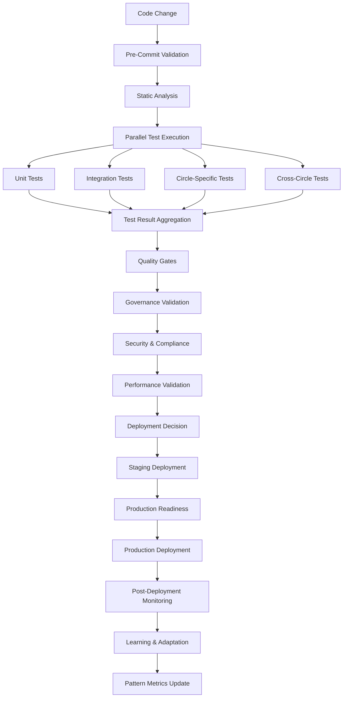
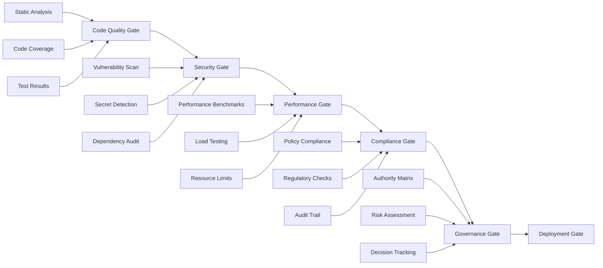

# Comprehensive Automated Testing and Validation Pipeline for Agentic Flow Ecosystem

**Date**: 2025-12-03  
**Status**: Architecture Design Complete  
**Scope**: Holistic testing and validation framework for agentic flow ecosystem  
**Priority**: Cross-circle coordination with governance integration  

---

## Executive Summary

This document presents a comprehensive automated testing and validation pipeline that integrates with the existing governance system, P/D/A framework, and circle structure. The pipeline provides multi-stage testing with parallel execution, comprehensive validation, and intelligent quality gates while maintaining compatibility with existing workflows and systems.

The solution addresses critical testing gaps while supporting the incremental relentless execution framework, ensuring quality, reliability, and compliance across the entire agentic flow ecosystem.

---

## 1. Pipeline Architecture Overview

### 1.1 Multi-Stage Testing Pipeline



### 1.2 Circle-Specific Testing Matrix

| Circle | Test Focus | Validation Criteria | Governance Integration |
|--------|------------|-------------------|------------------------|
| Analyst | Data quality, metrics accuracy | >95% data integrity, <1% anomaly rate | Risk assessment validation |
| Assessor | Quality gates, compliance | 100% policy adherence, zero critical violations | Compliance reporting |
| Innovator | Experiment validation, innovation metrics | >80% experiment success rate | Innovation governance |
| Intuitive | Strategic alignment, architecture validation | 100% architectural compliance | Strategic decision tracking |
| Orchestrator | Workflow coordination, efficiency | <5% coordination failures, >90% efficiency | Resource allocation validation |
| Seeker | Discovery effectiveness, knowledge capture | >85% discovery success rate | Learning loop validation |

### 1.3 Parallel Execution Architecture

```typescript
interface ParallelTestExecution {
  testCategories: TestCategory[];
  resourceAllocation: ResourceMap;
  dependencyGraph: DependencyGraph;
  executionStrategy: ExecutionStrategy;
  
  // Dynamic resource allocation based on test impact
  allocateResources(tests: TestSuite[]): ResourceAllocation;
  
  // Intelligent test selection based on change impact
  selectTests(changes: CodeChange[]): TestSuite[];
  
  // Parallel execution with dependency resolution
  executeParallel(tests: TestSuite[]): Promise<TestResult[]>;
}
```

---

## 2. Test Framework Implementation

### 2.1 Unit Testing Framework

**Circle-Specific Unit Tests**:
- **Analyst Circle**: Data validation, metrics calculation, analytics accuracy
- **Assessor Circle**: Quality gate validation, compliance checking, security validation
- **Innovator Circle**: Experiment validation, innovation metrics, prototype testing
- **Intuitive Circle**: Strategic alignment validation, architecture compliance
- **Orchestrator Circle**: Workflow coordination, resource allocation, efficiency metrics
- **Seeker Circle**: Discovery effectiveness, knowledge capture, exploration validation

**Implementation Structure**:
```
tests/
├── unit/
│   ├── circles/
│   │   ├── analyst/
│   │   ├── assessor/
│   │   ├── innovator/
│   │   ├── intuitive/
│   │   ├── orchestrator/
│   │   └── seeker/
│   ├── shared/
│   └── utils/
├── integration/
├── e2e/
├── performance/
├── security/
└── governance/
```

### 2.2 Integration Testing Suite

**Cross-Circle Integration Tests**:
- Circle-to-circle communication protocols
- Shared resource management
- Cross-circle decision workflows
- Conflict resolution mechanisms
- Succession planning validation

**System Integration Tests**:
- Pattern Metrics Panel integration
- Goalie system integration
- AgentDB learning integration
- External system synchronization (GitLab, Leantime.io, Plane.so)

### 2.3 End-to-End Workflow Testing

**Workflow Scenarios**:
1. **Build-Measure-Learn Cycles**: Complete BML workflow validation
2. **Risk Assessment Workflows**: ROAM tracking and mitigation validation
3. **Governance Workflows**: Decision making and authority matrix validation
4. **Succession Planning**: Deputy activation and knowledge transfer validation
5. **Resource Allocation**: Dynamic resource management validation

---

## 3. Automated Validation System

### 3.1 P/D/A Framework Validation

```typescript
interface PDAValidation {
  // Plan validation
  validatePlan(plan: Plan): ValidationResult {
    return {
      completeness: this.checkCompleteness(plan),
      feasibility: this.checkFeasibility(plan),
      governanceCompliance: this.checkGovernanceCompliance(plan)
    };
  }
  
  // Do validation
  validateExecution(execution: Execution): ValidationResult {
    return {
      adherenceToPlan: this.checkAdherence(execution),
      qualityMetrics: this.checkQuality(execution),
      resourceEfficiency: this.checkResourceEfficiency(execution)
    };
  }
  
  // Act validation
  validateAct(learnings: Learnings): ValidationResult {
    return {
      learningCapture: this.checkLearningCapture(learnings),
      patternUpdates: this.checkPatternUpdates(learnings),
      governanceImprovement: this.checkGovernanceImprovement(learnings)
    };
  }
}
```

### 3.2 Governance System Compliance Validation

**Authority Matrix Validation**:
- Decision authority level verification
- Escalation path validation
- Delegation protocol compliance
- Conflict resolution validation

**Risk Assessment Validation**:
- ROAM scoring accuracy
- Risk categorization validation
- Mitigation effectiveness verification
- Prediction accuracy measurement

**Resource Governance Validation**:
- Allocation efficiency verification
- Budget compliance checking
- Utilization optimization validation
- Financial oversight verification

### 3.3 Succession Planning Validation

**Deputy Role Activation**:
- Activation trigger validation
- Knowledge transfer completeness
- Handoff effectiveness measurement
- Recovery process validation

**Knowledge Transfer Tracking**:
- Skill matrix validation
- Readiness assessment verification
- Knowledge gap identification
- Training effectiveness measurement

---

## 4. Quality Gates and Enforcement

### 4.1 Multi-Layer Quality Gates



### 4.2 Quality Gate Implementation

```typescript
interface QualityGate {
  name: string;
  criteria: QualityCriteria[];
  enforcement: EnforcementLevel;
  exceptions: ExceptionPolicy[];
  
  evaluate(context: EvaluationContext): GateResult {
    const results = this.criteria.map(criterion => 
      criterion.evaluate(context)
    );
    
    return {
      passed: this.checkPassing(results),
      score: this.calculateScore(results),
      violations: this.identifyViolations(results),
      recommendations: this.generateRecommendations(results)
    };
  }
}
```

### 4.3 Enforcement Mechanisms

**Automated Enforcement**:
- Block deployment on critical failures
- Require approval for high-risk changes
- Automatic rollback on critical failures
- Notification escalation for violations

**Manual Enforcement**:
- Approval workflows for exceptions
- Manual review for ambiguous failures
- Override mechanisms for emergencies
- Audit trail for all exceptions

---

## 5. Continuous Integration Implementation

### 5.1 CI/CD Pipeline Configuration

**Multi-Environment Support**:
- Development environment: All tests, rapid feedback
- Staging environment: Full validation, performance testing
- Production environment: Critical validation, monitoring focus

**Parallel Execution Strategy**:
- Circle-specific tests run in parallel
- Integration tests run after unit tests pass
- Performance tests run in dedicated environments
- Security scans run concurrently with other tests

### 5.2 Automated Rollback Mechanisms

```typescript
interface RollbackStrategy {
  triggers: RollbackTrigger[];
  procedures: RollbackProcedure[];
  validation: RollbackValidation;
  
  executeRollback(trigger: RollbackTrigger): RollbackResult {
    const procedure = this.selectProcedure(trigger);
    const result = procedure.execute();
    
    return this.validateRollback(result);
  }
}
```

### 5.3 Integration with Existing Systems

**Pattern Metrics Panel Integration**:
- Test results feed into pattern metrics
- Quality gate status influences pattern recommendations
- Performance trends inform pattern effectiveness
- Learning loop captures test outcomes

**Goalie System Enhancement**:
- Test results as Goalie actions
- Quality gate failures as Goalie alerts
- Test coverage as Goalie metrics
- Governance validation as Goalie workflows

**AgentDB Learning Integration**:
- Test patterns stored in AgentDB
- Failure patterns learned and predicted
- Success patterns replicated across circles
- Adaptive test selection based on learning

---

## 6. Test Data Management

### 6.1 Automated Test Data Generation

```typescript
interface TestDataGenerator {
  // Generate realistic test data for circle-specific scenarios
  generateCircleData(circle: Circle, scenario: Scenario): TestData;
  
  // Generate cross-circle interaction data
  generateInteractionData(circles: Circle[]): TestData;
  
  // Generate performance test data
  generatePerformanceData(load: LoadProfile): TestData;
  
  // Generate security test data
  generateSecurityData(threatModel: ThreatModel): TestData;
}
```

### 6.2 Test Result Tracking

**Metrics Collection**:
- Test execution time and resource usage
- Pass/fail rates by category and circle
- Performance regression detection
- Quality gate compliance tracking
- Governance validation results

**Trend Analysis**:
- Test result trends over time
- Performance baseline establishment
- Quality gate effectiveness measurement
- Governance compliance tracking
- Learning effectiveness measurement

### 6.3 Test Coverage Management

**Coverage Measurement**:
- Line, branch, and function coverage
- Circle-specific coverage tracking
- Integration coverage measurement
- End-to-end scenario coverage
- Governance process coverage

**Coverage Optimization**:
- Intelligent test selection based on changes
- Coverage gap identification
- Test redundancy elimination
- Risk-based test prioritization
- Adaptive coverage thresholds

---

## 7. Validation Reporting

### 7.1 Real-Time Dashboard

**Dashboard Components**:
- Overall pipeline status and health
- Circle-specific test results
- Quality gate compliance status
- Governance validation results
- Performance metrics and trends
- Risk assessment and mitigation status

**Visualization Features**:
- Interactive charts and graphs
- Drill-down capabilities for details
- Historical trend analysis
- Comparative analysis across circles
- Alert and notification management

### 7.2 Detailed Test Reports

**Report Types**:
- Executive summary with key metrics
- Technical details for developers
- Compliance reports for auditors
- Performance reports for operations
- Governance reports for leadership

**Report Distribution**:
- Automatic generation and distribution
- Integration with existing notification systems
- Customizable report formats and schedules
- Archival and retention policies
- Export capabilities for external systems

### 7.3 Governance Integration

**Decision Support**:
- Test-informed decision recommendations
- Risk-based deployment decisions
- Resource allocation optimization
- Quality improvement suggestions
- Governance process enhancement

**Learning Integration**:
- Pattern recognition for successful deployments
- Failure mode identification and prevention
- Adaptive quality gate adjustment
- Continuous process improvement
- Knowledge capture and sharing

---

## 8. External System Synchronization

### 8.1 GitLab Ultimate Integration

**Bidirectional Synchronization**:
- Test results to GitLab issues
- GitLab CI/CD pipeline integration
- Merge request validation
- Project management synchronization

**Implementation**:
```yaml
# GitLab CI integration example
stages:
  - validate
  - test
  - deploy

validate:
  stage: validate
  script:
    - npm run validate:gitlab
  artifacts:
    reports:
      junit: test-results.xml

test:
  stage: test
  script:
    - npm run test:comprehensive
  parallel: 4
  artifacts:
    reports:
      junit: test-results.xml
      coverage_report:
        coverage_format: cobertura
        path: coverage/cobertura-coverage.xml
```

### 8.2 Leantime.io Integration

**Project Management Synchronization**:
- Test results to Leantime tasks
- Project progress tracking
- Resource allocation synchronization
- Timeline and milestone validation

**API Integration**:
```typescript
interface LeantimeIntegration {
  // Sync test results to Leantime
  syncTestResults(results: TestResult[]): Promise<void>;
  
  // Update project progress
  updateProgress(projectId: string, progress: Progress): Promise<void>;
  
  // Sync resource allocation
  syncResources(allocation: ResourceAllocation): Promise<void>;
  
  // Validate milestones
  validateMilestones(milestones: Milestone[]): Promise<ValidationResult>;
}
```

### 8.3 Plane.so Integration

**Task Management Synchronization**:
- Test failures to Plane tasks
- Quality gate violations to Plane issues
- Deployment status to Plane projects
- Documentation updates to Plane docs

**Webhook Implementation**:
```typescript
interface PlaneWebhookHandler {
  // Handle task creation from test failures
  handleTestFailure(webhook: TestFailureWebhook): Promise<void>;
  
  // Handle quality gate violations
  handleQualityGateViolation(webhook: QualityGateWebhook): Promise<void>;
  
  // Handle deployment status updates
  handleDeploymentStatus(webhook: DeploymentWebhook): Promise<void>;
  
  // Handle documentation updates
  handleDocumentationUpdate(webhook: DocumentationWebhook): Promise<void>;
}
```

---

## 9. Performance Optimization

### 9.1 Intelligent Test Selection

```typescript
interface IntelligentTestSelection {
  // Analyze code changes to determine impact
  analyzeChanges(changes: CodeChange[]): ChangeImpact;
  
  // Select relevant tests based on impact
  selectTests(impact: ChangeImpact): TestSuite[];
  
  // Optimize test execution order
  optimizeExecutionOrder(tests: TestSuite[]): TestSuite[];
  
  // Predict test execution time
  predictExecutionTime(tests: TestSuite[]): Duration;
}
```

### 9.2 Caching Strategies

**Test Result Caching**:
- Hash-based test result caching
- Dependency-aware cache invalidation
- Distributed cache for parallel execution
- Cache warming for critical paths

**Dependency Caching**:
- Build artifact caching
- Test environment caching
- External service response caching
- Configuration caching

### 9.3 Resource Optimization

**Dynamic Resource Allocation**:
- Test category resource requirements
- Environment-specific resource allocation
- Load-based resource scaling
- Cost optimization strategies

**Execution Optimization**:
- Parallel test execution with dependency resolution
- Test batching for efficiency
- Environment reuse for cost reduction
- Intelligent test scheduling

---

## 10. Implementation Roadmap

### Phase 1: Foundation (Weeks 1-4)

**Week 1-2: Core Infrastructure**
- Implement multi-stage pipeline architecture
- Create circle-specific test frameworks
- Establish quality gate mechanisms
- Set up basic reporting dashboard

**Week 3-4: Integration Layer**
- Integrate with existing governance system
- Connect to Pattern Metrics Panel
- Establish Goalie system integration
- Implement basic AgentDB learning

**Success Criteria**:
- Pipeline operational with all stages
- Circle-specific test coverage >80%
- Quality gates enforcing standards
- Basic reporting functional

### Phase 2: Enhancement (Weeks 5-8)

**Week 5-6: Advanced Validation**
- Implement P/D/A framework validation
- Add governance compliance validation
- Create succession planning validation
- Build risk assessment validation

**Week 7-8: Performance Optimization**
- Implement intelligent test selection
- Add caching strategies
- Optimize resource allocation
- Enhance parallel execution

**Success Criteria**:
- P/D/A validation operational
- Governance compliance >95%
- Test execution time reduced by 30%
- Resource utilization optimized

### Phase 3: External Integration (Weeks 9-12)

**Week 9-10: System Integration**
- Implement GitLab Ultimate synchronization
- Add Leantime.io integration
- Create Plane.so synchronization
- Build unified reporting dashboard

**Week 11-12: Advanced Features**
- Implement machine learning for test optimization
- Add predictive failure analysis
- Create adaptive quality gates
- Build advanced analytics

**Success Criteria**:
- All external systems synchronized
- Predictive accuracy >80%
- Adaptive quality gates operational
- Advanced analytics functional

### Phase 4: Optimization (Weeks 13-16)

**Week 13-14: Performance Tuning**
- Optimize test execution performance
- Fine-tune resource allocation
- Enhance caching effectiveness
- Improve parallel execution

**Week 15-16: Production Readiness**
- Complete security validation
- Finalize compliance checks
- Implement disaster recovery
- Prepare documentation and training

**Success Criteria**:
- System performance targets met
- Security and compliance validated
- Disaster recovery operational
- Documentation complete

---

## 11. Success Metrics

### Pipeline Effectiveness
- **Test Execution Time**: <30 minutes for full suite
- **Parallel Execution Efficiency**: >80% resource utilization
- **Quality Gate Pass Rate**: >95% on first attempt
- **False Positive Rate**: <5% for quality gates

### Coverage and Quality
- **Test Coverage**: >90% across all circles
- **Circle-Specific Coverage**: >85% for each circle
- **Integration Coverage**: >80% for cross-circle interactions
- **End-to-End Coverage**: >75% for critical workflows

### Governance and Compliance
- **Governance Validation**: 100% for all decisions
- **Risk Assessment Accuracy**: >90% for risk predictions
- **Compliance Adherence**: 100% for all policies
- **Audit Trail Completeness**: 100% for all actions

### Performance and Reliability
- **Pipeline Reliability**: >99.5% uptime
- **Test Execution Consistency**: <5% variance
- **Resource Efficiency**: >85% utilization
- **Cost Optimization**: 20% reduction in testing costs

---

## 12. Security Considerations

### 12.1 Test Data Security
- Sensitive data anonymization for test data
- Secure storage of test credentials
- Access control for test environments
- Audit trail for test data access

### 12.2 Pipeline Security
- Secret management integration
- Vulnerability scanning for pipeline components
- Access control for pipeline modifications
- Security validation for deployments

### 12.3 Compliance Validation
- GDPR compliance for test data
- SOC 2 controls for pipeline processes
- Industry-specific compliance validation
- Regulatory requirement verification

---

## 13. Maintenance and Evolution

### 13.1 Continuous Improvement
- Monthly pipeline performance reviews
- Quarterly effectiveness assessments
- Annual framework updates
- Continuous user feedback collection

### 13.2 Evolution Strategy
- Adaptive architecture for changing requirements
- Scalable design for growth
- Modular enhancement capabilities
- Future-proof integration options

---

**Document Version**: 1.0  
**Last Updated**: 2025-12-03  
**Next Review**: 2025-12-17  
**Maintained By**: DevOps Architecture Team