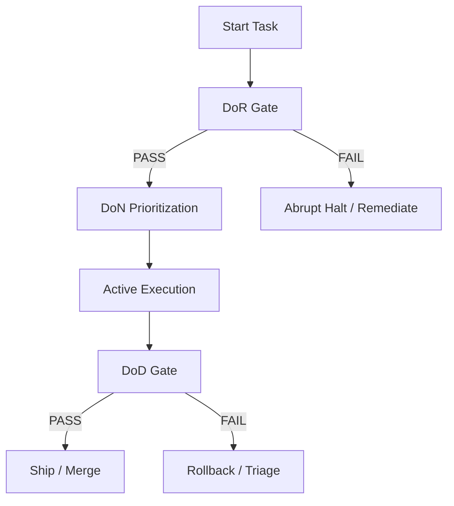
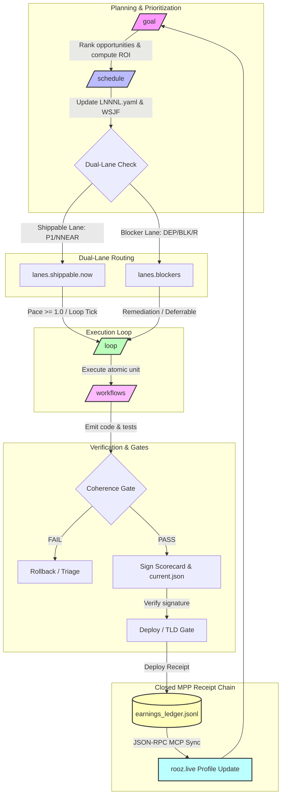

# Standard Definitions: DoN, DoR, and DoD

This document outlines the canonical definitions and quality gates governing the development lifecycle in the workspace.



---

## 🕒 1. Definition of Now (DoN)

**Definition of Now (DoN)** dictates what must be worked on *right now* to maximize Return on Investment (ROI) and minimize Cost of Delay (CoD). It prevents task clutter and ensures effort aligns with the highest-priority lanes.

### DoN Checklist

- [ ] **P1 Alignment**: The target task is registered as a P1 item in `config/cicd/loop_prompts.yaml` under `wsjf_now_items`.
- [ ] **Blocker Prioritization**: Any active blocker or single point of failure (SPOF) in the critical path (e.g., DNS, gRPC service downtime) takes absolute precedence over feature additions.
- [ ] **Tail-Risk Disposition**: Highly-complex or aging risks in the ROAM register at the head of the LNNNL queue must be addressed before deferrable work.
- [ ] **Pace Regulation**: The Cost of Delay weight (0.5 to 1.5) is computed via `pace_from_lnnnl.py` to adapt the loop execution speed and limit WIP.

> [!TIP]
> DoN is about extreme simplification: if a task is not actively unblocking the head of the LNNNL lane or mitigating a tail risk, it should be deferred to avoid "autonomy theater."

---

## 🚦 2. Definition of Readiness (DoR)

**Definition of Readiness (DoR)** specifies the entry criteria that must be satisfied before any agent or engineer can execute a task. It ensures the environment is clean, stable, and secure to prevent polluting the codebase.

### DoR Checklist

- [ ] **Workspace Cleanliness**: The workspace must be in a known good state, verified by running the pre-task gate:

  ```bash
  AGENT_SLICE=publication bash code/tooling/scripts/agent_session_dor.sh
  ```

- [ ] **Provenance Security**: Local signer keys (`.goalie/scorecards/workspace_signer`) and allowed signer lists (`.goalie/scorecards/allowed_signers` or `.local` fallbacks) must be present and verified.
- [ ] **Harness Readiness**: Cargo check, Pytest environment, and Playwright config are verified locally.
- [ ] **No Untracked Pollution**: Conflicting or temporary environment configurations must be stashed or removed to keep the local sweep clean.

> [!IMPORTANT]
> Never skip the DoR pre-task check. Sourcing incorrect environment variables or writing code against a broken baseline is an immediate gate violation.

---

## 🏁 3. Definition of Done (DoD)

**Definition of Done (DoD)** defines the exit criteria a change must satisfy to be considered shippable. No work exists in main unless it complies fully with all DoD gates.

### DoD Checklist

- [ ] **Gate Verification**: All checks must run successfully, verified by the post-task gate:

  ```bash
  ./scripts/dod-gate.sh --post-task
  ```

- [ ] **Testing Integrity**:
  - `pytest` suite passes 100% with no regressions or un-mocked side-effects.
  - `playwright` E2E spec list is discoverable and passes.
- [ ] **Cryptographic Sign-off**: A valid scorecard file must be generated at `.goalie/scorecards/current.json` containing verified `coherence_results.json` signals, signed by an allowed workspace key.
- [ ] **Anti-CVT Enforcement**: All code changes are staged, tracked via `git status`, and committed to git (or staged for review) with zero untracked side-effects.
- [ ] **Public Edge Proof**: Endpoint health probes (like `public_synthetic_check.sh`) must pass or have explicitly logged blockers in `.goalie/evidence/public-edge/`.

> [!WARNING]
> Stating that a feature is complete without generating signed gate evidence and executing E2E checks violates the core integrity model of the platform.

---

## 🌐 4. Product Maturity & Edge Flow Contexts

These definitions cover the boundary systems and distribution contexts used to measure real-world production maturity across web, DNS, mobile, and ledger integrations.

### TLD Cypher / Registry

- **Definition**: Canonical FQDN inventory map (`config/fqdn_registry.yaml`) cataloged by `gate_tier` taxonomy (`smoke`, `billing`, `apex`) with a drift detector (`tld_registry_drift.py`) validating spec-to-registry coherence.

### iOS/Android Prod Maturity

- **Definition**: Web-redirect store presence Capacitor shell (`apps/summerjobswap/`) with web funnel checks. Native binary is marked as *not shippable* (due to lack of native signing, Detox, fastlane, Firebase setup) and managed under the accepted risk register (`R-MOBILE-01`).

### Earnings Web Flow

- **Definition**: End-to-end ledger and sync process (`earnings_ledger.jsonl`, `earnings_latest.json`) translating agent scorecard performance into verified earnings using a shared JSON-RPC MCP envelope synced via `sync_earnings_to_hire.py`.

---

## 🧭 5. Command Primitives (`/goal`, `/workflows`, `/schedule`, `/loop`)

These four primitives form the canonical owner surface for pacing, routing, and executing work. They are dispatched through `scripts/one.sh` and each owns a single bounded responsibility.

### `/goal` — Destination / ROI Snapshot

- **Definition**: The maximum-ROI-per-hour compass. It answers the question: *"given current state, what is the highest-return next move?"*.
- **Entry point**: `scripts/one-sh.d/goal.sh` → `scripts/cicd/lib/roi_iterate.py`.
- **DoN signal**: Emits a JSON snapshot of ranked opportunities, cost-of-delay weights, and the current anti-CVT velocity (`%` closed, `#` open, `#.%` pace, `%.#` velocity). Producer: `scripts/metrics/inbox_zero_timescape.py` → `.goalie/evidence/inbox_zero_latest.json`.
- **DoD signal**: Must produce a committable next-step hint or a blocker decision with a ROAM disposition; no-op "advice only" output is considered theater.

### `/workflows` — Logic / Ruflo Orchestration

- **Definition**: The agentic orchestration plane. It maps human or scheduled intent into running ruflo workflows, tasks, swarms, sessions, and memory operations.
- **Entry point**: `scripts/one-sh.d/workflow.sh` → `npx ruflo@3.14.1 <cmd>`.
- **DoN signal**: A workflow is ready to run when the ruflo runtime is initialized (`one.sh ruflo init`) and the requested operation has a clear, bounded output.
- **DoD signal**: The command must return a machine-readable result or a named receipt; long-running workflows must expose a `status` query.

### `/schedule` — Cadence / WSJF LNNNL Update

- **Definition**: The time-boxed prioritization heartbeat. It updates the multi-lane Now/Near/Next/Later ledger, separating shippable work from blockers, and recalculates WSJF scores.
- **Entry point**: `scripts/one-sh.d/schedule.sh` → `scripts/cicd/update_lnnnl.py`.
- **DoN signal**: The top-level `schedule` field contains only shippable items; blockers live in dedicated `lanes.blockers` and `blockers_now/near/next` fields.
- **DoD signal**: Write-back must preserve the dual-lane contract (`P1-*` and `NNEAR-*` are shippable; `B-*` and `NB-*` are blockers) and emit a valid `LNNNL.yaml`.

### `/loop` — Engine / Timer Tick

- **Definition**: The low-frequency execution engine that fires bounded work cycles on a timer. It consumes the head of the LNNNL shippable lane and the current pace signal, then executes one atomic unit of work per tick.
- **Entry point**: `scripts/one-sh.d/loop.sh` → `scripts/cicd/loop_timer_engine.sh`.
- **DoN signal**: A loop tick is only valid when the workspace is clean, the DoR gate passes, and the chosen `LOOP_ITEM` is drawn from `lanes.shippable.now`.
- **DoD signal**: Each tick must produce a signed receipt (or blocker) and advance the LNNNL state; ticks that run without a shippable head are anti-CVT theater.

### Primitive Interaction Model

```mermaid
graph LR
    G[/goal] -->|picks highest ROI| S[/schedule]
    S -->|emits shippable head| L[/loop]
    L -->|executes atomic unit| W[/workflows]
    W -->|produces receipt| G
```

> [!NOTE]
> `one.sh` is the canonical router; it does not contain logic. Each primitive has its own slice script under `scripts/one-sh.d/`, tracked in git, and tested via `tests/pytest/test_one_sh_wiring.py`.

---

## 6. Tick Orchestration Contract (per cycle)

Each `tick_post_hooks.sh` run follows this order; skipping or reordering breaks pace/AQE policy.

| Step | Command / owner | Notes |
|------|-----------------|-------|
| 1 Bootstrap | `env_key_resolver.py --tick-bootstrap` | **Inverted OP**: `AF_ALLOW_OP_READ=1` for one resolve pass; then `AF_SKIP_OP_READ=1`; sync ROAM main+cog; emit exports (no second Python/op pass) |
| 2 Shell source | fd-only `source <(printf …)` | Rest of tick runs with `AF_SKIP_OP_READ=1` (OP forbidden) |
| 3 Rank | `update_lnnnl.py` → `LNNNL.yaml` v1.1 | Single WSJF owner; `AF_SKIP_ROAM_SYNC=1` on second callers |
| 4 Pace | `pace_from_lnnnl.py` → `tick_cycle_policy.py` | **Shippable lane only** (`lanes.shippable`); blockers visible but do not set pace |
| 5 Verify | `scorecard_gate.py --verify` | CI forbids `--self-asserted`; requires `coherence_derived=PASS` to SHIP |
| 6 Prove edge | `tld-deploy-gate.yml` (workflow_dispatch) | Strict DNS/manifest (`TLD_GATE_STRICT_*=1`); PR lane lenient skips ≠ DoD |

### Environment flags

| Flag | Default | Meaning |
|------|---------|---------|
| `AF_ALLOW_OP_READ` | `0` | **Inverted OP**: when `0`, tick-bootstrap never calls `op read`; set `1` for one bootstrap pass only |
| `AF_SKIP_OP_READ` | `1` in tick_post | After bootstrap, forbid `op read` in child Python (hire, roam sync, registry) |
| `AF_SKIP_ROAM_SYNC` | `0` | Skip duplicate `sync_roam_env_deps` in `update_lnnnl` |
| `AF_OP_VAULT_SCAN` | `0` | Scan Antigravity vault blobs (expensive; off in tick) |
| `AF_LNNNL_ENFORCE` | `1` | Fail tick when `update_lnnnl.py` exits non-zero |
| `AF_LNNNL_STALE_ENFORCE` | `1` | Fail tick when `update_lnnnl.py` exits with 2 (stale ROAM gate) |
| `AF_TICK_POST_ENFORCE` | `1` | Propagates sub-hook failures (exit code) to the final script exit status (propagates to production loops) |
| `AF_ROAM_REFRESH_TIMESTAMPS` | `0` | When enabled (set to `1`), refreshes `last_verified` (and `discovered` if uninitialized) in ROAM tracker files |
| `AF_CORRELATE_ENFORCE` | `0` | If `1`, enforces strict correlation of timescape evidence |
| `AF_TIMESCAPE_ENFORCE` | `0` (local); `1` in CI via `tick_post_hooks.sh` | Exit non-zero when `timescape_envelope` status is `BLOCK` |
| `LOOP_ARTIFACT_OK` | `0` | Allow staging `.goalie/` and `reports/` when `1` (pre-commit) |
| `AF_RECEIPT_CHAIN_MOCK_HIRE` | `0` | Contract tests: append mock hire JSONL via receipt_chain |
| `AF_RECEIPT_CHAIN_ENFORCE` | `0` locally; `1` in CI tick_post | Fail-closed receipt chain; SKIP/BLOCK receipts fail tick when `1` |


### Tick-post pace reconcile (F4)

`reconcile_tick_post_pace.py` runs after `tick_cycle_policy_latest.json` is written. `on_exit` calls `_refresh_saved_pace_bundle` so the EXIT trap cannot clobber `pace_source=policy_snapshot` with the early LNNNL pace read.

Evidence: `.goalie/evidence/tick_post_latest.json` records `env_export_ok`, `lnnnl_exit`, `pace_cod_weight`.

### Anti-CVT velocity notation (`%` / `#` / `%.#` / `#.%`)

Canonical compact gauges for inbox-zero / goal snapshots. **Read order is type-tagged** (symbol before number), not decimal fractions.

| Symbol | Field | Producer | Meaning |
|--------|-------|----------|---------|
| `%` | `pct_closed` / `completion_ratio_percent` | `inbox_zero_timescape.py` | Share of tracked items closed in the timescape window (ROAM + upstream + DLQ numerator/denominator). |
| `#` | `open_count` / `absolute_open_items` | `inbox_zero_timescape.py` | Absolute open backlog (open ROAM + open upstream + DLQ rows). |
| `%.#` | `velocity_fmt` | `inbox_zero_timescape.py` | **Left = `%` closed (one decimal), right = `#` open (integer)** — e.g. `42.5.17` → 42.5% closed, 17 open. Not a single float. |
| `#.%` | `pace_fmt` | `inbox_zero_timescape.py` | **Left = `#` open (integer), right = shippable CoD pace (one decimal)** — pace from `lanes.shippable` head WSJF via `pace_from_lnnnl.py`. |

**Pace vs blocker pace (dual-lane):**

| Field | Producer | Lane | Notes |
|-------|----------|------|-------|
| `pace` / `pace_cod_weight` | `pace_from_lnnnl.py`, `tick_post_latest.json` | `lanes.shippable` only | Drives AQE utilization and `tick_cycle_policy.py` (`utilize_mode`). |
| `blocker_pace_cod_weight` | `pace_from_lnnnl.py`, `tick_post_latest.json` | `lanes.blockers` head | Visibility / ROAM closure pressure; does **not** raise shippable `#.%` pace. |
| `pace_source` | `tick_post_latest.json` | n/a | `live` \| `last_good` \| `stale` — fail-closed when `AF_PACE_FAIL_CLOSED=1`. |

**Anti-CVT breakdown** (`anti_cvt` in inbox snapshot): `untracked` + `unobservable` + `unorchestrated` + `unutilized` → `anti_cvt_score` / `total`. Blocker-only WSJF wins improve `%` / `#` and may raise `blocker_pace_cod_weight`, but **#.% shippable pace** stays flat until a `P1-*` / `NNEAR-*` item leads `lanes.shippable.now`.


### AQE utilization honesty (shippable vs deferrable)

`tick_cycle_policy.py` splits utilization so deferrable/blocker-remediation runs never inflate shippable `#.%` pace. The execution mode is governed by `utilize_mode`:

| Mode | Condition | Meaning |
|------|-----------|---------|
| `full` | Shippable pace $\ge 1.0$ | Full shippable lane execution. Runs AQE and upstream upgrades. |
| `deferred` | Shippable pace $< 1.0$ | Skips AQE and upstream checks. |
| `deferrable` | Shippable pace $< 1.0$ & `AQE_UTILIZE_DEFERRABLE=1` | Runs scoped AQE checks. |
| `blocker-remediation` | Shippable empty + blocker NOW | Scoped AQE coherence without upstream upgrades. |

| Field | Meaning |
|-------|---------|
| `aqe_utilization_pct` | Shippable lane only: **0** or **100** (100 when `pace_cod_weight >= 1.0` and `utilize_mode=full`). Alias of `shippable_utilization_pct` at full pace. |
| `shippable_utilization_pct` | `tick_cycle_policy.py` | Shippable-only utilization (0 or 100); never inflated by blocker-remediation runs. |
| `blocker_lane_active` | `tick_cycle_policy.py` | `true` when blocker lane has NOW work while shippable pace is deferred/empty. |
| `aqe_deferrable_ran` | True when AQE ran under `deferrable` or `blocker-remediation` (pace below shippable head). |
| `aqe_scope_utilization_pct` | Scoped run intensity: 100 for full shippable, 50 for deferrable/blocker-remediation, else 0. |

`cycle_tick.sh` defaults `AF_AQE_ENFORCE=1` when shippable pace ≥ 1.0 (from `pace_from_lnnnl.py`); keeps `AF_AQE_ENFORCE=0` when pace < 1.0 or `AQE_UTILIZE_DEFERRABLE=1`.

### Dual-lane pace vs blocker WSJF

Blockers (`lanes.blockers`) rank high in WSJF for visibility and ROAM closure **%/#**, but **#.% pace** and AQE utilization read **shippable** `P1-*` / `NNEAR-*` only. Closing `R-SPOF-01` does not raise pace until a shippable item heads `lanes.shippable.now`.

### TLD gate and DoD

- **PR / default CI**: lenient Playwright skips (DNS timeout, manifest 404) are **not** DoD green.
- **Post-deploy**: run `.github/workflows/tld-deploy-gate.yml` (strict-only) after `deploy-uapi`.

### Deploy → TLD gate receipt chain (fail-closed)

| Step | Signal | Fail-closed rule |
|------|--------|------------------|
| UAPI upload | curl exit, non-empty JSON WHM response | Domain not counted OK; deploy exits if any domain fails |
| TLD dispatch | `tld_gate_dispatch_latest.json` | `github_run_id` bound to `deploy_run_id`; pending → exit 5 when `AF_TLD_GATE_REQUIRE_WAIT=1` |
| DoD artifact | `last_deploy_uapi.json` | Requires `tld_gate_status=pass` and `playwright_exit=0` when CI trigger enabled |
| Scorecard `--verify` | `ingest_deploy_receipt()` | CI/enforce blocks when receipt status ≠ pass |
| Single dispatch | `deploy_happy_path.sh` | Dedupes phase-4 TLD when deploy-uapi already passed |

Lenient Playwright skips require **`TLD_GATE_LENIENT=1`**; `test:e2e:tld-gate:strict` sets `TLD_GATE_LENIENT=0`.
### Deploy receipt closed (DoD)

**Deploy receipt closed** when `.goalie/evidence/last_deploy_uapi.json` on current `HEAD` contains:

- `tld_gate_status`: `pass`
- `playwright_exit`: `0`
- `tld_gate_github_run_id`: bound GitHub Actions run id
- `tld_gate_conclusion`: `success`

Legacy artifacts (no `tld_gate_status`) or stale artifacts (`hash` ≠ `git HEAD`) are **skipped** by DoD and scorecard derive — not FAIL.


### Tick earnings receipt chain closure (MPP)

`scripts/cicd/receipt_chain.sh` runs **after** post-AQE timescape in `tick_post_hooks.sh`. Fail-closed order:

| Step | Script | Closure signal |
|------|--------|----------------|
| 1 | `scorecard_resolver.py` | Canonical scorecard path (`current.json` → `latest.json`; rejects coherence-only artifacts) |
| 2 | `earnings_engine.py --verify` | Ledger/scorecard coherence + gate integrity |
| 3 | `earnings_export_json.py --require-verified` | Writes `.goalie/evidence/earnings_latest.json` from **verified** ledger rows only |
| 4 | `compile_profile_readme.py` | Regenerates `profile_readme.md` from verified ledger |
| 5 | `sync_earnings_to_hire.py` | MCP profile sync when `HIRE_MCP_TOKEN` is set |
| 6 | `hire_mcp_client.py` | Appends one JSON line to `.goalie/evidence/hire_receipts.jsonl` per MCP call |
| 7 | `receipt_chain.sh` | Writes `.goalie/evidence/receipts/tick_*.json` with `status=PASS` **last** |

| Env | Default | Meaning |
|-----|---------|---------|
| `LOOP_ARTIFACT_OK` | `0` | Allow staging `.goalie/` and `reports/` when `1` (pre-commit) |
| `AF_RECEIPT_CHAIN_MOCK_HIRE` | `0` | Contract tests: append mock hire JSONL via receipt_chain |
| `AF_RECEIPT_CHAIN_ENFORCE` | `0` local / `1` CI | `receipt_chain.sh` alone defaults `0`; `tick_post_hooks.sh` sets `1` when `CI` or `GITHUB_ACTIONS`. Block tick when any step fails. |
| `HIRE_MCP_TOKEN` | unset | Bearer token for hire MCP; required for live hire sync |
| `AF_RECEIPT_CHAIN_ALLOW_DRY_HIRE` | `0` | When `1`, runs `sync_earnings_to_hire.py --dry-run` (no `hire_receipts.jsonl` append) |
| `AF_RECEIPT_CHAIN_MOCK_HIRE` | `0` | Contract tests only: append validated F9 hire receipt without MCP (not for production ticks) |

### `#.%` sentinel vs policy snapshot

When `tick_post_latest.json` has `pace_source=stale` and `pace_cod_weight=null`, inbox timescape **prefers** `tick_cycle_policy_latest.json` (written post-AQE in the same tick) if it carries `pace_cod_weight`. Then `pace_fmt` uses `{open_count}.{pace}` and `pace_source=policy_snapshot`. Only when **both** tick_post pace is absent **and** policy snapshot is missing does `pace_fmt` emit the fail-closed sentinel `#.%`.

### P1-LOOP-AUTO-01 (auto-merge loop, hard gates only)

Backlog item: merge `chore/swarm-p1-*` loop branches when **only** hard gates pass (scorecard provenance, coherence, receipt chain, timescape enforce) — no DNS/SPOF (R-SPOF-01) work. Prompt lives in `config/cicd/loop_prompts.yaml`.

### DoN `LOOP_ITEM` and blocker ID binding

`LOOP_ITEM` for `/loop` must come from `lanes.shippable.now` (DoN). Blocker lane classification uses shared `BLOCKER_ID_RE` in `update_lnnnl.py` and `pace_from_lnnnl.py`: `^(DEP-|BLK-|B-|R04|R-)`. Keep both files aligned when extending blocker prefixes (e.g. `R-MAIL-03`).


---

## 🪙 7. ROAM Cost, Theater Risks, & Closed MPP Receipt Chains

### ROAM Cost & Theater Risks

Autonomy and execution metrics can easily fall prey to **under-utilization theater**. This occurs when the head of the shippable lane (`lanes.shippable`) is blocked or empty, but loop cycles continue to burn wall-clock compute executing non-head, deferrable, or minor blocker tasks.

- **Under-Utilization Theater**: Compute metrics appear active (e.g. running loops, committing minor fixes), but the shippable pace remains at `0` because no high-value `P1-*` or `NNEAR-*` items are being delivered.
- **Compute spent vs. Shippable pace**: Running tests and loops is cheap, but it is extremely expensive when it masks behavioral regressions or delays resolving critical-path blockers.
- **Enforcement**: Setting `AF_LNNNL_STALE_ENFORCE=1` blocks loop execution if the ROAM tracker or WSJF inputs are stale, forcing manual or automated remediation of aging risks before consuming more compute.

### Closed MPP Receipt Chain

To prevent contract drift between the local agent ledger and public web platforms, the platform enforces a **Closed MPP (Model-Processor-Protocol) Receipt Chain**.

- **Earning-to-Profile Sync**: Every time an agent completes a cycle and generates signed scorecard evidence, its verified earnings (Earning's Per Agent, Engine, Engineer, and Ingenuity) are appended to a local ledger (`earnings_ledger.jsonl`).
- **JSON-RPC MCP Client**: Rather than using isolated scripts, the sync hook (`sync_earnings_to_hire.py`) leverages a JSON-RPC request over the Model Context Protocol (MCP) to securely push earnings vectors and update the public profile (`rooz.live` / `hire.agentics.org`).
- **Verification**: The public `profile_readme.md` is derived dynamically from these ledger vectors, creating a cryptographically and locally verifiable audit trail from tick execution to public presence.

### Causal System Diagram




### Ruflo upgrade harness (PI 2026-Q2-RUFLO-01)

| Artifact | Path |
|----------|------|
| PI backlog | `config/cicd/ruflo_pi_backlog.yaml` |
| Monorepo roots | `config/monorepo/roots.yaml` |
| Doctor + ROAM | `.goalie/evidence/ruflo_doctor_latest.json` |
| Ceremony sync | `.goalie/evidence/ruflo_ceremony_latest.json` |
| WSJF head | `.goalie/evidence/wsjf_ruflo_latest.json` |
| Version portfolio manifest | `config/versions/portfolio.yaml` |
| Version probe (read-only) | `.goalie/evidence/version_portfolio_latest.json` |
| Pin render ({SA}/[FA]) | `.goalie/evidence/version_pin_render_latest.json` |
| Intel pipeline | `.goalie/evidence/intel_pipeline_latest.json` |
| Inbox-zero exit gate | `.goalie/evidence/ruflo_upgrade_exit_latest.json` |

**Invert:** enable HNSW/graph only after doctor `inbox_zero_gate` (no disk blockers). Intelligence `pattern_stored` requires receipt `PASS` + provenance when `AF_CI_PROVENANCE_HEAD` is set.

```bash
npm run ruflo:doctor
npm run ruflo:wsjf
npm run ruflo:ceremony -- standup
```

---

## 7. Agile Ceremony Cadence

All ceremonies are bounded, time-boxed, and produce a committable artifact or an explicit ROAM disposition. "Meeting without artifact" is anti-CVT theater.

### Ceremony Matrix

| Ceremony | Cadence | Owner script | Output artifact | DoN gate |
|----------|---------|-------------|-----------------|----------|
| **Standup** | Every tick (sub-hourly) | `one.sh ruflo ceremony standup` → `.goalie/evidence/ruflo_ceremony_latest.json` | `standup` field in ceremony JSON | LNNNL head shippable or explicit blocker |
| **Review** | Per PR / loop cycle | `one.sh scorecard` → `.goalie/scorecards/current.json` | Signed scorecard SHIP/HOLD | `coherence_derived=PASS` |
| **Retro** | Per wave (after ≥10 ticks) | `one.sh ruflo ceremony retro` | ROAM dispositions updated in `ROAM_TRACKER.yaml` | All open tail risks have disposition |
| **Replenish** | Per sprint boundary | `one.sh schedule` + `update_lnnnl.py` | `LNNNL.yaml` v1.1 head updated | WSJF re-ranked; no stale items |
| **Refine** | Mid-sprint (wave midpoint) | LNNNL `wsjf_now_items` re-ranked | `ruflo_pi_backlog.yaml` updated | Next wave items are DoR-ready |
| **PI Prep** | Before PI Planning session | Review `config/cicd/ruflo_pi_backlog.yaml` + ROAM | PI backlog pruned + prioritized | All blockers have ROAM disposition |
| **PI Planning** | Per Program Increment (~6 waves) | PI sync ceremony | `ruflo_pi_backlog.yaml` + AGENTS.md WSJF table updated | DoD proof for prior PI delivered |
| **PI Sync** | Mid-PI (wave 3 of 6) | `one.sh goal` snapshot + PI delta review | `inbox_zero_latest.json` velocity delta | `%/.#` pace reads shippable lane |

### Ceremony Anti-CVT Rules

1. **No ceremony without artifact.** Every ceremony call must write to `.goalie/evidence/` or update a tracked YAML. No-op JSON notes (`{}`) are blocked when `AF_CEREMONY_ENFORCE=1`.
2. **Standup ≠ status theater.** If LNNNL head is not shippable, standup output must name the blocker and its ROAM ID. Generic "in progress" is rejected.
3. **Retro closes tails.** A retro that produces zero ROAM disposition updates is an anti-CVT signal. At minimum one item must be moved from IDENTIFIED → OWNED/MITIGATED.
4. **PI Planning ≠ slide deck.** PI Planning output is a committed `ruflo_pi_backlog.yaml` diff, not a document. The diff is the artifact.
5. **Replenish governs WIP.** After replenish, `lanes.shippable.now` must have ≤ `pace_cod_weight × 3` items. Over-WIP is a ROAM risk.

### Ceremony Velocity Metrics

```
%.# = (closed_items / total_items) × (pace_cod_weight)   — shippable velocity
#.% = open_count / expected_throughput                    — WIP pressure
anti_cvt = untracked + unobservable + unorchestrated + unutilized items
```

Emit via: `python3 scripts/metrics/inbox_zero_timescape.py --json → .goalie/evidence/inbox_zero_latest.json`

### PI Planning / Prep / Sync — Bounded Artifacts

| Phase | Entry gate (DoR) | Exit gate (DoD) | Artifact path |
|-------|-----------------|-----------------|---------------|
| **PI Prep** | ROAM risk register reviewed; all B-* blockers have disposition | Backlog pruned to ≤2 waves of DoR-ready items | `config/cicd/ruflo_pi_backlog.yaml` |
| **PI Planning** | PI Prep artifact committed; all P1-* items have acceptance criteria | Sprint goals committed; WSJF AGENTS.md table updated | `AGENTS.md` WSJF + `ruflo_pi_backlog.yaml` |
| **PI Sync** | PI Planning committed; ≥3 waves delivered | Velocity delta reviewed; ROAM risks triaged | `inbox_zero_latest.json` + `ROAM_TRACKER.yaml` |

---

### F4 pace authority (policy_snapshot)

After `tick_cycle_policy_latest.json` is written, **`pace_cod_weight` and `pace_source` in `tick_post_latest.json` must come from policy**, not from the pre-policy `read_pace_bundle()` snapshot or a prior tick file. `reconcile_tick_post_pace.py` and the `EXIT` trap call `pace_bundle()` so `on_exit` cannot restore stale `pace_source`.

`is_ci_env` (shell: `scripts/cicd/lib/is_ci_env.sh`, Python: `scorecard_gate.is_ci_env`) treats only truthy `CI` / `GITHUB_ACTIONS` values as CI — empty string is not CI.
