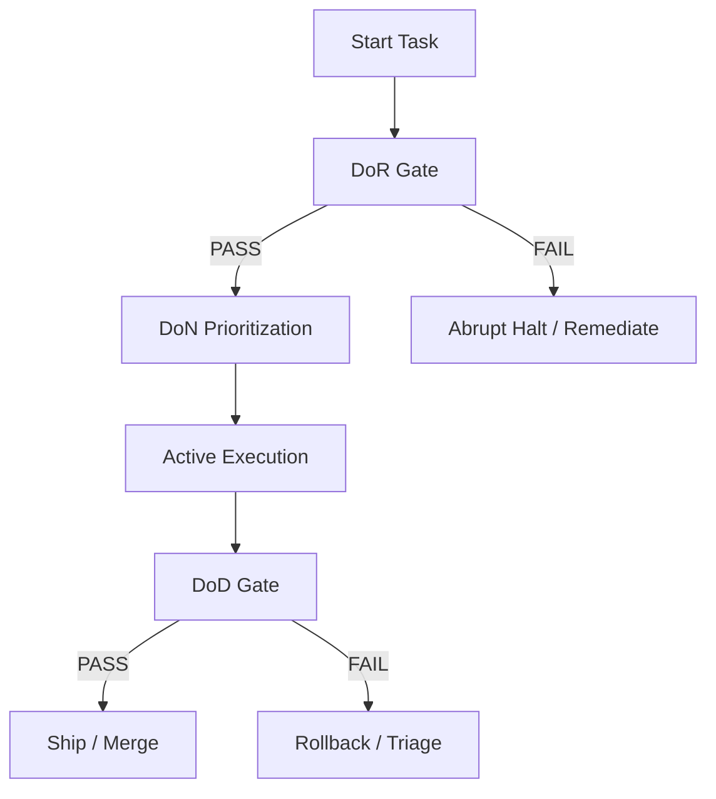

# Standard Definitions: DoN, DoR, and DoD

This document outlines the canonical definitions and quality gates governing the development lifecycle in the workspace.



---

## 🕒 1. Definition of Now (DoN)

**Definition of Now (DoN)** dictates what must be worked on *right now* to maximize Return on Investment (ROI) and minimize Cost of Delay (CoD). It prevents task clutter and ensures effort aligns with the highest-priority lanes.

### DoN Checklist

- [ ] **P1 Alignment**: The target task is registered as a P1 item in `config/cicd/loop_prompts.yaml` under `wsjf_now_items`.
- [ ] **Blocker Prioritization**: Any active blocker or single point of failure (SPOF) in the critical path (e.g., DNS, gRPC service downtime) takes absolute precedence over feature additions.
- [ ] **Tail-Risk Disposition**: Highly-complex or aging risks in the ROAM register at the head of the LNNNL queue must be addressed before deferrable work.
- [ ] **Pace Regulation**: The Cost of Delay weight (0.5 to 1.5) is computed via `pace_from_lnnnl.py` to adapt the loop execution speed and limit WIP.

> [!TIP]
> DoN is about extreme simplification: if a task is not actively unblocking the head of the LNNNL lane or mitigating a tail risk, it should be deferred to avoid "autonomy theater."

---

## 🚦 2. Definition of Readiness (DoR)

**Definition of Readiness (DoR)** specifies the entry criteria that must be satisfied before any agent or engineer can execute a task. It ensures the environment is clean, stable, and secure to prevent polluting the codebase.

### DoR Checklist

- [ ] **Workspace Cleanliness**: The workspace must be in a known good state, verified by running the pre-task gate:

  ```bash
  AGENT_SLICE=publication bash code/tooling/scripts/agent_session_dor.sh
  ```

- [ ] **Provenance Security**: Local signer keys (`.goalie/scorecards/workspace_signer`) and allowed signer lists (`.goalie/scorecards/allowed_signers` or `.local` fallbacks) must be present and verified.
- [ ] **Harness Readiness**: Cargo check, Pytest environment, and Playwright config are verified locally.
- [ ] **No Untracked Pollution**: Conflicting or temporary environment configurations must be stashed or removed to keep the local sweep clean.

> [!IMPORTANT]
> Never skip the DoR pre-task check. Sourcing incorrect environment variables or writing code against a broken baseline is an immediate gate violation.

---

## 🏁 3. Definition of Done (DoD)

**Definition of Done (DoD)** defines the exit criteria a change must satisfy to be considered shippable. No work exists in main unless it complies fully with all DoD gates.

### DoD Checklist

- [ ] **Gate Verification**: All checks must run successfully, verified by the post-task gate:

  ```bash
  ./scripts/dod-gate.sh --post-task
  ```

- [ ] **Testing Integrity**:
  - `pytest` suite passes 100% with no regressions or un-mocked side-effects.
  - `playwright` E2E spec list is discoverable and passes.
- [ ] **Cryptographic Sign-off**: A valid scorecard file must be generated at `.goalie/scorecards/current.json` containing verified `coherence_results.json` signals, signed by an allowed workspace key.
- [ ] **Anti-CVT Enforcement**: All code changes are staged, tracked via `git status`, and committed to git (or staged for review) with zero untracked side-effects.
- [ ] **Public Edge Proof**: Endpoint health probes (like `public_synthetic_check.sh`) must pass or have explicitly logged blockers in `.goalie/evidence/public-edge/`.

> [!WARNING]
> Stating that a feature is complete without generating signed gate evidence and executing E2E checks violates the core integrity model of the platform.

---

## 🌐 4. Product Maturity & Edge Flow Contexts

These definitions cover the boundary systems and distribution contexts used to measure real-world production maturity across web, DNS, mobile, and ledger integrations.

### TLD Cypher / Registry

- **Definition**: Canonical FQDN inventory map (`config/fqdn_registry.yaml`) cataloged by `gate_tier` taxonomy (`smoke`, `billing`, `apex`) with a drift detector (`tld_registry_drift.py`) validating spec-to-registry coherence.

### iOS/Android Prod Maturity

- **Definition**: Web-redirect store presence Capacitor shell (`apps/summerjobswap/`) with web funnel checks. Native binary is marked as *not shippable* (due to lack of native signing, Detox, fastlane, Firebase setup) and managed under the accepted risk register (`R-MOBILE-01`).

### Earnings Web Flow

- **Definition**: End-to-end ledger and sync process (`earnings_ledger.jsonl`, `earnings_latest.json`) translating agent scorecard performance into verified earnings using a shared JSON-RPC MCP envelope synced via `sync_earnings_to_hire.py`.
