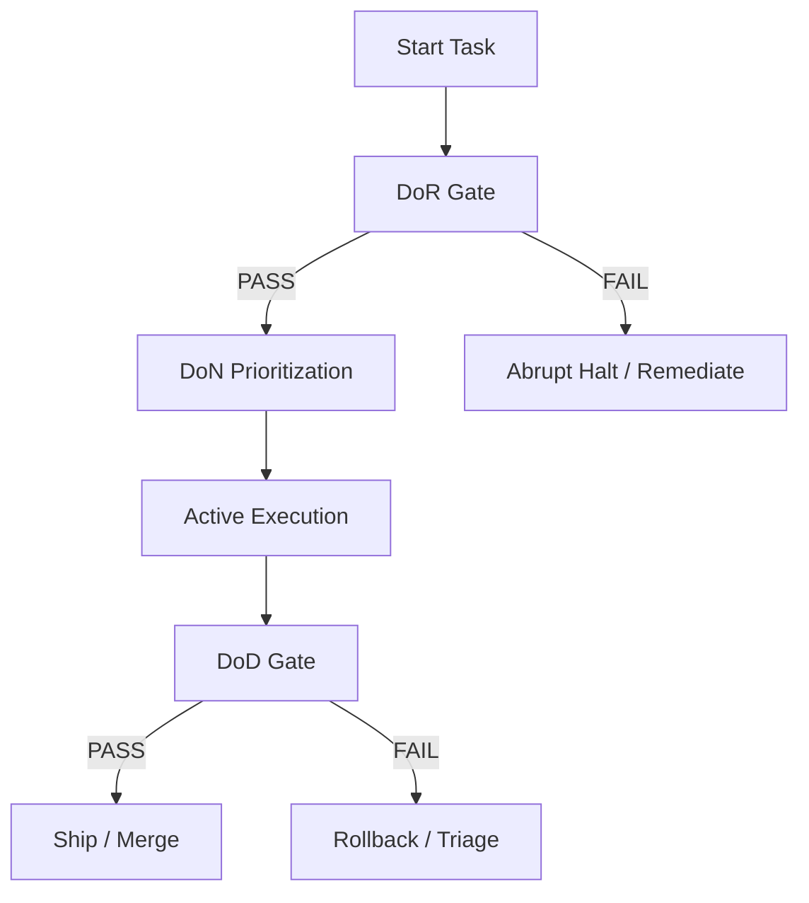

# Standard Definitions: DoN, DoR, and DoD

This document outlines the canonical definitions and quality gates governing the development lifecycle in the workspace.



---

## 🕒 1. Definition of Now (DoN)

**Definition of Now (DoN)** dictates what must be worked on *right now* to maximize Return on Investment (ROI) and minimize Cost of Delay (CoD). It prevents task clutter and ensures effort aligns with the highest-priority lanes.

### DoN Checklist

- [ ] **P1 Alignment**: The target task is registered as a P1 item in `config/cicd/loop_prompts.yaml` under `wsjf_now_items`.
- [ ] **Blocker Prioritization**: Any active blocker or single point of failure (SPOF) in the critical path (e.g., DNS, gRPC service downtime) takes absolute precedence over feature additions.
- [ ] **Tail-Risk Disposition**: Highly-complex or aging risks in the ROAM register at the head of the LNNNL queue must be addressed before deferrable work.
- [ ] **Pace Regulation**: The Cost of Delay weight (0.5 to 1.5) is computed via `pace_from_lnnnl.py` to adapt the loop execution speed and limit WIP.

> [!TIP]
> DoN is about extreme simplification: if a task is not actively unblocking the head of the LNNNL lane or mitigating a tail risk, it should be deferred to avoid "autonomy theater."

---

## 🚦 2. Definition of Readiness (DoR)

**Definition of Readiness (DoR)** specifies the entry criteria that must be satisfied before any agent or engineer can execute a task. It ensures the environment is clean, stable, and secure to prevent polluting the codebase.

### DoR Checklist

- [ ] **Workspace Cleanliness**: The workspace must be in a known good state, verified by running the pre-task gate:

  ```bash
  AGENT_SLICE=publication bash code/tooling/scripts/agent_session_dor.sh
  ```

- [ ] **Provenance Security**: Local signer keys (`.goalie/scorecards/workspace_signer`) and allowed signer lists (`.goalie/scorecards/allowed_signers` or `.local` fallbacks) must be present and verified.
- [ ] **Harness Readiness**: Cargo check, Pytest environment, and Playwright config are verified locally.
- [ ] **No Untracked Pollution**: Conflicting or temporary environment configurations must be stashed or removed to keep the local sweep clean.

> [!IMPORTANT]
> Never skip the DoR pre-task check. Sourcing incorrect environment variables or writing code against a broken baseline is an immediate gate violation.

---

## 🏁 3. Definition of Done (DoD)

**Definition of Done (DoD)** defines the exit criteria a change must satisfy to be considered shippable. No work exists in main unless it complies fully with all DoD gates.

### DoD Checklist

- [ ] **Gate Verification**: All checks must run successfully, verified by the post-task gate:

  ```bash
  ./scripts/dod-gate.sh --post-task
  ```

- [ ] **Testing Integrity**:
  - `pytest` suite passes 100% with no regressions or un-mocked side-effects.
  - `playwright` E2E spec list is discoverable and passes.
- [ ] **Cryptographic Sign-off**: A valid scorecard file must be generated at `.goalie/scorecards/current.json` containing verified `coherence_results.json` signals, signed by an allowed workspace key.
- [ ] **Anti-CVT Enforcement**: All code changes are staged, tracked via `git status`, and committed to git (or staged for review) with zero untracked side-effects.
- [ ] **Public Edge Proof**: Endpoint health probes (like `public_synthetic_check.sh`) must pass or have explicitly logged blockers in `.goalie/evidence/public-edge/`.

> [!WARNING]
> Stating that a feature is complete without generating signed gate evidence and executing E2E checks violates the core integrity model of the platform.

---

## 🌐 4. Product Maturity & Edge Flow Contexts

These definitions cover the boundary systems and distribution contexts used to measure real-world production maturity across web, DNS, mobile, and ledger integrations.

### TLD Cypher / Registry

- **Definition**: Canonical FQDN inventory map (`config/fqdn_registry.yaml`) cataloged by `gate_tier` taxonomy (`smoke`, `billing`, `apex`) with a drift detector (`tld_registry_drift.py`) validating spec-to-registry coherence.

### iOS/Android Prod Maturity

- **Definition**: Web-redirect store presence Capacitor shell (`apps/summerjobswap/`) with web funnel checks. Native binary is marked as *not shippable* (due to lack of native signing, Detox, fastlane, Firebase setup) and managed under the accepted risk register (`R-MOBILE-01`).

### Earnings Web Flow

- **Definition**: End-to-end ledger and sync process (`earnings_ledger.jsonl`, `earnings_latest.json`) translating agent scorecard performance into verified earnings using a shared JSON-RPC MCP envelope synced via `sync_earnings_to_hire.py`.

---

## 🧭 5. Command Primitives (`/goal`, `/workflows`, `/schedule`, `/loop`)

These four primitives form the canonical owner surface for pacing, routing, and executing work. They are dispatched through `scripts/one.sh` and each owns a single bounded responsibility.

### `/goal` — Destination / ROI Snapshot

- **Definition**: The maximum-ROI-per-hour compass. It answers the question: *"given current state, what is the highest-return next move?"*.
- **Entry point**: `scripts/one-sh.d/goal.sh` → `scripts/cicd/lib/roi_iterate.py`.
- **DoN signal**: Emits a JSON snapshot of ranked opportunities, cost-of-delay weights, and the current anti-CVT velocity (`%` closed, `#` open, `#.%` pace, `%.#` velocity).
- **DoD signal**: Must produce a committable next-step hint or a blocker decision with a ROAM disposition; no-op "advice only" output is considered theater.

### `/workflows` — Logic / Ruflo Orchestration

- **Definition**: The agentic orchestration plane. It maps human or scheduled intent into running ruflo workflows, tasks, swarms, sessions, and memory operations.
- **Entry point**: `scripts/one-sh.d/workflow.sh` → `npx ruflo@3.14.1 <cmd>`.
- **DoN signal**: A workflow is ready to run when the ruflo runtime is initialized (`one.sh ruflo init`) and the requested operation has a clear, bounded output.
- **DoD signal**: The command must return a machine-readable result or a named receipt; long-running workflows must expose a `status` query.

### `/schedule` — Cadence / WSJF LNNNL Update

- **Definition**: The time-boxed prioritization heartbeat. It updates the multi-lane Now/Near/Next/Later ledger, separating shippable work from blockers, and recalculates WSJF scores.
- **Entry point**: `scripts/one-sh.d/schedule.sh` → `scripts/cicd/update_lnnnl.py`.
- **DoN signal**: The top-level `schedule` field contains only shippable items; blockers live in dedicated `lanes.blockers` and `blockers_now/near/next` fields.
- **DoD signal**: Write-back must preserve the dual-lane contract (`P1-*` and `NNEAR-*` are shippable; `B-*` and `NB-*` are blockers) and emit a valid `LNNNL.yaml`.

### `/loop` — Engine / Timer Tick

- **Definition**: The low-frequency execution engine that fires bounded work cycles on a timer. It consumes the head of the LNNNL shippable lane and the current pace signal, then executes one atomic unit of work per tick.
- **Entry point**: `scripts/one-sh.d/loop.sh` → `scripts/cicd/loop_timer_engine.sh`.
- **DoN signal**: A loop tick is only valid when the workspace is clean, the DoR gate passes, and the chosen `LOOP_ITEM` is drawn from `lanes.shippable.now`.
- **DoD signal**: Each tick must produce a signed receipt (or blocker) and advance the LNNNL state; ticks that run without a shippable head are anti-CVT theater.

### Primitive Interaction Model

```mermaid
graph LR
    G[/goal] -->|picks highest ROI| S[/schedule]
    S -->|emits shippable head| L[/loop]
    L -->|executes atomic unit| W[/workflows]
    W -->|produces receipt| G
```

> [!NOTE]
> `one.sh` is the canonical router; it does not contain logic. Each primitive has its own slice script under `scripts/one-sh.d/`, tracked in git, and tested via `tests/pytest/test_one_sh_wiring.py`.

---

## 5. Tick Orchestration Contract (per cycle)

Each `tick_post_hooks.sh` run follows this order; skipping or reordering breaks pace/AQE policy.

| Step | Command / owner | Notes |
|------|-----------------|-------|
| 1 Export | `env_key_resolver.py --export-shell` | TRACKED_KEYS only; lazy `op read`; `mktemp` + `source` (not `eval`) |
| 2 Sync ROAM | `--sync-roam` once | Set `AF_SKIP_OP_READ=1` only when exports present |
| 3 Rank | `update_lnnnl.py` → `LNNNL.yaml` v1.1 | Single WSJF owner; `AF_SKIP_ROAM_SYNC=1` on second callers |
| 4 Pace | `pace_from_lnnnl.py` → `tick_cycle_policy.py` | **Shippable lane only** (`lanes.shippable`); blockers visible but do not set pace |
| 5 Verify | `scorecard_gate.py --verify` | CI forbids `--self-asserted`; requires `coherence_derived=PASS` to SHIP |
| 6 Prove edge | `tld-deploy-gate.yml` (workflow_dispatch) | Strict DNS/manifest (`TLD_GATE_STRICT_*=1`); PR lane lenient skips ≠ DoD |

### Environment flags

| Flag | Default | Meaning |
|------|---------|---------|
| `AF_SKIP_OP_READ` | unset | After successful export-shell, skip further `op read` in child Python |
| `AF_SKIP_ROAM_SYNC` | `0` | Skip duplicate `sync_roam_env_deps` in `update_lnnnl` |
| `AF_OP_VAULT_SCAN` | `0` | Scan Antigravity vault blobs (expensive; off in tick) |
| `AF_LNNNL_ENFORCE` | `0` | Fail tick when `update_lnnnl.py` exits non-zero |
| `AF_ROAM_REFRESH_TIMESTAMPS` | `0` | Do not reset ROAM `discovered` on every tick |

Evidence: `.goalie/evidence/tick_post_latest.json` records `env_export_ok`, `lnnnl_exit`, `pace_cod_weight`.

### Dual-lane pace vs blocker WSJF

Blockers (`lanes.blockers`) rank high in WSJF for visibility and ROAM closure **%/#**, but **#.% pace** and AQE utilization read **shippable** `P1-*` / `NNEAR-*` only. Closing `R-SPOF-01` does not raise pace until a shippable item heads `lanes.shippable.now`.

### TLD gate and DoD

- **PR / default CI**: lenient Playwright skips (DNS timeout, manifest 404) are **not** DoD green.
- **Post-deploy**: run `.github/workflows/tld-deploy-gate.yml` with `strict=true` after `deploy-uapi`.

