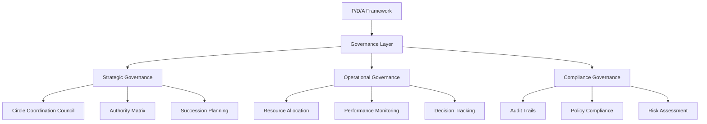
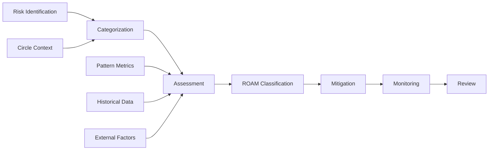
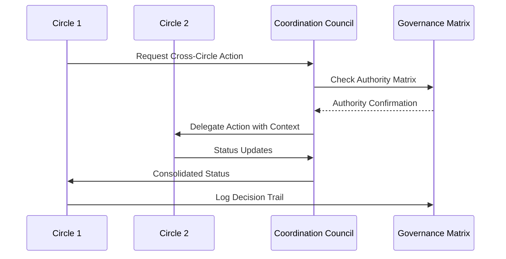
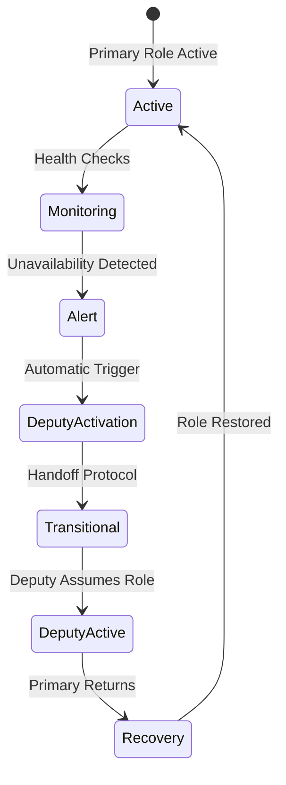
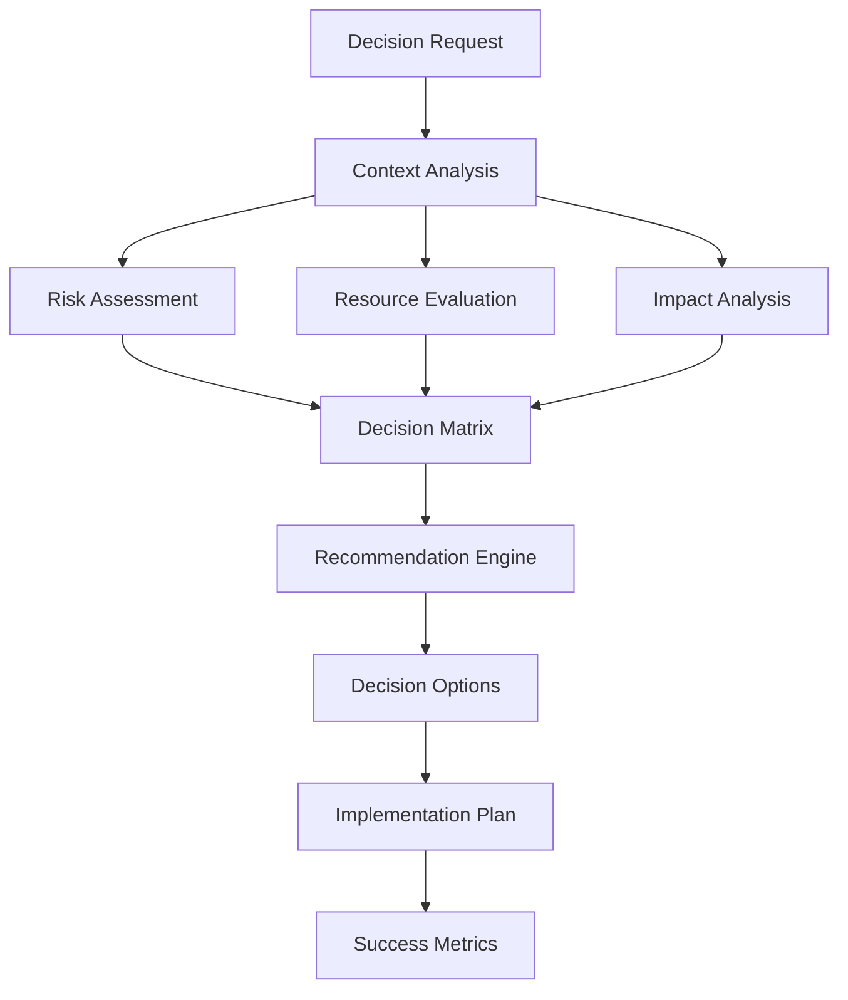
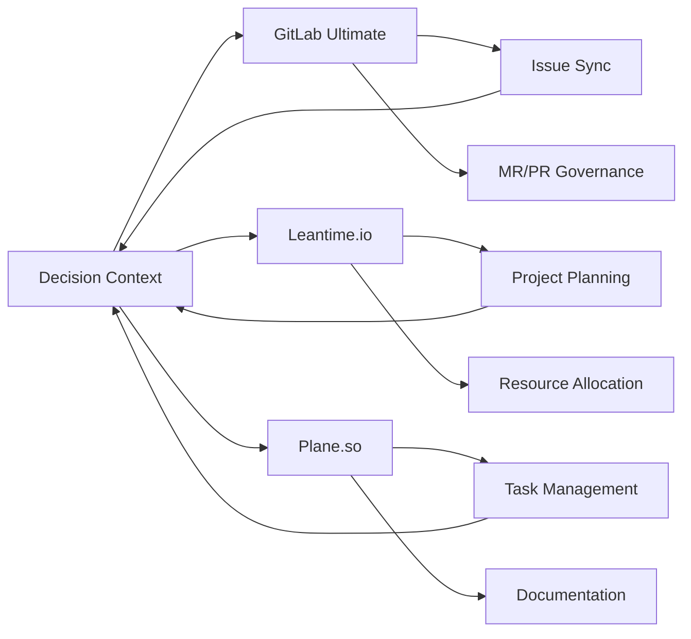

# Comprehensive Governance and Risk Assessment System

**Date**: 2025-12-03  
**Status**: Architecture Complete  
**Scope**: Holistic governance framework for agentic flow ecosystem  
**Priority**: Cross-circle coordination mechanisms as foundation  

---

## Executive Summary

This document presents a comprehensive governance and risk assessment system that integrates with the existing P/D/A framework and circle structure. The system enhances the ROAM risk tracking framework, establishes bidirectional synchronization with external systems (GitLab Ultimate, Leantime.io, Plane.so), and provides a phased implementation approach that builds upon existing strengths.

The solution addresses critical governance gaps while maintaining compatibility with existing workflows and systems, ensuring incremental adoption with measurable success criteria.

---

## 1. Governance Framework Architecture

### 1.1 Enhanced P/D/A Integration

Building on the existing Plan/Do/Act cycle, the new governance framework adds strategic oversight layers:



### 1.2 Authority Matrix System

**Decision Authority Levels**:
- **Strategic**: Circle Leads (major decisions, resource allocation >24h)
- **Tactical**: Role Leads (domain decisions, resource allocation <24h)
- **Operational**: Individual Contributors (task decisions, immediate resource needs)

**Escalation Paths**:
- Level 1: Role Lead → Circle Lead (4-hour SLA)
- Level 2: Circle Lead → Executive Council (24-hour SLA)
- Level 3: Executive Council → System Override (emergency)

**Delegation Protocols**:
- Temporary authority delegation with automatic expiration
- Complete audit trail of delegated decisions
- Automatic reversion when primary returns
- Conflict resolution for overlapping delegations

### 1.3 Cross-Circle Coordination Council

**Structure**:
- **Executive Council**: Circle Leads + Intuitive Circle facilitator (weekly)
- **Operational Council**: Role Leads from each circle (daily standups)
- **Special Interest Councils**: Topic-specific (Security, Performance) (bi-weekly)
- **Emergency Council**: Critical incident response (as needed)

**Meeting Cadences**:
- **Daily**: 15-minute operational coordination
- **Weekly**: 1-hour tactical review
- **Monthly**: 2-hour strategic planning
- **Quarterly**: 4-hour comprehensive review

---

## 2. Multi-Dimensional Risk Assessment Framework

### 2.1 Enhanced ROAM Implementation

Building on existing ROAM tracking with multi-dimensional analysis:



### 2.2 Risk Scoring Algorithm

```typescript
interface RiskScore {
  baseScore: number;        // 1-10 initial assessment
  circleMultiplier: number;  // Circle-specific risk factor
  patternImpact: number;      // Pattern-based adjustment
  historicalWeight: number;   // Past incident frequency
  exposureLevel: number;      // System exposure (0-1)
  mitigationEffectiveness: number; // Current controls (0-1)
  
  finalScore: number;       // Weighted calculation
  riskCategory: 'CRITICAL' | 'HIGH' | 'MEDIUM' | 'LOW';
}
```

**Calculation Formula**:
```
finalScore = (baseScore * circleMultiplier * patternImpact) + 
             (historicalWeight * exposureLevel) - 
             (mitigationEffectiveness * 2)
```

### 2.3 Circle-Specific Risk Profiles

**Analyst Circle**:
- Data integrity risks (model drift, data quality)
- Insight relevance risks (misaligned analysis)
- Timeline risks (analysis delays)

**Assessor Circle**:
- Quality gate failures (missed defects)
- Compliance violations (regulatory gaps)
- Security risks (vulnerability exposure)

**Innovator Circle**:
- Experiment failure risks (resource waste)
- Adoption resistance risks (change management)
- Technology risks (obsolescence)

**Intuitive Circle**:
- Strategic misalignment risks
- Architectural flaw risks
- Integration failure risks

**Orchestrator Circle**:
- Coordination failure risks
- Dependency conflict risks
- Resource bottleneck risks

**Seeker Circle**:
- Information gap risks
- Opportunity miss risks
- Knowledge silo risks

---

## 3. Cross-Circle Governance Mechanisms

### 3.1 Coordination Protocols



### 3.2 Shared Governance Dashboard

**Real-time Visualization**:
- Circle health indicators (DoR/DoD compliance)
- Cross-circle dependency mapping
- Risk distribution heat map across circles
- Resource utilization metrics
- Decision latency and outcome tracking

**Dashboard Components**:
- Executive Overview (strategic metrics)
- Circle Performance (operational metrics)
- Risk Status (ROAM distribution)
- Resource Allocation (efficiency metrics)
- Decision Tracking (audit trails)

### 3.3 Conflict Resolution Process

1. **Identification**: Automated detection of conflicting decisions
2. **Escalation**: Route to appropriate authority level
3. **Mediation**: Structured discussion with documented positions
4. **Resolution**: Decision recorded with rationale
5. **Learning**: Update patterns and authority matrix

**Conflict Types**:
- Resource allocation conflicts
- Priority disagreements
- Timeline conflicts
- Authority boundary disputes

---

## 4. Succession Planning Integration

### 4.1 Deputy Role Activation System



**Activation Triggers**:
- Health check failure (>3 consecutive failures)
- Manual activation request
- Emergency declaration
- Scheduled absence

### 4.2 Knowledge Transfer Tracking

**Skill Matrix**:
- Role-specific capabilities and proficiency levels
- Cross-training requirements
- Readiness assessment criteria
- Performance benchmarks

**Knowledge Gaps**:
- Identified through performance metrics
- Tracked via skill assessment
- Addressed through training programs
- Monitored for improvement

### 4.3 Emergency Succession Protocols

**Response Times**:
- Immediate activation: <5 minutes for critical roles
- Context preservation: Complete state transfer
- Communication plan: Stakeholder notification sequence
- Recovery process: Smooth transition back to primary

**Critical Roles**:
- Circle Leads (all circles)
- Security coordinators
- Infrastructure operators
- Emergency response coordinators

---

## 5. Resource Governance System

### 5.1 Dynamic Resource Allocation

```typescript
interface ResourceAllocation {
  circle: string;
  resourceType: 'compute' | 'storage' | 'network' | 'human';
  currentAllocation: number;
  utilizationRate: number;
  priorityScore: number;
  efficiency: number;
  
  // Dynamic adjustment factors
  workloadTrend: number;     // Increasing/decreasing demand
  businessImpact: number;      // Revenue/cost impact
  riskExposure: number;       // Associated risks
  
  recommendedAllocation: number;
  adjustmentReason: string;
}
```

### 5.2 Resource Utilization Monitoring

**Real-time Tracking**:
- Compute resource consumption by circle
- Storage utilization patterns
- Network bandwidth allocation
- Human resource capacity and allocation
- Cost efficiency metrics

**Optimization Algorithms**:
- Predictive scaling based on historical patterns
- Load balancing across circles
- Cost optimization recommendations
- Performance tuning suggestions

### 5.3 Budget Tracking and Financial Oversight

**CapEx/OpEx Classification**:
- Automated categorization based on impact
- Maintenance vs. growth investment tracking
- ROI calculation by circle and initiative
- Budget variance analysis

**Financial Controls**:
- Real-time budget vs. actual tracking
- Automated approval workflows for expenditures
- Cost optimization recommendations
- Financial risk assessment

---

## 6. Decision Support Systems

### 6.1 Strategic Decision Framework



### 6.2 Risk-Adjusted Decision Matrices

**Decision Impact Assessment**:
- Cost analysis (short-term, long-term)
- Benefit quantification (tangible, intangible)
- Risk assessment (probability, impact)
- Timeline evaluation (critical path, dependencies)

**Multi-Criteria Analysis**:
- Weighted decision factors by context
- Scenario modeling (best, worst, likely)
- Sensitivity analysis for key variables
- Stakeholder impact assessment

### 6.3 Decision Audit Trail

```typescript
interface DecisionRecord {
  id: string;
  timestamp: Date;
  decisionMaker: string;
  circle: string;
  context: DecisionContext;
  options: DecisionOption[];
  selectedOption: string;
  rationale: string;
  riskAssessment: RiskScore;
  resourceImplications: ResourceImpact;
  expectedOutcomes: ExpectedResult[];
  actualOutcomes: ActualResult[];
  lessonsLearned: string;
}
```

---

## 7. Compliance and Audit Framework

### 7.1 Policy Compliance Monitoring

**Automated Policy Checks**:
- Continuous validation against standards
- Compliance scorecards by circle
- Violation tracking and categorization
- Remediation workflow automation

**Policy Categories**:
- Security policies (access control, data protection)
- Operational policies (process adherence)
- Financial policies (budget compliance)
- Governance policies (authority adherence)

### 7.2 Audit Trail System

```typescript
interface AuditEvent {
  id: string;
  timestamp: Date;
  eventType: 'DECISION' | 'RISK' | 'RESOURCE' | 'COMPLIANCE';
  actor: string;              // Who initiated
  circle: string;             // Responsible circle
  action: string;             // What was done
  rationale: string;          // Why it was done
  approval: string;           // Who approved
  impact: AuditImpact;         // Consequences
  evidence: string[];          // Supporting documentation
}
```

**Audit Capabilities**:
- Immutable record of all governance actions
- Tamper-proof storage with blockchain verification
- Real-time audit dashboard
- Automated compliance reporting

---

## 8. Integration with Existing Systems

### 8.1 Pattern Metrics Panel Integration

**Risk-Informed Pattern Selection**:
- ROAM scores influence pattern recommendations
- Governance metrics integrated with pattern effectiveness
- Decision patterns tracked for successful approaches
- Learning loop for governance outcomes

**Integration Points**:
- Pattern event schema extension for governance context
- Risk score calculation in pattern metrics
- Governance pattern library creation
- Cross-system analytics correlation

### 8.2 Goalie System Enhancement

**Governance Actions**:
- Extend Goalie to track governance decisions
- Risk events from Goalie alerts to ROAM
- Policy validation in Goalie workflows
- Audit integration for Goalie events

**Enhanced Features**:
- Governance action templates
- Risk-triggered Goalie workflows
- Compliance checks in Goalie gates
- Governance metrics in Goalie dashboard

### 8.3 AgentDB Learning Integration

**Governance Patterns**:
- Store and retrieve successful governance approaches
- Risk prediction from historical outcomes
- Decision optimization over time
- Knowledge transfer across circles

**Learning Capabilities**:
- Governance pattern recognition
- Success factor analysis
- Failure mode identification
- Adaptive recommendation improvement

### 8.4 External System Synchronization



**Bidirectional Synchronization**:
- Decision context to external systems
- Risk status synchronization
- Resource allocation updates
- Compliance status sharing

---

## 9. Implementation Roadmap

### Phase 1: Foundation (Weeks 1-4)

**Week 1-2: Cross-Circle Coordination**
- Implement Coordination Council structure
- Deploy shared governance dashboard
- Establish meeting cadences and protocols
- Create decision authority matrix

**Week 3-4: Risk Assessment Enhancement**
- Extend ROAM framework with multi-dimensional scoring
- Implement circle-specific risk profiles
- Create risk visualization dashboard
- Establish risk monitoring automation

**Success Criteria**:
- Coordination council operational with documented processes
- Risk dashboard showing real-time ROAM status
- Authority matrix implemented with escalation paths
- Cross-circle handoff efficiency <2 hours

### Phase 2: Integration (Weeks 5-8)

**Week 5-6: Succession Planning**
- Implement deputy role activation system
- Create knowledge transfer tracking
- Establish emergency protocols
- Integrate with circle performance metrics

**Week 7-8: Resource Governance**
- Deploy dynamic resource allocation system
- Implement utilization monitoring
- Create budget tracking dashboard
- Establish financial oversight protocols

**Success Criteria**:
- Deputy activation system tested with <5 minute response
- Resource allocation dashboard with efficiency metrics
- Budget variance tracking with automated alerts
- Knowledge transfer metrics for all critical roles

### Phase 3: Intelligence (Weeks 9-12)

**Week 9-10: Decision Support**
- Implement strategic decision framework
- Create risk-adjusted decision matrices
- Deploy scenario planning tools
- Establish decision audit trails

**Week 11-12: Compliance Framework**
- Implement policy compliance monitoring
- Deploy comprehensive audit trail system
- Create compliance scorecards
- Establish remediation workflows

**Success Criteria**:
- Decision support system with scenario modeling
- Complete audit trail for all governance actions
- Compliance scorecards with automated monitoring
- Decision latency <48 hours for standard requests

### Phase 4: External Integration (Weeks 13-16)

**Week 13-14: System Integration**
- Integrate with Pattern Metrics Panel
- Enhance Goalie system for governance
- Connect AgentDB learning capabilities
- Implement governance pattern library

**Week 15-16: External Synchronization**
- Implement GitLab Ultimate bidirectional sync
- Deploy Leantime.io integration
- Connect Plane.so task management
- Establish unified governance dashboard

**Success Criteria**:
- Pattern metrics panel with governance context
- Goalie system enhanced with governance actions
- AgentDB learning from governance outcomes
- Bidirectional sync with all external systems

### Phase 5: Optimization (Weeks 17-20)

**Week 17-18: Performance Optimization**
- Analyze governance system performance
- Optimize decision processes
- Enhance risk prediction accuracy
- Improve resource allocation efficiency

**Week 19-20: Adoption and Training**
- Conduct comprehensive training programs
- Establish governance best practices
- Create user documentation
- Implement continuous improvement process

**Success Criteria**:
- System performance metrics meeting targets
- User adoption rate >90% across circles
- Documentation complete with training materials
- Continuous improvement process operational

---

## 10. Success Metrics

### Governance Effectiveness
- **Decision Latency**: <48 hours for standard decisions
- **Cross-Circle Coordination**: <2 hours handoff time
- **Authority Matrix Compliance**: >95% correct routing
- **Conflict Resolution**: <24 hours resolution time

### Risk Management
- **Risk Identification**: >90% risks identified before impact
- **ROAM Processing**: <24 hours classification and mitigation
- **Risk Reduction**: 30% reduction in high-impact risks
- **Prediction Accuracy**: >80% risk forecast accuracy

### Operational Efficiency
- **Resource Utilization**: >85% efficiency target
- **Budget Variance**: <10% deviation from plan
- **Compliance Rate**: >95% policy adherence
- **Audit Completeness**: 100% decision audit coverage

### System Integration
- **External Sync Success**: >99% synchronization accuracy
- **Data Consistency**: Zero data loss in bidirectional sync
- **API Response Time**: <2 seconds for governance queries
- **System Availability**: >99.9% uptime for governance services

---

## 11. Technical Architecture

### 11.1 System Components

**Core Services**:
- Governance Engine (decision processing, authority matrix)
- Risk Assessment Service (ROAM scoring, prediction)
- Resource Management Service (allocation, optimization)
- Compliance Service (policy checking, audit)
- Integration Service (external system sync)

**Data Stores**:
- Governance Database (decisions, policies, authority)
- Risk Database (ROAM tracking, historical data)
- Resource Database (allocation, utilization, budgets)
- Audit Database (immutable audit trail)
- Pattern Library (governance patterns, best practices)

### 11.2 Integration Points

**Internal Systems**:
- Pattern Metrics Panel (risk-informed recommendations)
- Goalie System (governance actions, risk events)
- AgentDB (learning, pattern storage)
- Circle Workflows (decision context, authority)

**External Systems**:
- GitLab Ultimate (issue sync, MR governance)
- Leantime.io (project planning, resource allocation)
- Plane.so (task management, documentation)

---

## 12. Security Considerations

### 12.1 Data Protection
- Encryption at rest and in transit for all governance data
- Role-based access control with principle of least privilege
- Data anonymization for analytics and reporting
- Regular security audits and penetration testing

### 12.2 Audit Security
- Immutable audit logs with blockchain verification
- Tamper-evident storage for critical records
- Multi-signature approval for high-impact decisions
- Secure backup and recovery procedures

### 12.3 Compliance
- GDPR compliance for personal data handling
- SOC 2 controls for governance processes
- ISO 27001 security management
- Industry-specific regulatory compliance

---

## 13. Maintenance and Evolution

### 13.1 Continuous Improvement
- Monthly governance process reviews
- Quarterly system performance assessments
- Annual framework updates based on lessons learned
- Continuous user feedback collection and analysis

### 13.2 Evolution Strategy
- Adaptive governance based on organizational maturity
- Scalable architecture for growth and complexity
- Modular design for incremental enhancement
- Future-proof integration capabilities

---

**Document Version**: 1.0  
**Last Updated**: 2025-12-03  
**Next Review**: 2025-12-17  
**Maintained By**: Governance Architecture Team