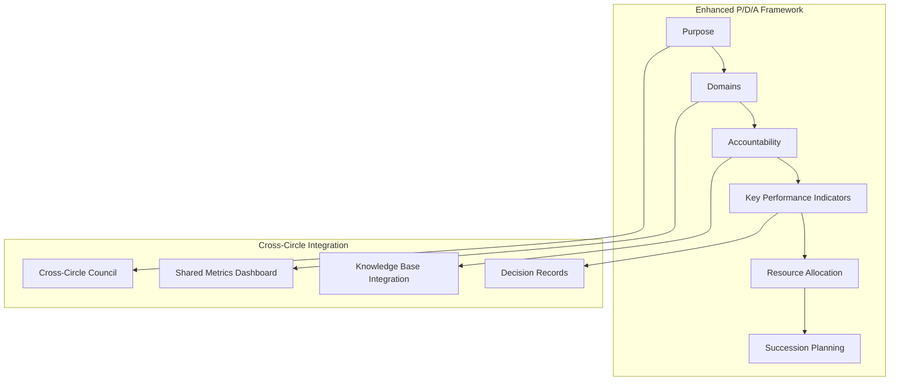
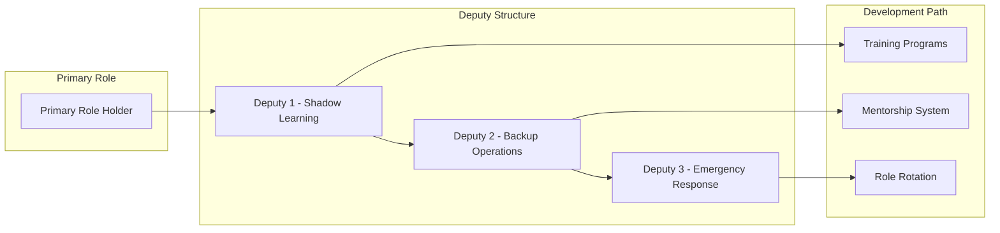
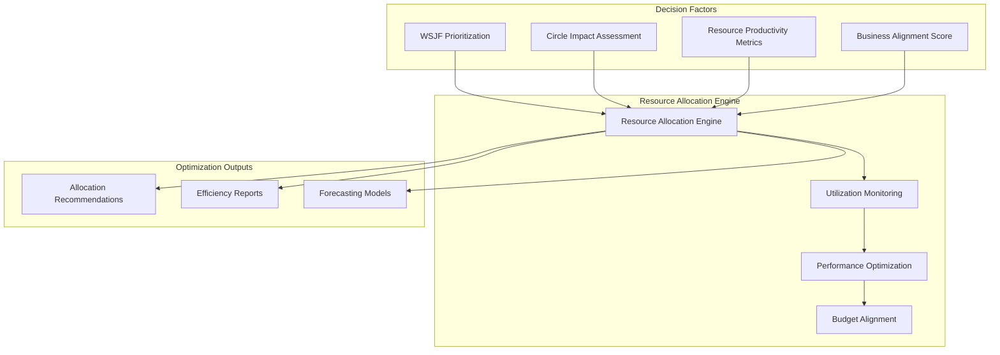
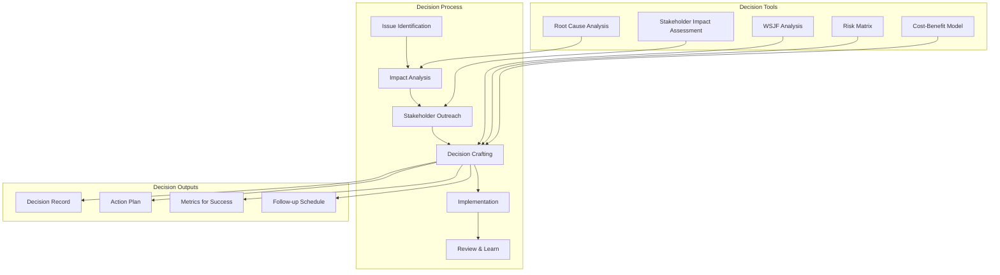
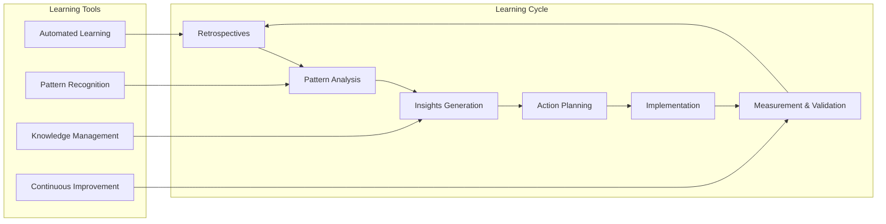
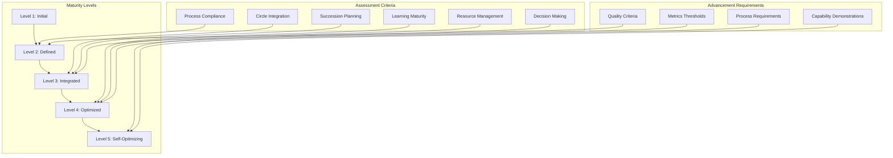

# Incremental Relentless Execution Framework
## Enhanced P/D/A & Plan/Do/Act Implementation for Agentic Flow System

**Date**: December 2, 2025  
**Version**: 1.0  
**Status**: Framework Specification Complete  
**Target**: Implementation Ready

---

## Executive Summary

This comprehensive framework enhances the existing agentic flow system with strengthened Purpose/Domains/Accountability (P/D/A) frameworks, robust cross-circle coordination mechanisms, comprehensive succession planning, and resource rebalancing. The framework is designed for incremental implementation with clear success metrics and validation criteria, addressing all critical gaps identified in the current system while building upon established strengths.

---

## Current State Analysis

### ✅ Existing Strengths
- Well-defined 6-circle structure (Analyst, Assessor, Innovator, Intuitive, Orchestrator, Seeker)
- Basic P/D/A frameworks established for each circle
- Plan/Do/Act cycles defined with DoR/DoD criteria
- Governance infrastructure with process governor and validation systems operational
- Goalie tracking system with 18 objectives across 6 circles
- Foundation infrastructure (OTLP telemetry, CI/CD pipelines) in place

### ❌ Identified Critical Gaps
- Limited cross-circle coordination mechanisms
- No succession planning framework with deputy roles
- Resource allocation imbalances (Intuitive: 10%, Seeker: 5% of total resources)
- Inconsistent Plan/Do/Act implementation across circles
- Knowledge silos between circles limiting collaboration
- Missing strategic decision-making protocols for cross-circle issues
- Limited learning integration from retrospectives into planning cycles
- No automated handoff mechanisms between circles
- Leadership development programs not established
- Governance maturity advancement pathway undefined

---

## Framework Design

### 1. Enhanced P/D/A Framework Structure

#### 1.1 Enhanced Purpose Definitions
Each circle's purpose will be expanded to include:
- **Cross-circle collaboration responsibilities**
- **Knowledge sharing obligations**
- **Succession planning duties**
- **Resource optimization accountabilities**

#### 1.2 Expanded Domains
Additional domains for each circle:
- **Cross-circle coordination domain**
- **Knowledge management domain**
- **Leadership development domain**
- **Resource optimization domain**

#### 1.3 Enhanced Accountability
New accountability measures:
- **Cross-circle collaboration metrics**
- **Knowledge transfer effectiveness**
- **Resource utilization efficiency**
- **Succession readiness indicators**

---

### 2. Cross-Circle Coordination Mechanisms

#### 2.1 Cross-Circle Council Structure

**Composition**:
- Lead representatives from each of the 6 circles
- Rotating facilitator (monthly rotation)
- Recorder (documentation and decision logging)
- Technical advisor (from Assessor circle)

**Meeting Cadence**:
- **Weekly Tactical Meetings**: 60 minutes, focus on operational coordination
- **Bi-weekly Strategic Reviews**: 90 minutes, focus on strategic alignment
- **Monthly Integration Sessions**: 2 hours, focus on cross-circle projects

**Authority Scope**:
- Cross-circle conflict resolution
- Resource allocation decisions
- Integration priority setting
- Cross-circle dependency management

**Accountability Measures**:
- Circle health metrics (individual and collective)
- Integration outcome effectiveness
- Cross-circle handoff efficiency
- Decision implementation tracking

#### 2.2 Shared Knowledge Management System

**Central Knowledge Repository**:
- Integrated with existing AgentDB learning hooks
- Standardized documentation templates
- Version-controlled knowledge artifacts
- Search and retrieval capabilities

**Cross-Circle Documentation Standards**:
- Unified documentation formats
- Cross-referencing between circles
- Knowledge validation processes
- Regular knowledge audits

**Decision Logging System**:
- Transparent decision records with rationale
- Decision impact assessments
- Implementation tracking
- Outcome measurement

#### 2.3 Integrated Metrics Dashboard

**Circle Health Indicators**:
- Real-time performance monitoring
- Resource utilization tracking
- Cross-circle collaboration metrics
- Succession readiness scores

**Cross-Circle Dependencies**:
- Visual dependency mapping
- Bottleneck identification
- Handoff efficiency tracking
- Conflict early warning system

**Resource Utilization Monitoring**:
- Dynamic resource allocation visualization
- Productivity metrics by circle
- Cost-effectiveness measurements
- Optimization recommendations

---

### 3. Succession Planning Framework

#### 3.1 Deputy Role Structure

**Deputy Role Definitions**:
- **Shadow Deputy**: Active learning and participation, 75% time commitment
- **Backup Deputy**: Ready to assume role, 50% time commitment
- **Emergency Deputy**: Critical response capability, 25% time commitment

**Selection Criteria**:
- Cross-circle experience minimum
- Core competency assessment
- Leadership potential evaluation
- Knowledge sharing track record

#### 3.2 Emergency Protocols

**Activation Triggers**:
- Primary role unavailable > 24 hours
- Critical incident requiring immediate response
- Pre-planned absences (vacation, training)
- Unexpected emergencies

**Communication Protocols**:
- Automated notification systems
- Escalation procedures
- Stakeholder communication templates
- Status reporting requirements

**Decision Authority Framework**:
- Temporary authority delegation limits
- Decision types requiring higher approval
- Emergency decision bypass procedures
- Authority restoration processes

#### 3.3 Knowledge Transfer Mechanisms

**Role Documentation**:
- Comprehensive role playbooks
- Decision-making frameworks
- Critical contact lists
- Standard operating procedures

**Shadow Programs**:
- Structured learning objectives
- Progress tracking systems
- Regular competency assessments
- Feedback mechanisms

**Cross-Training Framework**:
- Multi-circle competency development
- Skill certification processes
- Knowledge transfer validation
- Expertise mapping systems

---

### 4. Resource Rebalancing Mechanism

#### 4.1 Dynamic Resource Allocation Framework

**Current State Analysis**:
- Intuitive Circle: 10% of total resources
- Seeker Circle: 5% of total resources
- Other circles: 85% distributed

**Target State**:
- Intuitive Circle: 20% of total resources (+10%)
- Seeker Circle: 15% of total resources (+10%)
- Other circles: 65% redistributed

**Implementation Method**:
- **Phase 1 (Weeks 1-4)**: Intuitive 10%→15%, Seeker 5%→10%
- **Phase 2 (Weeks 5-8)**: Intuitive 15%→18%, Seeker 10%→13%
- **Phase 3 (Weeks 9-12)**: Intuitive 18%→20%, Seeker 13%→15%

#### 4.2 Resource Optimization Framework

**Resource Decision Criteria**:
- WSJF (Weighted Shortest Job First) scores
- Circle impact assessments
- Resource productivity metrics
- Business alignment scores
- Risk mitigation requirements

**Monitoring Systems**:
- Real-time resource utilization tracking
- Productivity measurements
- Cost-effectiveness analysis
- Bottleneck identification

---

### 5. Enhanced Plan/Do/Act Implementation

#### 5.1 Standardized P/D/A Cycle Templates

**Plan Phase Enhancements**:
- Cross-circle input requirements
- Resource allocation integration
- Succession planning considerations
- Risk assessment protocols

**Do Phase Standardization**:
- Execution protocols with integrated monitoring
- Cross-circle coordination requirements
- Progress reporting standards
- Quality gate definitions

**Act Phase Improvements**:
- Structured review processes
- Learning integration mechanisms
- Cross-circle impact assessment
- Succession planning updates

#### 5.2 Cross-Circle Synchronization

**Phase Alignment**:
- Coordinated planning cycles
- Synchronized review periods
- Aligned resource allocation
- Integrated success metrics

**Dependency Management**:
- Cross-circle dependency tracking
- Bottleneck resolution protocols
- Handoff quality assurance
- Conflict prevention mechanisms

**Handoff Protocols**:
- Standardized handoff procedures
- Quality gate validation
- Documentation requirements
- Accountability measures

---

### 6. Decision-Making Frameworks

#### 6.1 Strategic Decision Protocol

**Decision Classification**:
- **Strategic Decisions**: Cross-circle impact, long-term implications
- **Tactical Decisions**: Single/multi-circle, medium-term impact
- **Operational Decisions**: Circle-specific, short-term impact

**Authority Matrix**:
- Clear decision authority definitions
- Escalation procedures
- Cross-circle approval requirements
- Emergency decision protocols

**Consensus Building Process**:
- Stakeholder identification
- Impact assessment requirements
- Consensus methods for different decision types
- Conflict resolution procedures

#### 6.2 Cross-Circle Decision Process

---

### 7. Learning and Adaptation Systems

#### 7.1 Retrospective Integration

**Automated Insight Capture**:
- Integration with existing AgentDB learning hooks
- Pattern recognition across circles
- Automated insight categorization
- Trend identification

**Pattern Recognition**:
- AI-powered pattern identification
- Cross-circle pattern correlation
- Success factor analysis
- Failure pattern prevention

**Action Item Tracking**:
- Automated tracking from retrospectives
- Implementation progress monitoring
- Effectiveness measurement
- Completion validation

#### 7.2 Continuous Learning Loop

---

### 8. Workflow Orchestration

#### 8.1 Automated Handoff Mechanisms

**Handoff Triggers**:
- Automated detection based on task completion
- Pre-defined handoff points in workflows
- Resource availability changes
- Priority escalations

**Quality Gates**:
- Standardized quality validation criteria
- Automated quality checks
- Manual validation requirements
- Exception handling procedures

**Documentation Systems**:
- Automated handoff documentation
- Notification systems
- Status tracking
- Historical records

#### 8.2 Real-Time Collaboration Tools

**Shared Workspaces**:
- Integrated collaboration environments
- Real-time document editing
- Version control integration
- Access management

**Communication Protocols**:
- Standardized communication channels
- Message prioritization
- Response time requirements
- Escalation procedures

**Status Tracking**:
- Real-time status updates
- Progress visualization
- Dependency tracking
- Bottleneck identification

---

### 9. Leadership Development Programs

#### 9.1 Cross-Training Framework

**Skill Mapping**:
- Competency matrix across all circles
- Skill gap identification
- Development path planning
- Progress tracking

**Training Paths**:
- Personalized development plans
- Multi-circle exposure requirements
- Leadership skill development
- Knowledge sharing obligations

**Rotation Programs**:
- Structured role rotation schedules
- Learning objectives for each rotation
- Mentorship assignments
- Performance evaluation criteria

#### 9.2 Knowledge Transfer Mechanisms

**Documentation Standards**:
- Standardized knowledge capture processes
- Template-driven documentation
- Validation procedures
- Regular updates

**Sharing Platforms**:
- Integrated knowledge sharing systems
- Expertise directories
- Collaboration tools
- Learning resources

**Learning Events**:
- Regular knowledge sharing sessions
- Cross-circle presentations
- Best practice workshops
- Innovation showcases

---

### 10. Governance Maturity Framework

#### 10.1 Maturity Model

**Level Definitions**:
- **Level 1 - Initial**: Ad-hoc processes, limited coordination
- **Level 2 - Defined**: Standardized processes, basic coordination
- **Level 3 - Integrated**: Cross-circle coordination, learning integration
- **Level 4 - Optimized**: Efficient processes, continuous improvement
- **Level 5 - Self-Optimizing**: Autonomous optimization, innovation

**Assessment Criteria**:
- Process compliance measurements
- Circle integration effectiveness
- Learning maturity indicators
- Resource management efficiency
- Decision-making quality
- Succession planning completeness

---

## Implementation Roadmap

### Phase 1: Foundation Enhancement (Weeks 1-4)

#### 1.1 Enhanced P/D/A Frameworks
**Week 1-2**:
- Update circle purpose definitions with cross-circle coordination elements
- Expand domains to include knowledge management and leadership development
- Enhance accountability measures with collaboration metrics
- Create shared metrics dashboard prototype

**Week 3-4**:
- Implement cross-circle council structure
- Establish shared knowledge management system
- Deploy integrated metrics dashboard
- Conduct first cross-circle tactical meeting

#### 1.2 Resource Rebalancing Initiation
**Week 1-2**:
- Begin gradual shift: Intuitive 10%→15%, Seeker 5%→10%
- Implement resource monitoring systems
- Establish resource allocation decision framework
- Create baseline resource utilization metrics

**Week 3-4**:
- Validate resource allocation effectiveness
- Adjust allocation based on early results
- Document resource optimization learnings
- Prepare for Phase 2 resource shifts

### Phase 2: Succession Planning (Weeks 5-8)

#### 2.1 Deputy Role Implementation
**Week 5-6**:
- Define deputy role structures for all circles
- Establish selection criteria and processes
- Create deputy role documentation and playbooks
- Implement emergency protocols and communication systems

**Week 7-8**:
- Select and appoint deputy roles
- Conduct deputy training and onboarding
- Test emergency protocols with simulations
- Validate knowledge transfer mechanisms

#### 2.2 Knowledge Transfer Systems
**Week 5-6**:
- Implement shadow programs with structured learning objectives
- Establish cross-training frameworks
- Create knowledge transfer tracking systems
- Develop mentorship matching algorithms

**Week 7-8**:
- Launch shadow programs across all circles
- Initiate cross-training rotations
- Validate knowledge transfer effectiveness
- Refine mentorship programs based on feedback

### Phase 3: Integration Optimization (Weeks 9-12)

#### 3.1 Complete Resource Rebalancing
**Week 9-10**:
- Continue resource shifts: Intuitive 15%→18%, Seeker 10%→13%
- Optimize resource utilization based on Phase 1 learnings
- Implement advanced resource allocation algorithms
- Validate resource productivity improvements

**Week 11-12**:
- Finalize resource shifts: Intuitive 18%→20%, Seeker 13%→15%
- Complete resource rebalancing validation
- Document resource optimization outcomes
- Establish ongoing resource monitoring

#### 3.2 Advanced Coordination Mechanisms
**Week 9-10**:
- Implement automated handoff systems
- Deploy real-time collaboration tools
- Establish decision-making frameworks
- Create cross-circle dependency tracking

**Week 11-12**:
- Test and validate automated handoffs
- Optimize collaboration tool configurations
- Refine decision-making processes
- Conduct integration effectiveness assessment

### Phase 4: Maturity Advancement (Weeks 13-16)

#### 4.1 Learning and Adaptation
**Week 13-14**:
- Implement retrospective integration systems
- Deploy pattern recognition capabilities
- Establish continuous learning loops
- Create automated insight capture

**Week 15-16**:
- Validate learning integration effectiveness
- Refine pattern recognition algorithms
- Optimize continuous learning processes
- Document learning outcomes and improvements

#### 4.2 Governance Optimization
**Week 13-14**:
- Assess current governance maturity level
- Implement self-optimizing capabilities
- Create advancement roadmap to Level 5
- Establish governance metrics dashboard

**Week 15-16**:
- Validate governance framework effectiveness
- Complete maturity advancement to target level
- Document governance improvements
- Plan ongoing optimization initiatives

---

## Success Metrics

### Framework Effectiveness Metrics

| Metric | Target | Measurement Method | Frequency |
|----------|---------|-------------------|------------|
| Cross-Circle Coordination Efficiency | Handoff time < 2 hours | Automated tracking | Weekly |
| Decision Quality | 90% decision effectiveness rate | Outcome analysis | Monthly |
| Resource Utilization | 85% optimal resource allocation | Resource monitoring | Real-time |
| Succession Readiness | 100% roles have designated deputies | Role audit | Quarterly |
| Learning Integration | 80% of retrospective insights implemented | Action tracking | Bi-weekly |
| Knowledge Sharing | 75% knowledge transfer effectiveness | Transfer validation | Monthly |
| Cross-Circle Collaboration | 90% positive collaboration score | Survey metrics | Monthly |
| Plan/Do/Act Consistency | 95% compliance across circles | Process audit | Monthly |

### Circle Health Indicators

| Indicator | Target | Measurement Method | Frequency |
|-----------|---------|-------------------|------------|
| Circle Performance | Above baseline score | Performance metrics | Weekly |
| Resource Efficiency | Productivity increase > 15% | Utilization analysis | Monthly |
| Innovation Rate | 40% increase in successful innovations | Innovation tracking | Quarterly |
| Adaptability | 50% faster response to changes | Change response time | As needed |
| Leadership Pipeline | 75% leadership pipeline readiness | Pipeline assessment | Quarterly |
| Governance Maturity | Achieve Level 4 (Optimized) | Maturity assessment | Quarterly |

### Business Impact Metrics

| Metric | Target | Measurement Method | Timeline |
|----------|---------|-------------------|-----------|
| Cycle Time Reduction | 25% improvement in execution cycles | Time analysis | 16 weeks |
| Quality Improvement | 30% reduction in defects/rework | Quality metrics | 16 weeks |
| Innovation Success | 40% increase in successful innovations | Innovation tracking | 16 weeks |
| Resource Optimization | 20% improvement in resource effectiveness | Resource analysis | 16 weeks |
| Decision Speed | 35% faster decision-making | Decision timing | 16 weeks |
| Learning Effectiveness | 50% faster learning integration | Learning metrics | 16 weeks |

---

## Risk Mitigation

### Implementation Risks

| Risk | Probability | Impact | Mitigation Strategy |
|-------|------------|--------|------------------|
| Resistance to Change | Medium | High | Gradual implementation, stakeholder involvement, change management |
| Resource Constraints | Medium | High | Phased approach, cross-training, external support |
| Coordination Overhead | High | Medium | Automated systems, clear protocols, efficiency focus |
| Knowledge Transfer Gaps | Medium | High | Structured programs, validation, continuous monitoring |
| Technology Adoption Issues | Low | Medium | Training, support, fallback procedures |

### Contingency Plans

**Scenario 1: Implementation Delays**
- Flexible timeline with milestone-based adjustments
- Parallel development tracks where possible
- Resource reallocation from lower priority items
- External consulting engagement if needed

**Scenario 2: Resource Shortages**
- Cross-training provides backup capabilities
- Deputy roles cover critical functions
- External resource engagement protocols
- Prioritization of critical path items

**Scenario 3: Technology Issues**
- Fallback procedures and alternative solutions
- Manual workarounds for critical functions
- Rapid problem resolution protocols
- Vendor support relationships

**Scenario 4: Adoption Challenges**
- Change management programs
- Comprehensive training and support
- Early adopter champion programs
- Continuous feedback and improvement

---

## Validation Criteria

### Phase Gates

**Phase 1 Gate** (Week 4):
- [ ] Enhanced P/D/A frameworks implemented across all circles
- [ ] Cross-circle council operational with documented meetings
- [ ] Resource monitoring systems active with baseline established
- [ ] Initial resource shifts completed (Intuitive 15%, Seeker 10%)
- [ ] Shared metrics dashboard functional with key indicators

**Phase 2 Gate** (Week 8):
- [ ] Deputy roles appointed and trained for all circles
- [ ] Emergency protocols tested and validated
- [ ] Knowledge transfer systems operational with tracking
- [ ] Shadow programs active with measurable progress
- [ ] Cross-training rotations initiated with defined objectives

**Phase 3 Gate** (Week 12):
- [ ] Complete resource rebalancing achieved (Intuitive 20%, Seeker 15%)
- [ ] Automated handoff systems operational with <2 hour efficiency
- [ ] Real-time collaboration tools deployed and adopted
- [ ] Decision-making frameworks implemented and used
- [ ] Cross-circle dependency tracking functional

**Phase 4 Gate** (Week 16):
- [ ] Learning integration systems operational with 80% insight implementation
- [ ] Pattern recognition capabilities deployed and validated
- [ ] Governance maturity assessed at Level 4 or higher
- [ ] Self-optimizing capabilities implemented
- [ ] All success metrics meeting or exceeding targets

### Ongoing Validation

**Monthly Reviews**:
- Framework effectiveness assessment
- Success metrics evaluation
- Risk monitoring and mitigation
- Stakeholder feedback collection

**Quarterly Assessments**:
- Comprehensive framework audit
- Maturity level evaluation
- Business impact measurement
- Improvement planning

---

## Conclusion

This comprehensive framework addresses all critical gaps identified in the current agentic flow system while building upon established strengths. The incremental implementation approach ensures minimal disruption while maximizing effectiveness through:

1. **Enhanced P/D/A frameworks** with cross-circle coordination elements
2. **Robust succession planning** with deputy roles and emergency protocols
3. **Dynamic resource rebalancing** to optimize allocation (Intuitive 10%→20%, Seeker 5%→15%)
4. **Strategic decision-making frameworks** for cross-circle collaboration
5. **Integrated learning systems** for continuous adaptation
6. **Automated workflow orchestration** for efficiency
7. **Leadership development programs** for sustainability
8. **Governance maturity advancement** toward self-optimization

The 16-week implementation roadmap provides clear phases, success metrics, and validation criteria to ensure successful framework adoption and effectiveness.

---

**Document Status**: ✅ Framework Specification Complete  
**Next Step**: Implementation Planning and Resource Allocation  
**Owner**: Agentic Flow Governance Team  
**Review Date**: January 6, 2026