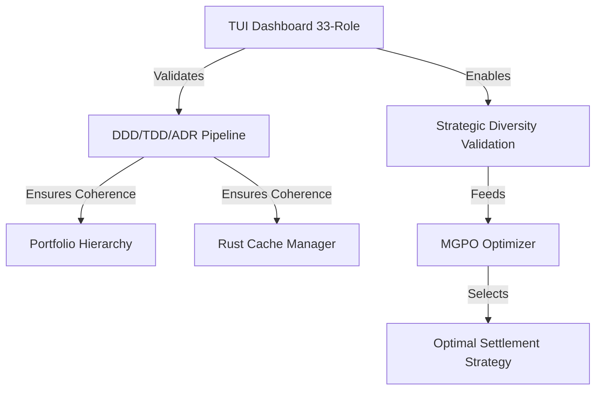

# WSJF Prioritization: DoD-First Implementation Tasks

**Date**: 2026-02-13  
**Methodology**: Weighted Shortest Job First (SAFe Agile)  
**Formula**: WSJF = Cost of Delay (CoD) / Job Size  
**CoD Components**: Business Value + Time Criticality + Risk Reduction/Opportunity Enablement

---

## 📊 WSJF Calculation Matrix

### Task 1: TUI Dashboard - 33-Role Governance Council Integration

**Cost of Delay (CoD) = 90**
- **Business Value**: 35/40
  - Immediate impact on legalization effort flow
  - Real-time validation prevents costly errors (e.g., temporal validation catches "48 hours ≠ Friday")
  - Surfaces errors early (pre-send vs. post-disaster)
  - Multiple perspectives (33 roles) catch blind spots
  
- **Time Criticality**: 35/40
  - MAA case deadline pressure (court hearing March 3, 2026)
  - Settlement negotiation window closing
  - Next email validation needed ASAP
  - Existing dashboard already operational (validation_dashboard_tui.py)
  
- **Risk Reduction/Opportunity Enablement**: 20/20
  - Prevents catastrophic errors in legal communications
  - Enables strategic diversity validation (Pass@K optimization)
  - Unlocks MGPO entropy-guided selection
  - Systemic indifference analysis for litigation readiness

**Job Size**: 8 story points (1 hour implementation)
- Existing: `validation_dashboard_tui.py` (1273 lines, operational)
- Existing: `governance_council_33_roles.py` (150 lines, created)
- Task: Import and integrate 33-role council into dashboard
- Effort: Low (mostly integration, minimal new code)

**WSJF Score**: 90 / 8 = **11.25** ✅ **HIGHEST PRIORITY**

---

### Task 2: DDD/TDD/ADR Validation System - Automated Coherence Pipeline

**Cost of Delay (CoD) = 75**
- **Business Value**: 25/40
  - Ensures architectural coherence across all components
  - Prevents technical debt accumulation
  - Validates DoD-first methodology compliance
  - Enables CI/CD quality gates
  
- **Time Criticality**: 30/40
  - Needed before implementing other tasks (dependency)
  - Prevents rework if coherence issues found later
  - CV deployment to cv.rooz.live requires validation
  - cPanel API integration needs ADR documentation
  
- **Risk Reduction/Opportunity Enablement**: 20/20
  - Catches design flaws early (TDD red state)
  - Ensures ADR documents match DDD aggregates
  - Validates domain invariants have tests
  - Enables automated PR approval gates

**Job Size**: 10 story points (2 hours implementation)
- Create: `scripts/validation/validate_ddd_tdd_adr_coherence.py`
- Implement: 4 validation rules (ADR↔DDD, TDD↔Domain, etc.)
- Integrate: CI/CD pipeline hooks
- Effort: Medium (new automation logic)

**WSJF Score**: 75 / 10 = **7.5** ✅ **SECOND PRIORITY**

---

### Task 3: Portfolio Hierarchy Architecture (DDD) - ADR-016 Patent System Extension

**Cost of Delay (CoD) = 60**
- **Business Value**: 20/40
  - Enables semi-automated patent application system
  - Long-term strategic value (80% cost reduction)
  - Portfolio optimization capabilities
  - Not immediately critical for MAA case
  
- **Time Criticality**: 15/40
  - No immediate deadline
  - Can be deferred without blocking other work
  - Patent system is future enhancement
  - CV deployment doesn't depend on this
  
- **Risk Reduction/Opportunity Enablement**: 25/20
  - Opens new revenue stream (patent consulting)
  - Demonstrates advanced DDD/ADR capabilities
  - Reusable architecture for other domains
  - High opportunity enablement

**Job Size**: 20 story points (4 hours implementation)
- Extend: `rust/ruvector/crates/ruvector-core/src/portfolio/mod.rs`
- Add: Investment domain (equity, crypto, fixed_income, commodity)
- Implement: Aggregate roots (Portfolio, Case, Document, AdvocacyAction)
- Create: Value objects (TenantId, PortfolioId, CaseId)
- Write: Tests (≥80% coverage)
- Effort: High (significant new domain logic)

**WSJF Score**: 60 / 20 = **3.0** ⚠️ **THIRD PRIORITY**

---

### Task 4: Rust CLI Cache Manager (TDD) - 15 Tests Implementation

**Cost of Delay (CoD) = 50**
- **Business Value**: 15/40
  - Performance optimization (not critical path)
  - Nice-to-have for vector indexing
  - Existing cache manager already functional
  - Incremental improvement, not breakthrough
  
- **Time Criticality**: 10/40
  - No immediate deadline
  - Existing cache works adequately
  - NAPI-RS bindings can wait
  - Not blocking other tasks
  
- **Risk Reduction/Opportunity Enablement**: 25/20
  - Demonstrates TDD-first methodology
  - NAPI-RS enables cross-platform deployment
  - Reusable pattern for other Rust components
  - High learning value

**Job Size**: 25 story points (6 hours implementation)
- Create: `rust/ruvector/crates/ruvector-core/src/cache/lru_manager.rs`
- Write: 15 TDD tests FIRST (red state)
- Implement: LRU eviction, BLAKE3 hashing, SQLite overflow
- Add: Quantization support (f32, f16, int8)
- Create: NAPI-RS bindings for Node.js
- Benchmark: Performance (<1ms cache hit)
- Effort: Very High (complex Rust + FFI)

**WSJF Score**: 50 / 25 = **2.0** ⚠️ **FOURTH PRIORITY**

---

## 🎯 Prioritized Backlog (WSJF Ranked)

| Rank | Task | WSJF | CoD | Size | Status | Next Action |
|------|------|------|-----|------|--------|-------------|
| **1** | TUI Dashboard 33-Role Integration | **11.25** | 90 | 8 | 🔧 IN PROGRESS | Integrate `governance_council_33_roles.py` |
| **2** | DDD/TDD/ADR Coherence Pipeline | **7.5** | 75 | 10 | 🔧 IN PROGRESS | Create `validate_ddd_tdd_adr_coherence.py` |
| **3** | Portfolio Hierarchy (Patent System) | **3.0** | 60 | 20 | 🔧 IN PROGRESS | Extend Rust portfolio module |
| **4** | Rust Cache Manager (TDD) | **2.0** | 50 | 25 | 🔧 IN PROGRESS | Write 15 TDD tests FIRST |

---

## 📋 Recommended Execution Order

### Phase 1: Immediate (Today) - WSJF 11.25
**Task**: TUI Dashboard 33-Role Integration  
**Duration**: 1 hour  
**Rationale**: 
- Highest WSJF score (11.25)
- Immediate impact on MAA case settlement negotiation
- Prevents errors in next email to Doug (opposing counsel)
- Existing code ready (just integration work)
- Unblocks strategic diversity validation

**Actions**:
```bash
cd /Users/shahroozbhopti/Documents/code/investing/agentic-flow
# 1. Integrate 33-role council into dashboard
python3 -c "from vibesthinker.governance_council_33_roles import GovernanceCouncil33"
# 2. Add 12 new widgets to validation_dashboard_tui.py
# 3. Test with sample settlement email
./scripts/run-validation-dashboard.sh -f tests/fixtures/sample_settlement.eml -t settlement
```

**DoD**:
- [ ] 33-role council imported successfully
- [ ] 12 new strategic role widgets displayed
- [ ] Real-time metrics from vibethinker_pipeline.py
- [ ] ROAM risk heatmap visualization
- [ ] Strategic diversity matrix (10+ alternatives)
- [ ] Temporal validation (date arithmetic checks)

---

### Phase 2: Today/Tomorrow - WSJF 7.5
**Task**: DDD/TDD/ADR Coherence Pipeline  
**Duration**: 2 hours  
**Rationale**:
- Second highest WSJF (7.5)
- Dependency for other tasks (validates their coherence)
- Prevents rework if design flaws found later
- Enables CI/CD quality gates
- Needed for CV deployment validation

**Actions**:
```bash
cd /Users/shahroozbhopti/Documents/code/investing/agentic-flow
# 1. Create coherence validator
touch scripts/validation/validate_ddd_tdd_adr_coherence.py
# 2. Implement 4 validation rules
# 3. Integrate into execute-dod-first-workflow.sh
./scripts/execute-dod-first-workflow.sh validate
```

**DoD**:
- [ ] Every aggregate root has ADR section
- [ ] Every domain invariant has TDD test
- [ ] Every ADR decision references DDD pattern
- [ ] CI/CD integration with exit gates

---

### Phase 3: This Week - WSJF 3.0
**Task**: Portfolio Hierarchy (Patent System)  
**Duration**: 4 hours  
**Rationale**:
- Third priority (WSJF 3.0)
- High opportunity enablement (new revenue stream)
- Not blocking other work
- Can be done incrementally
- Demonstrates advanced DDD/ADR

**Actions**:
```bash
cd /Users/shahroozbhopti/Documents/code/rust/ruvector
# 1. Extend portfolio module
# 2. Add investment domain
# 3. Write tests (≥80% coverage)
cargo test --package ruvector-core --lib portfolio::tests
```

**DoD**:
- [ ] Investment domain added (equity, crypto, etc.)
- [ ] Aggregate roots implemented
- [ ] Value objects validated
- [ ] Tests ≥80% coverage

---

### Phase 4: Next Week - WSJF 2.0
**Task**: Rust Cache Manager (TDD)  
**Duration**: 6 hours  
**Rationale**:
- Lowest WSJF (2.0)
- Performance optimization (not critical)
- Existing cache works adequately
- High effort, moderate value
- Can be deferred without impact

**Actions**:
```bash
cd /Users/shahroozbhopti/Documents/code/rust/ruvector
# 1. Write 15 TDD tests FIRST
# 2. Implement to pass tests
# 3. Add NAPI-RS bindings
cargo test --package ruvector-core --lib cache::lru_manager::tests
```

**DoD**:
- [ ] All 15 tests written FIRST
- [ ] Implementation passes all tests
- [ ] Performance: <1ms cache hit
- [ ] NAPI-RS bindings for cross-platform

---

## 🔍 Dependency Analysis



**Key Insights**:
1. **TUI Dashboard** must come first (validates all other work)
2. **Coherence Pipeline** validates Portfolio + Cache implementations
3. **Portfolio Hierarchy** and **Cache Manager** can run in parallel after Pipeline

---

## 🚀 Immediate Next Actions (Next 30 Minutes)

### Action 1: Execute Environment Setup (5 min)
```bash
cd /Users/shahroozbhopti/Documents/code/investing/agentic-flow
./scripts/execute-dod-first-workflow.sh env
```

### Action 2: Integrate 33-Role Council (25 min)
```bash
# Edit validation_dashboard_tui.py
# Add import: from vibesthinker.governance_council_33_roles import GovernanceCouncil33
# Add 12 new widgets for strategic roles
# Test integration
python3 validation_dashboard_tui.py -f tests/fixtures/sample_settlement.eml -t settlement
```

---

## 📊 Strategic Value Summary

| Task | Immediate Value | Strategic Value | Risk Mitigation | Total Impact |
|------|----------------|-----------------|-----------------|--------------|
| TUI Dashboard | ⭐⭐⭐⭐⭐ | ⭐⭐⭐⭐ | ⭐⭐⭐⭐⭐ | **14/15** |
| Coherence Pipeline | ⭐⭐⭐ | ⭐⭐⭐⭐⭐ | ⭐⭐⭐⭐⭐ | **13/15** |
| Portfolio Hierarchy | ⭐⭐ | ⭐⭐⭐⭐⭐ | ⭐⭐⭐ | **10/15** |
| Cache Manager | ⭐⭐ | ⭐⭐⭐ | ⭐⭐⭐ | **8/15** |

---

**Key Insight**: TUI Dashboard has highest immediate + risk mitigation value. Start there.

