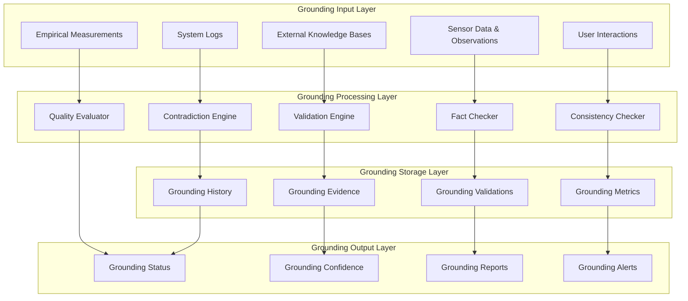

# DreamLab AI Metaverse Ontology - Robust Grounding Protocols

**Status:** Technical Specification
**Owner:** Architect
**Date:** 2025-11-24
**Context:** Comprehensive grounding protocols for knowledge representation and validation in DreamLab AI Metaverse Ontology integration.

## Overview

Grounding protocols ensure that ontological concepts and relationships are anchored to verifiable reality, providing the foundation for trustworthy AI reasoning and decision-making in the metaverse context. This specification defines robust mechanisms for semantic validation, fact-checking, and continuous improvement.

## Grounding Framework Architecture



## Core Grounding Components

### 1. Validation Engine

```typescript
interface GroundingValidationEngine {
  // Core validation methods
  validateEntity(entity: MetaverseEntity): Promise<ValidationResult>;
  validateRelationship(relationship: OntologyRelationship): Promise<ValidationResult>;
  validateProperty(property: OntologyProperty): Promise<ValidationResult>;
  
  // Batch validation
  validateBatch(entities: MetaverseEntity[], relationships: OntologyRelationship[]): Promise<BatchValidationResult>;
  
  // Continuous validation
  enableContinuousValidation(config: ContinuousValidationConfig): void;
  disableContinuousValidation(): void;
}

class DreamLabValidationEngine implements GroundingValidationEngine {
  private knowledgeBases: KnowledgeBase[];
  private factCheckers: FactChecker[];
  private consistencyChecker: ConsistencyChecker;
  private contradictionDetector: ContradictionDetector;
  
  async validateEntity(entity: MetaverseEntity): Promise<ValidationResult> {
    const validations = await Promise.all([
      this.validateAgainstKnowledgeBases(entity),
      this.validateWithFactCheckers(entity),
      this.checkInternalConsistency(entity),
      this.detectContradictions(entity)
    ]);
    
    const overallResult = this.combineValidationResults(validations);
    
    // Store validation result
    await this.storeValidationResult({
      entityId: entity.id,
      result: overallResult,
      timestamp: new Date(),
      evidence: this.extractEvidence(validations)
    });
    
    return overallResult;
  }
  
  private async validateAgainstKnowledgeBases(entity: MetaverseEntity): Promise<KnowledgeBaseValidation> {
    const results = await Promise.all(
      this.knowledgeBases.map(kb => kb.validateEntity(entity))
    );
    
    const supportingEvidence = results.filter(r => r.isValid);
    const contradictingEvidence = results.filter(r => !r.isValid);
    
    return {
      isValid: supportingEvidence.length > contradictingEvidence.length,
      confidence: this.calculateKnowledgeBaseConfidence(results),
      supportingEvidence,
      contradictingEvidence,
      recommendations: this.generateKnowledgeBaseRecommendations(results)
    };
  }
  
  private async validateWithFactCheckers(entity: MetaverseEntity): Promise<FactCheckValidation> {
    const claims = this.extractClaimsFromEntity(entity);
    const factChecks = await Promise.all(
      claims.map(claim => this.factCheckers.map(fc => fc.checkClaim(claim)))
    );
    
    const flatResults = factChecks.flat();
    const verifiedClaims = flatResults.filter(fc => fc.verified);
    const debunkedClaims = flatResults.filter(fc => !fc.verified);
    
    return {
      isValid: verifiedClaims.length >= debunkedClaims.length,
      confidence: this.calculateFactCheckConfidence(flatResults),
      verifiedClaims,
      debunkedClaims,
      unknownClaims: flatResults.filter(fc => fc.verified === null)
    };
  }
}
```

### 2. Fact Checker Implementation

```typescript
interface FactChecker {
  checkClaim(claim: Claim): Promise<FactCheckResult>;
  getSourceReliability(source: string): Promise<number>;
  updateKnowledgeBase(claims: Claim[]): Promise<void>;
}

class MultiSourceFactChecker implements FactChecker {
  private sources: FactCheckSource[];
  private cache: Map<string, FactCheckResult>;
  
  async checkClaim(claim: Claim): Promise<FactCheckResult> {
    const cacheKey = this.generateCacheKey(claim);
    
    // Check cache first
    if (this.cache.has(cacheKey)) {
      return this.cache.get(cacheKey)!;
    }
    
    // Check against multiple sources
    const results = await Promise.all(
      this.sources.map(source => source.checkClaim(claim))
    );
    
    // Aggregate results
    const aggregatedResult = this.aggregateFactCheckResults(results);
    
    // Cache result
    this.cache.set(cacheKey, aggregatedResult);
    
    return aggregatedResult;
  }
  
  private aggregateFactCheckResults(results: FactCheckResult[]): FactCheckResult {
    const verified = results.filter(r => r.verified);
    const debunked = results.filter(r => r.verified === false);
    const unknown = results.filter(r => r.verified === null);
    
    // Weight by source reliability
    const verifiedWeight = verified.reduce((sum, r) => sum + r.sourceReliability, 0);
    const debunkedWeight = debunked.reduce((sum, r) => sum + r.sourceReliability, 0);
    const unknownWeight = unknown.reduce((sum, r) => sum + r.sourceReliability, 0);
    
    const totalWeight = verifiedWeight + debunkedWeight + unknownWeight;
    
    return {
      claim: results[0].claim,
      verified: verifiedWeight > debunkedWeight,
      confidence: Math.abs(verifiedWeight - debunkedWeight) / totalWeight,
      sourceCount: results.length,
      verifiedSources: verified,
      debunkedSources: debunked,
      unknownSources: unknown,
      aggregatedWeight: { verified: verifiedWeight, debunked: debunkedWeight, unknown: unknownWeight }
    };
  }
}
```

### 3. Consistency Checker

```typescript
interface ConsistencyChecker {
  checkInternalConsistency(entity: MetaverseEntity): Promise<ConsistencyResult>;
  checkExternalConsistency(entity: MetaverseEntity, context: OntologyContext): Promise<ConsistencyResult>;
  checkLogicalConsistency(entities: MetaverseEntity[], relationships: OntologyRelationship[]): Promise<ConsistencyResult>;
}

class SemanticConsistencyChecker implements ConsistencyChecker {
  private reasoningEngine: ReasoningEngine;
  private constraintValidator: ConstraintValidator;
  private ontologyRules: OntologyRule[];
  
  async checkInternalConsistency(entity: MetaverseEntity): Promise<ConsistencyResult> {
    const inconsistencies: Inconsistency[] = [];
    
    // Check property constraints
    const propertyInconsistencies = await this.checkPropertyConstraints(entity);
    inconsistencies.push(...propertyInconsistencies);
    
    // Check semantic coherence
    const semanticInconsistencies = await this.checkSemanticCoherence(entity);
    inconsistencies.push(...semanticInconsistencies);
    
    // Check type constraints
    const typeInconsistencies = await this.checkTypeConstraints(entity);
    inconsistencies.push(...typeInconsistencies);
    
    return {
      isConsistent: inconsistencies.length === 0,
      inconsistencies,
      confidence: this.calculateConsistencyConfidence(inconsistencies),
      recommendations: this.generateConsistencyRecommendations(inconsistencies)
    };
  }
  
  private async checkPropertyConstraints(entity: MetaverseEntity): Promise<Inconsistency[]> {
    const inconsistencies: Inconsistency[] = [];
    const constraints = await this.constraintValidator.getConstraintsForType(entity.type);
    
    for (const constraint of constraints) {
      const violation = await constraint.validate(entity.properties);
      if (violation) {
        inconsistencies.push({
          type: 'property_constraint_violation',
          severity: violation.severity,
          description: violation.description,
          property: violation.property,
          expectedValue: violation.expected,
          actualValue: entity.properties[violation.property],
          recommendation: violation.recommendation
        });
      }
    }
    
    return inconsistencies;
  }
  
  private async checkSemanticCoherence(entity: MetaverseEntity): Promise<Inconsistency[]> {
    const inconsistencies: Inconsistency[] = [];
    
    // Check for contradictory semantic tags
    const contradictoryTags = await this.findContradictoryTags(entity.semanticContext.tags);
    if (contradictoryTags.length > 0) {
      inconsistencies.push({
        type: 'contradictory_tags',
        severity: 'medium',
        description: 'Entity contains contradictory semantic tags',
        tags: contradictoryTags,
        recommendation: 'Remove or resolve contradictory tags'
      });
    }
    
    // Check category coherence
    const categoryInconsistencies = await this.checkCategoryCoherence(entity);
    inconsistencies.push(...categoryInconsistencies);
    
    return inconsistencies;
  }
}
```

### 4. Contradiction Detection Engine

```typescript
interface ContradictionDetector {
  detectEntityContradictions(entity: MetaverseEntity, ontology: Ontology): Promise<Contradiction[]>;
  detectRelationshipContradictions(relationship: OntologyRelationship, ontology: Ontology): Promise<Contradiction[]>;
  detectSystemContradictions(ontology: Ontology): Promise<SystemContradiction[]>;
}

class OntologyContradictionDetector implements ContradictionDetector {
  private reasoningEngine: ReasoningEngine;
  private contradictionRules: ContradictionRule[];
  
  async detectEntityContradictions(entity: MetaverseEntity, ontology: Ontology): Promise<Contradiction[]> {
    const contradictions: Contradiction[] = [];
    
    // Find related entities
    const relatedEntities = await ontology.getRelatedEntities(entity.id);
    
    // Check against related entities
    for (const related of relatedEntities) {
      const entityContradictions = await this.checkEntityContradiction(entity, related);
      contradictions.push(...entityContradictions);
    }
    
    // Check against ontology rules
    const ruleContradictions = await this.checkRuleContradictions(entity, ontology);
    contradictions.push(...ruleContradictions);
    
    // Check temporal contradictions
    const temporalContradictions = await this.checkTemporalContradictions(entity, relatedEntities);
    contradictions.push(...temporalContradictions);
    
    return contradictions;
  }
  
  private async checkEntityContradiction(entity1: MetaverseEntity, entity2: MetaverseEntity): Promise<Contradiction[]> {
    const contradictions: Contradiction[] = [];
    
    // Check property contradictions
    const propertyContradictions = await this.findPropertyContradictions(entity1, entity2);
    contradictions.push(...propertyContradictions);
    
    // Check relationship contradictions
    const relationshipContradictions = await this.findRelationshipContradictions(entity1, entity2);
    contradictions.push(...relationshipContradictions);
    
    // Check semantic contradictions
    const semanticContradictions = await this.findSemanticContradictions(entity1, entity2);
    contradictions.push(...semanticContradictions);
    
    return contradictions;
  }
  
  private async findPropertyContradictions(entity1: MetaverseEntity, entity2: MetaverseEntity): Promise<Contradiction[]> {
    const contradictions: Contradiction[] = [];
    
    for (const [property, value1] of Object.entries(entity1.properties)) {
      if (property in entity2.properties) {
        const value2 = entity2.properties[property];
        const contradiction = await this.checkPropertyValueContradiction(property, value1, value2);
        
        if (contradiction) {
          contradictions.push({
            type: 'property_contradiction',
            severity: contradiction.severity,
            entity1: entity1.id,
            entity2: entity2.id,
            property,
            value1,
            value2,
            description: contradiction.description,
            resolution: contradiction.resolution
          });
        }
      }
    }
    
    return contradictions;
  }
}
```

## Grounding Quality Metrics

### 1. Quality Assessment Framework

```typescript
interface GroundingQualityAssessment {
  overallScore: number;
  dimensions: QualityDimension[];
  recommendations: QualityRecommendation[];
  trend: QualityTrend;
}

interface QualityDimension {
  name: string;
  score: number;
  weight: number;
  contributingFactors: string[];
  improvementSuggestions: string[];
}

class GroundingQualityAssessor {
  private qualityMetrics: QualityMetric[];
  private assessmentHistory: QualityAssessment[];
  
  async assessGroundingQuality(entity: MetaverseEntity): Promise<GroundingQualityAssessment> {
    const dimensions = await this.evaluateQualityDimensions(entity);
    const overallScore = this.calculateOverallScore(dimensions);
    const trend = this.calculateQualityTrend(entity.id);
    const recommendations = this.generateQualityRecommendations(dimensions);
    
    const assessment: GroundingQualityAssessment = {
      overallScore,
      dimensions,
      recommendations,
      trend
    };
    
    // Store assessment
    await this.storeQualityAssessment(entity.id, assessment);
    
    return assessment;
  }
  
  private async evaluateQualityDimensions(entity: MetaverseEntity): Promise<QualityDimension[]> {
    const dimensions: QualityDimension[] = [];
    
    // Evidence strength dimension
    const evidenceStrength = await this.assessEvidenceStrength(entity);
    dimensions.push({
      name: 'evidence_strength',
      score: evidenceStrength.score,
      weight: 0.25,
      contributingFactors: evidenceStrength.factors,
      improvementSuggestions: evidenceStrength.suggestions
    });
    
    // Consistency dimension
    const consistency = await this.assessConsistency(entity);
    dimensions.push({
      name: 'consistency',
      score: consistency.score,
      weight: 0.20,
      contributingFactors: consistency.factors,
      improvementSuggestions: consistency.suggestions
    });
    
    // Verifiability dimension
    const verifiability = await this.assessVerifiability(entity);
    dimensions.push({
      name: 'verifiability',
      score: verifiability.score,
      weight: 0.20,
      contributingFactors: verifiability.factors,
      improvementSuggestions: verifiability.suggestions
    });
    
    // Semantic coherence dimension
    const semanticCoherence = await this.assessSemanticCoherence(entity);
    dimensions.push({
      name: 'semantic_coherence',
      score: semanticCoherence.score,
      weight: 0.15,
      contributingFactors: semanticCoherence.factors,
      improvementSuggestions: semanticCoherence.suggestions
    });
    
    // Temporal validity dimension
    const temporalValidity = await this.assessTemporalValidity(entity);
    dimensions.push({
      name: 'temporal_validity',
      score: temporalValidity.score,
      weight: 0.10,
      contributingFactors: temporalValidity.factors,
      improvementSuggestions: temporalValidity.suggestions
    });
    
    // Source reliability dimension
    const sourceReliability = await this.assessSourceReliability(entity);
    dimensions.push({
      name: 'source_reliability',
      score: sourceReliability.score,
      weight: 0.10,
      contributingFactors: sourceReliability.factors,
      improvementSuggestions: sourceReliability.suggestions
    });
    
    return dimensions;
  }
  
  private calculateOverallScore(dimensions: QualityDimension[]): number {
    return dimensions.reduce((sum, dim) => sum + (dim.score * dim.weight), 0);
  }
}
```

### 2. Continuous Improvement Mechanisms

```typescript
interface ContinuousImprovementEngine {
  enableContinuousImprovement(config: ContinuousImprovementConfig): void;
  analyzeGroundingPatterns(): Promise<GroundingPattern[]>;
  implementImprovements(improvements: GroundingImprovement[]): Promise<ImprovementResult>;
  monitorImprovementEffectiveness(): Promise<EffectivenessReport>;
}

class GroundingContinuousImprovement implements ContinuousImprovementEngine {
  private patternAnalyzer: GroundingPatternAnalyzer;
  private improvementImplementer: ImprovementImplementer;
  private effectivenessMonitor: EffectivenessMonitor;
  
  async analyzeGroundingPatterns(): Promise<GroundingPattern[]> {
    // Collect recent grounding data
    const recentGroundings = await this.getRecentGroundingData(30); // Last 30 days
    
    // Analyze patterns
    const patterns = await this.patternAnalyzer.analyzePatterns(recentGroundings);
    
    // Identify improvement opportunities
    const improvements = await this.identifyImprovementOpportunities(patterns);
    
    return patterns;
  }
  
  private async identifyImprovementOpportunities(patterns: GroundingPattern[]): Promise<GroundingImprovement[]> {
    const improvements: GroundingImprovement[] = [];
    
    // Find common failure patterns
    const failurePatterns = patterns.filter(p => p.type === 'failure');
    const commonFailures = this.findCommonPatterns(failurePatterns);
    
    for (const failure of commonFailures) {
      improvements.push({
        type: 'prevent_failure',
        priority: this.calculateFailurePriority(failure),
        description: `Address common failure pattern: ${failure.description}`,
        implementation: this.generateFailurePreventionPlan(failure),
        expectedImpact: this.estimateFailurePreventionImpact(failure)
      });
    }
    
    // Find quality degradation patterns
    const qualityPatterns = patterns.filter(p => p.type === 'quality_degradation');
    const qualityIssues = this.findCommonPatterns(qualityPatterns);
    
    for (const issue of qualityIssues) {
      improvements.push({
        type: 'improve_quality',
        priority: this.calculateQualityPriority(issue),
        description: `Address quality issue: ${issue.description}`,
        implementation: this.generateQualityImprovementPlan(issue),
        expectedImpact: this.estimateQualityImprovementImpact(issue)
      });
    }
    
    return improvements.sort((a, b) => b.priority - a.priority);
  }
  
  async implementImprovements(improvements: GroundingImprovement[]): Promise<ImprovementResult> {
    const results: ImprovementResult[] = [];
    
    for (const improvement of improvements) {
      try {
        const result = await this.improvementImplementer.implement(improvement);
        results.push(result);
        
        // Monitor implementation
        await this.effectivenessMonitor.startMonitoring(improvement.id, result);
        
      } catch (error) {
        results.push({
          improvementId: improvement.id,
          success: false,
          error: error.message,
          timestamp: new Date()
        });
      }
    }
    
    return {
      totalImprovements: improvements.length,
      successfulImplementations: results.filter(r => r.success).length,
      failedImplementations: results.filter(r => !r.success).length,
      results
    };
  }
}
```

## Grounding Protocol Implementation

### 1. Real-time Grounding Pipeline

```typescript
class RealTimeGroundingPipeline {
  private validationEngine: GroundingValidationEngine;
  private factChecker: FactChecker;
  private consistencyChecker: ConsistencyChecker;
  private contradictionDetector: ContradictionDetector;
  private qualityAssessor: GroundingQualityAssessor;
  
  async processEntityUpdate(entity: MetaverseEntity): Promise<GroundingResult> {
    // Start grounding process
    const groundingId = this.generateGroundingId();
    const startTime = Date.now();
    
    try {
      // Step 1: Initial validation
      const validationResult = await this.validationEngine.validateEntity(entity);
      
      // Step 2: Fact checking
      const factCheckResult = await this.factChecker.checkEntity(entity);
      
      // Step 3: Consistency checking
      const consistencyResult = await this.consistencyChecker.checkInternalConsistency(entity);
      
      // Step 4: Contradiction detection
      const contradictionResult = await this.contradictionDetector.detectEntityContradictions(
        entity, await this.getCurrentOntology()
      );
      
      // Step 5: Quality assessment
      const qualityAssessment = await this.qualityAssessor.assessGroundingQuality(entity);
      
      // Step 6: Aggregate results
      const groundingResult = this.aggregateGroundingResults({
        groundingId,
        entity,
        validationResult,
        factCheckResult,
        consistencyResult,
        contradictionResult,
        qualityAssessment,
        processingTime: Date.now() - startTime
      });
      
      // Step 7: Store grounding result
      await this.storeGroundingResult(groundingResult);
      
      // Step 8: Trigger alerts if needed
      await this.triggerGroundingAlerts(groundingResult);
      
      return groundingResult;
      
    } catch (error) {
      const errorResult = this.createErrorResult(groundingId, entity, error);
      await this.storeGroundingResult(errorResult);
      throw error;
    }
  }
  
  private aggregateGroundingResults(results: GroundingStepResults): GroundingResult {
    const overallStatus = this.determineOverallStatus(results);
    const overallConfidence = this.calculateOverallConfidence(results);
    const groundingLevel = this.determineGroundingLevel(overallStatus, overallConfidence);
    
    return {
      groundingId: results.groundingId,
      entityId: results.entity.id,
      status: overallStatus,
      confidence: overallConfidence,
      groundingLevel,
      validationResults: {
        validation: results.validationResult,
        factCheck: results.factCheckResult,
        consistency: results.consistencyResult,
        contradictions: results.contradictionResult,
        quality: results.qualityAssessment
      },
      processingTime: results.processingTime,
      timestamp: new Date(),
      recommendations: this.generateRecommendations(results)
    };
  }
  
  private determineGroundingLevel(status: string, confidence: number): GroundingLevel {
    if (status === 'valid' && confidence >= 0.9) {
      return GroundingLevel.FULLY_GROUNDED;
    } else if (status === 'valid' && confidence >= 0.7) {
      return GroundingLevel.PARTIALLY_GROUNDED;
    } else if (status === 'warning') {
      return GroundingLevel.GROUNDED_WITH_RESERVATIONS;
    } else {
      return GroundingLevel.UNGROUNDED;
    }
  }
}
```

### 2. Batch Grounding Processor

```typescript
class BatchGroundingProcessor {
  private pipeline: RealTimeGroundingPipeline;
  private batchSize: number = 100;
  private concurrency: number = 10;
  
  async processBatch(entities: MetaverseEntity[]): Promise<BatchGroundingResult> {
    const batches = this.createBatches(entities, this.batchSize);
    const results: GroundingResult[] = [];
    
    // Process batches concurrently
    const batchPromises = batches.map(async (batch, index) => {
      return this.processBatchWithRetry(batch, index);
    });
    
    const batchResults = await Promise.all(batchPromises);
    const flatResults = batchResults.flat();
    
    // Generate batch summary
    const summary = this.generateBatchSummary(flatResults);
    
    return {
      totalEntities: entities.length,
      processedEntities: flatResults.length,
      successfulGroundings: flatResults.filter(r => r.status === 'valid').length,
      failedGroundings: flatResults.filter(r => r.status === 'error').length,
      results: flatResults,
      summary,
      processingTime: Date.now() - Date.now()
    };
  }
  
  private async processBatchWithRetry(batch: MetaverseEntity[], batchIndex: number): Promise<GroundingResult[]> {
    const maxRetries = 3;
    let attempt = 0;
    
    while (attempt < maxRetries) {
      try {
        const batchPromises = batch.map(entity => this.pipeline.processEntityUpdate(entity));
        return await Promise.all(batchPromises);
        
      } catch (error) {
        attempt++;
        if (attempt >= maxRetries) {
          console.error(`Batch ${batchIndex} failed after ${maxRetries} attempts:`, error);
          return batch.map(entity => this.createErrorResult(entity, error));
        }
        
        // Exponential backoff
        await this.delay(Math.pow(2, attempt) * 1000);
      }
    }
    
    return [];
  }
  
  private generateBatchSummary(results: GroundingResult[]): BatchSummary {
    const groundingLevels = results.reduce((acc, result) => {
      acc[result.groundingLevel] = (acc[result.groundingLevel] || 0) + 1;
      return acc;
    }, {} as Record<GroundingLevel, number>);
    
    const averageConfidence = results.reduce((sum, r) => sum + r.confidence, 0) / results.length;
    const averageProcessingTime = results.reduce((sum, r) => sum + r.processingTime, 0) / results.length;
    
    return {
      groundingLevels,
      averageConfidence,
      averageProcessingTime,
      totalProcessingTime: results.reduce((sum, r) => sum + r.processingTime, 0),
      qualityDistribution: this.calculateQualityDistribution(results)
    };
  }
}
```

## Integration with Existing Systems

### 1. AgentDB Grounding Integration

```typescript
class AgentDBGroundingIntegration {
  private agentdb: AgentDB;
  private groundingPipeline: RealTimeGroundingPipeline;
  private batchProcessor: BatchGroundingProcessor;
  
  constructor(agentdb: AgentDB, groundingConfig: GroundingConfig) {
    this.agentdb = agentdb;
    this.groundingPipeline = new RealTimeGroundingPipeline(groundingConfig);
    this.batchProcessor = new BatchGroundingProcessor(groundingConfig);
    
    // Set up AgentDB hooks for automatic grounding
    this.setupGroundingHooks();
  }
  
  private setupGroundingHooks(): void {
    // Hook into entity creation
    this.agentdb.on('entity_created', async (entity) => {
      await this.groundingPipeline.processEntityUpdate(entity);
    });
    
    // Hook into entity updates
    this.agentdb.on('entity_updated', async (entity) => {
      await this.groundingPipeline.processEntityUpdate(entity);
    });
    
    // Hook into relationship creation
    this.agentdb.on('relationship_created', async (relationship) => {
      await this.groundRelationship(relationship);
    });
    
    // Schedule periodic batch processing
    this.schedulePeriodicGrounding();
  }
  
  async groundRelationship(relationship: OntologyRelationship): Promise<GroundingResult> {
    // Convert relationship to entity-like structure for grounding
    const relationshipEntity = this.relationshipToEntity(relationship);
    
    return await this.groundingPipeline.processEntityUpdate(relationshipEntity);
  }
  
  private schedulePeriodicGrounding(): void {
    // Run batch grounding every hour
    setInterval(async () => {
      await this.runPeriodicBatchGrounding();
    }, 60 * 60 * 1000); // 1 hour
  }
  
  private async runPeriodicBatchGrounding(): Promise<void> {
    // Get ungrounded entities
    const ungroundedEntities = await this.agentdb.query(`
      SELECT * FROM metaverse_entities 
      WHERE grounding_status = 'ungrounded' OR grounding_status = 'validation_pending'
      LIMIT 1000
    `);
    
    if (ungroundedEntities.length > 0) {
      const batchResult = await this.batchProcessor.processBatch(ungroundedEntities);
      
      // Update AgentDB with grounding results
      for (const result of batchResult.results) {
        await this.agentdb.update('metaverse_entities', result.entityId, {
          grounding_status: result.groundingLevel,
          grounding_confidence: result.confidence,
          last_grounding: result.timestamp
        });
      }
      
      console.log(`Periodic grounding completed: ${batchResult.summary}`);
    }
  }
}
```

### 2. ReasoningBank Grounding Enhancement

```typescript
class ReasoningBankGroundingEnhancement {
  private reasoningBank: ReasoningBank;
  private groundingPipeline: RealTimeGroundingPipeline;
  
  constructor(reasoningBank: ReasoningBank, groundingConfig: GroundingConfig) {
    this.reasoningBank = reasoningBank;
    this.groundingPipeline = new RealTimeGroundingPipeline(groundingConfig);
    
    this.enhancePatternExtraction();
    this.enhancePatternMatching();
  }
  
  private enhancePatternExtraction(): void {
    // Override pattern extraction to include grounding validation
    const originalExtractPattern = this.reasoningBank.extractPattern.bind(this.reasoningBank);
    
    this.reasoningBank.extractPattern = async (trajectory: AgentTrajectory) => {
      const pattern = await originalExtractPattern(trajectory);
      
      // Ground the pattern
      const patternEntity = this.patternToEntity(pattern);
      const groundingResult = await this.groundingPipeline.processEntityUpdate(patternEntity);
      
      // Enhance pattern with grounding information
      return {
        ...pattern,
        groundingStatus: groundingResult.status,
        groundingConfidence: groundingResult.confidence,
        groundingLevel: groundingResult.groundingLevel,
        groundingRecommendations: groundingResult.recommendations
      };
    };
  }
  
  private enhancePatternMatching(): void {
    // Override pattern matching to prefer grounded patterns
    const originalMatchPatterns = this.reasoningBank.matchPatterns.bind(this.reasoningBank);
    
    this.reasoningBank.matchPatterns = async (query: string, options: PatternMatchOptions) => {
      const matches = await originalMatchPatterns(query, options);
      
      // Boost scores for well-grounded patterns
      const enhancedMatches = matches.map(match => ({
        ...match,
        enhancedScore: this.calculateGroundingEnhancedScore(match),
        groundingBoost: this.calculateGroundingBoost(match)
      }));
      
      // Re-sort by enhanced scores
      return enhancedMatches.sort((a, b) => b.enhancedScore - a.enhancedScore);
    };
  }
  
  private calculateGroundingEnhancedScore(match: PatternMatch): number {
    const baseScore = match.score;
    const groundingBonus = this.calculateGroundingBonus(match);
    
    return baseScore + groundingBonus;
  }
  
  private calculateGroundingBonus(match: PatternMatch): number {
    if (!match.groundingLevel) return 0;
    
    switch (match.groundingLevel) {
      case GroundingLevel.FULLY_GROUNDED:
        return 0.2; // 20% bonus
      case GroundingLevel.PARTIALLY_GROUNDED:
        return 0.1; // 10% bonus
      case GroundingLevel.GROUNDED_WITH_RESERVATIONS:
        return 0.05; // 5% bonus
      default:
        return 0;
    }
  }
}
```

## Monitoring and Alerting

### 1. Grounding Monitoring Dashboard

```typescript
class GroundingMonitoringDashboard {
  private metricsCollector: MetricsCollector;
  private alertManager: AlertManager;
  private reportGenerator: ReportGenerator;
  
  async generateDashboardData(): Promise<DashboardData> {
    const timeRange = { start: new Date(Date.now() - 24 * 60 * 60 * 1000), end: new Date() }; // Last 24 hours
    
    const metrics = await Promise.all([
      this.getGroundingVolumeMetrics(timeRange),
      this.getGroundingQualityMetrics(timeRange),
      this.getGroundingPerformanceMetrics(timeRange),
      this.getGroundingTrendMetrics(timeRange)
    ]);
    
    return {
      volume: metrics[0],
      quality: metrics[1],
      performance: metrics[2],
      trends: metrics[3],
      alerts: await this.getActiveAlerts(),
      recommendations: await this.generateRecommendations()
    };
  }
  
  private async getGroundingQualityMetrics(timeRange: TimeRange): Promise<QualityMetrics> {
    const groundingResults = await this.metricsCollector.getGroundingResults(timeRange);
    
    const groundingLevels = groundingResults.reduce((acc, result) => {
      acc[result.groundingLevel] = (acc[result.groundingLevel] || 0) + 1;
      return acc;
    }, {} as Record<GroundingLevel, number>);
    
    const averageConfidence = groundingResults.reduce((sum, r) => sum + r.confidence, 0) / groundingResults.length;
    const qualityDistribution = this.calculateQualityDistribution(groundingResults);
    
    return {
      groundingLevels,
      averageConfidence,
      qualityDistribution,
      totalProcessed: groundingResults.length,
      qualityScore: this.calculateOverallQualityScore(groundingResults)
    };
  }
  
  private async generateRecommendations(): Promise<Recommendation[]> {
    const recommendations: Recommendation[] = [];
    
    // Check for quality degradation
    const qualityTrend = await this.getQualityTrend(7); // Last 7 days
    if (qualityTrend.direction === 'decreasing') {
      recommendations.push({
        type: 'quality_improvement',
        priority: 'high',
        title: 'Grounding Quality Degradation Detected',
        description: 'Average grounding quality has decreased over the past week',
        actions: [
          'Review recent knowledge base updates',
          'Check fact checker configurations',
          'Validate consistency rules'
        ]
      });
    }
    
    // Check for performance issues
    const performanceTrend = await this.getPerformanceTrend(7);
    if (performanceTrend.averageProcessingTime > 100) { // 100ms threshold
      recommendations.push({
        type: 'performance_optimization',
        priority: 'medium',
        title: 'Grounding Performance Issues',
        description: 'Average grounding processing time exceeds acceptable thresholds',
        actions: [
          'Optimize validation rules',
          'Increase caching',
          'Consider scaling processing resources'
        ]
      });
    }
    
    return recommendations;
  }
}
```

This comprehensive grounding protocols specification provides the foundation for robust knowledge validation and continuous improvement in the DreamLab AI Metaverse Ontology integration, ensuring reliable and trustworthy semantic reasoning capabilities.