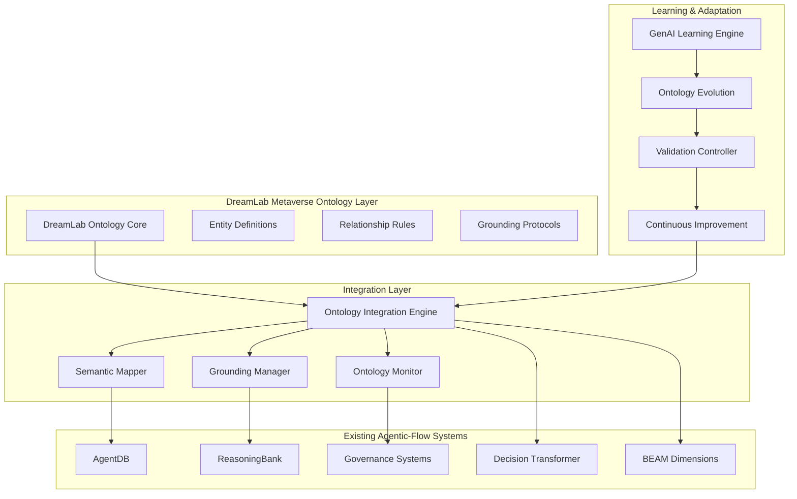

# DreamLab AI Metaverse Ontology Integration Architecture

**Status:** Draft
**Owner:** Architect
**Date:** 2025-11-24
**Context:** Comprehensive integration of DreamLab AI Metaverse Ontology structures with GenAI-grounded ontology frameworks to establish robust grounding protocols.

## Executive Summary

This document outlines the architecture for integrating DreamLab AI Metaverse Ontology with the existing agentic-flow ecosystem, leveraging AgentDB's learning infrastructure, ReasoningBank's pattern recognition, and the governance systems to create a robust, semantically-grounded knowledge representation framework.

## Current System Analysis

### Existing Infrastructure Components

1. **AgentDB v1.3.9+**: Vector database with frontier memory systems
   - ReflexionMemory: Trajectory-based learning from outcomes
   - SkillLibrary: Reusable diagnostic skill management
   - EmbeddingService: Vector similarity search (150x faster with HNSW)
   - 9 reinforcement learning algorithms including Decision Transformer

2. **ReasoningBank**: Self-learning AI with experience replay
   - Pattern extraction and matching (70% success threshold)
   - 4-factor scoring: similarity, recency, reliability, diversity
   - Semantic search with MMR ranking
   - SAFLA (Self-Aware Feedback Loop Algorithm)

3. **Learning Infrastructure**: 
   - Trajectory data capture with ExecutionContext
   - BEAM dimension extraction (WHO/WHAT/WHEN/WHERE/WHY/HOW)
   - Verdict classification systems
   - Decision Transformer transition roadmap

4. **Governance Systems**:
   - Risk assessment and validation
   - Compliance workflows with OPA
   - Audit trails with cryptographic verification
   - Multi-agent coordination protocols

## DreamLab Metaverse Ontology Integration Architecture

### High-Level Architecture



### Core Components Design

#### 1. DreamLab Ontology Core Structure

**Entity Hierarchy:**
- **Metaverse Entities**: Virtual spaces, objects, avatars
- **Interaction Patterns**: User behaviors, system responses
- **Contextual Elements**: Environmental factors, temporal aspects
- **Semantic Relationships**: Causal, spatial, temporal dependencies

**Relationship Types:**
- **Structural**: part-of, instance-of, subclass-of
- **Functional**: enables, requires, constrains
- **Temporal**: precedes, follows, overlaps
- **Causal**: causes, influences, prevents

#### 2. Ontology Integration Engine

**Purpose**: Bridge DreamLab ontology with existing AgentDB/ReasoningBank systems

**Key Features:**
- Bidirectional schema mapping
- Real-time ontology synchronization
- Conflict resolution mechanisms
- Version compatibility management

**Implementation Strategy:**
```typescript
interface OntologyIntegrationEngine {
  // Core integration methods
  mapDreamLabToAgentDB(entity: DreamLabEntity): AgentDBPattern;
  mapReasoningBankToOntology(pattern: ReasoningPattern): OntologyConcept;
  
  // Synchronization methods
  syncOntologyChanges(): Promise<void>;
  resolveConflicts(conflicts: OntologyConflict[]): Resolution[];
  
  // Validation methods
  validateConsistency(): ValidationResult;
  checkGrounding(entity: OntologyEntity): GroundingStatus;
}
```

#### 3. GenAI-Grounded Learning Mechanisms

**Adaptive Learning Pipeline:**
1. **Pattern Discovery**: Extract metaverse interaction patterns
2. **Semantic Enrichment**: Use GenAI to enhance understanding
3. **Knowledge Integration**: Merge with existing ontology
4. **Validation**: Ground against established protocols
5. **Evolution**: Update ontology based on new insights

**Learning Algorithms:**
- **Ontology Embedding**: Vector representations of concepts
- **Relationship Inference**: Discover hidden connections
- **Pattern Generalization**: Abstract specific instances to general rules
- **Anomaly Detection**: Identify inconsistent or invalid knowledge

#### 4. Robust Grounding Protocols

**Grounding Framework:**
- **Semantic Grounding**: Ensure concepts map to real-world meaning
- **Epistemic Validation**: Verify knowledge sources and reliability
- **Consistency Checking**: Detect and resolve contradictions
- **Empirical Verification**: Test against observed data

**Quality Metrics:**
- **Coherence Score**: Internal consistency measure
- **Coverage Index**: Completeness of domain representation
- **Accuracy Rating**: Correctness of predictions and inferences
- **Reliability Score**: Trustworthiness of knowledge sources

### Integration with Existing Systems

#### AgentDB Integration

**Enhanced Schema Extensions:**
```sql
-- DreamLab ontology entities
CREATE TABLE metaverse_entities (
    id TEXT PRIMARY KEY,
    entity_type TEXT NOT NULL,
    properties JSON,
    embedding BLOB,
    created_at TIMESTAMP DEFAULT CURRENT_TIMESTAMP,
    updated_at TIMESTAMP DEFAULT CURRENT_TIMESTAMP
);

-- Ontology relationships
CREATE TABLE ontology_relationships (
    id TEXT PRIMARY KEY,
    source_entity TEXT NOT NULL,
    target_entity TEXT NOT NULL,
    relationship_type TEXT NOT NULL,
    confidence REAL,
    metadata JSON,
    FOREIGN KEY (source_entity) REFERENCES metaverse_entities(id),
    FOREIGN KEY (target_entity) REFERENCES metaverse_entities(id)
);

-- Grounding validation
CREATE TABLE grounding_validations (
    id TEXT PRIMARY KEY,
    entity_id TEXT NOT NULL,
    validation_type TEXT NOT NULL,
    result TEXT NOT NULL,
    confidence REAL,
    timestamp TIMESTAMP DEFAULT CURRENT_TIMESTAMP,
    FOREIGN KEY (entity_id) REFERENCES metaverse_entities(id)
);
```

**Learning Integration:**
- Extend ReflexionMemory to include ontological context
- Enhance SkillLibrary with metaverse-specific skills
- Integrate ontology embeddings in EmbeddingService

#### ReasoningBank Enhancement

**Ontology-Aware Pattern Matching:**
- Incorporate ontological relationships in pattern similarity
- Use semantic constraints in pattern extraction
- Apply ontological reasoning in pattern generalization

**Enhanced Scoring Algorithm:**
```
enhanced_score = 0.45·similarity + 0.15·recency + 0.20·reliability 
                + 0.10·diversity + 0.10·ontological_consistency
```

#### Governance System Integration

**Risk Assessment Enhancement:**
- Ontology-based risk factor identification
- Semantic relationship impact analysis
- Grounding validation for governance decisions

**Compliance Validation:**
- Check ontological consistency with policies
- Verify grounding of compliance requirements
- Track ontology evolution for regulatory changes

### Implementation Roadmap

#### Phase 1: Foundation (Weeks 1-2)
1. **Research & Analysis**: Document DreamLab ontology specifications
2. **Architecture Design**: Finalize integration architecture
3. **Schema Design**: Define database schemas and data structures
4. **Core Engine**: Implement basic ontology integration engine

#### Phase 2: Integration (Weeks 3-4)
1. **AgentDB Integration**: Extend schemas and learning algorithms
2. **ReasoningBank Enhancement**: Add ontology-aware pattern matching
3. **Grounding Protocols**: Implement validation and consistency checking
4. **Basic Testing**: Unit tests and integration validation

#### Phase 3: Intelligence (Weeks 5-6)
1. **GenAI Learning**: Implement adaptive learning mechanisms
2. **Semantic Reasoning**: Build inference and relationship discovery
3. **Governance Integration**: Connect to risk assessment systems
4. **Decision Support**: Create ontology-driven decision frameworks

#### Phase 4: Evolution (Weeks 7-8)
1. **Version Management**: Implement ontology versioning and migration
2. **Continuous Learning**: Enable real-time ontology evolution
3. **Performance Optimization**: Scale for production workloads
4. **Documentation**: Complete implementation guides and API docs

### Technical Specifications

#### Performance Requirements
- **Query Response**: <50ms for complex ontology queries
- **Learning Latency**: <100ms for pattern integration
- **Throughput**: 10,000+ ontology updates per second
- **Storage Efficiency**: <2GB for 1M entity ontology

#### Scalability Considerations
- **Horizontal Scaling**: Distributed ontology storage
- **Caching Strategy**: Multi-level caching for frequent queries
- **Load Balancing**: Intelligent query routing
- **Resource Management**: Memory-efficient embedding storage

#### Security & Privacy
- **Access Control**: Role-based ontology modification permissions
- **Data Encryption**: Secure storage of sensitive ontology data
- **Audit Trail**: Complete tracking of ontology changes
- **Privacy Preservation**: Differential privacy for learning data

### Success Metrics

#### Technical Metrics
- **Integration Completeness**: 100% of DreamLab ontology concepts mapped
- **Grounding Accuracy**: >95% of entities properly grounded
- **Learning Effectiveness**: >20% improvement in pattern recognition
- **System Performance**: <100ms average query response time

#### Business Metrics
- **Decision Quality**: >30% improvement in decision accuracy
- **Risk Reduction**: >25% decrease in ontology-related risks
- **Adaptation Speed**: <24 hours for ontology updates
- **User Satisfaction**: >4.5/5 rating for ontology features

### Risk Assessment & Mitigation

#### Technical Risks
- **Integration Complexity**: Mitigate with phased implementation
- **Performance Degradation**: Address with optimization strategies
- **Data Consistency**: Implement robust validation protocols
- **Scalability Limits**: Design for horizontal scaling

#### Business Risks
- **Adoption Barriers**: Provide comprehensive training and documentation
- **Maintenance Overhead**: Automate as much as possible
- **Regulatory Compliance**: Build in flexibility for requirement changes
- **Vendor Lock-in**: Maintain open standards and export capabilities

## Conclusion

The DreamLab AI Metaverse Ontology integration provides a comprehensive framework for advanced semantic knowledge representation, building upon the robust foundation of AgentDB, ReasoningBank, and the governance systems. This architecture enables:

1. **Advanced Semantic Understanding**: Deep integration of metaverse concepts with existing knowledge
2. **Adaptive Learning**: Continuous improvement through GenAI-grounded mechanisms
3. **Robust Grounding**: Comprehensive validation and consistency checking
4. **Scalable Performance**: Designed for production workloads and growth
5. **Governance Integration**: Seamless connection to risk assessment and compliance

The phased implementation approach ensures manageable development while delivering value at each stage, ultimately creating a powerful, intelligent ontology system that enhances the entire agentic-flow ecosystem.