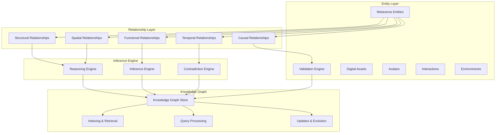

# DreamLab AI Metaverse Ontology - Semantic Relationship Mapping & Inference

**Status:** Technical Specification
**Owner:** Architect
**Date:** 2025-11-24
**Context:** Comprehensive semantic relationship mapping and inference capabilities for DreamLab AI Metaverse Ontology integration.

## Overview

Semantic relationship mapping and inference enables the DreamLab ontology to understand complex connections between metaverse entities, discover hidden relationships, and make intelligent inferences about user behaviors, system interactions, and environmental contexts. This system provides the foundation for advanced reasoning and decision-making in the metaverse.

## Semantic Relationship Architecture



## Core Relationship Types

### 1. Structural Relationships

```typescript
interface StructuralRelationship {
  id: string;
  type: StructuralRelationType;
  sourceEntity: string;
  targetEntity: string;
  properties: StructuralProperties;
  confidence: number;
  temporalContext: TemporalContext;
}

enum StructuralRelationType {
  PART_OF = 'part_of',           // Component relationships
  INSTANCE_OF = 'instance_of',       // Class instantiation
  SUBCLASS_OF = 'subclass_of',       // Taxonomic hierarchy
  CONTAINS = 'contains',           // Spatial containment
  COMPOSED_OF = 'composed_of',      // Composition relationships
  IMPLEMENTS = 'implements',         // Interface implementation
  EXTENDS = 'extends',             // Inheritance
  DEPENDS_ON = 'depends_on',        // Dependency relationships
  ASSOCIATED_WITH = 'associated_with'  // General association
}

interface StructuralProperties {
  cardinality?: Cardinality;
  transitivity?: boolean;
  symmetry?: boolean;
  reflexivity?: boolean;
  constraints?: RelationshipConstraint[];
  metadata?: Record<string, any>;
}

enum Cardinality {
  ONE_TO_ONE = '1:1',
  ONE_TO_MANY = '1:n',
  MANY_TO_ONE = 'n:1',
  MANY_TO_MANY = 'n:n'
}

class StructuralRelationshipProcessor {
  async inferStructuralRelationships(entity: MetaverseEntity, context: OntologyContext): Promise<InferredRelationship[]> {
    const relationships: InferredRelationship[] = [];
    
    // Infer based on entity type and properties
    const typeInferences = await this.inferFromEntityType(entity);
    relationships.push(...typeInferences);
    
    // Infer based on spatial context
    const spatialInferences = await this.inferFromSpatialContext(entity, context);
    relationships.push(...spatialInferences);
    
    // Infer based on behavioral patterns
    const behavioralInferences = await this.inferFromBehavioralPatterns(entity, context);
    relationships.push(...behavioralInferences);
    
    // Validate and score inferences
    const validatedRelationships = await this.validateInferences(relationships);
    
    return validatedRelationships;
  }
  
  private async inferFromEntityType(entity: MetaverseEntity): Promise<InferredRelationship[]> {
    const inferences: InferredRelationship[] = [];
    
    switch (entity.type) {
      case MetaverseEntityType.VIRTUAL_SPACE:
        // Virtual spaces are typically parts of larger environments
        inferences.push({
          type: StructuralRelationType.PART_OF,
          targetEntity: await this.findParentEnvironment(entity),
          confidence: 0.7,
          reasoning: 'Virtual spaces are typically contained within larger environments'
        });
        
        // May implement specific space types
        if (entity.properties.spaceType) {
          const prototype = await this.findPrototypeEntity(entity.properties.spaceType);
          if (prototype) {
            inferences.push({
              type: StructuralRelationType.INSTANCE_OF,
              targetEntity: prototype.id,
              confidence: 0.9,
              reasoning: `Entity implements ${entity.properties.spaceType} prototype`
            });
          }
        }
        break;
        
      case MetaverseEntityType.DIGITAL_ASSET:
        // Assets are typically contained in spaces
        inferences.push({
          type: StructuralRelationType.CONTAINS,
          targetEntity: await this.findContainingSpace(entity),
          confidence: 0.8,
          reasoning: 'Digital assets are typically contained within virtual spaces'
        });
        break;
        
      case MetaverseEntityType.AVATAR:
        // Avatars represent users and have associated assets
        inferences.push({
          type: StructuralRelationType.INSTANCE_OF,
          targetEntity: await this.findUserPrototype(entity),
          confidence: 0.9,
          reasoning: 'Avatars are instances of user representations'
        });
        break;
    }
    
    return inferences;
  }
}
```

### 2. Functional Relationships

```typescript
interface FunctionalRelationship {
  id: string;
  type: FunctionalRelationType;
  sourceEntity: string;
  targetEntity: string;
  properties: FunctionalProperties;
  confidence: number;
  effectiveness: number;
  temporalContext: TemporalContext;
}

enum FunctionalRelationType {
  ENABLES = 'enables',             // Enablement relationships
  REQUIRES = 'requires',           // Prerequisite relationships
  CONSTRAINS = 'constrains',         // Constraint relationships
  MODIFIES = 'modifies',           // Modification relationships
  TRIGGERS = 'triggers',           // Trigger relationships
  ENHANCES = 'enhances',           // Enhancement relationships
  SUPPORTS = 'supports',             // Support relationships
  FACILITATES = 'facilitates',       // Facilitation relationships
  REGULATES = 'regulates',           // Regulation relationships
  OPTIMIZES = 'optimizes'           // Optimization relationships
}

interface FunctionalProperties {
  strength?: number;           // Relationship strength (0-1)
  duration?: number;            // Effect duration in milliseconds
  conditions?: Condition[];       // Activation conditions
  sideEffects?: SideEffect[];     // Side effects
  priority?: number;            // Relationship priority
  reversibility?: boolean;       // Whether relationship is reversible
}

class FunctionalRelationshipProcessor {
  async inferFunctionalRelationships(interaction: MetaverseInteraction, context: OntologyContext): Promise<InferredRelationship[]> {
    const relationships: InferredRelationship[] = [];
    
    // Analyze interaction patterns
    const interactionPatterns = await this.analyzeInteractionPatterns(interaction);
    relationships.push(...interactionPatterns);
    
    // Analyze system responses
    const systemResponses = await this.analyzeSystemResponses(interaction, context);
    relationships.push(...systemResponses);
    
    // Analyze user behavior sequences
    const behaviorSequences = await this.analyzeBehaviorSequences(interaction, context);
    relationships.push(...behaviorSequences);
    
    return relationships;
  }
  
  private async analyzeInteractionPatterns(interaction: MetaverseInteraction): Promise<InferredRelationship[]> {
    const relationships: InferredRelationship[] = [];
    
    // Extract action-object relationships
    const action = interaction.action;
    const object = interaction.object;
    const subject = interaction.subject;
    
    // Infer enablement relationships
    if (this.isEnablingAction(action)) {
      relationships.push({
        type: FunctionalRelationType.ENABLES,
        sourceEntity: subject.id,
        targetEntity: object.id,
        confidence: 0.8,
        reasoning: `${action} enables access to ${object.type}`,
        properties: {
          strength: this.calculateActionStrength(action, interaction),
          duration: interaction.duration
        }
      });
    }
    
    // Infer requirement relationships
    if (this.isPrerequisiteAction(action)) {
      relationships.push({
        type: FunctionalRelationType.REQUIRES,
        sourceEntity: subject.id,
        targetEntity: object.id,
        confidence: 0.7,
        reasoning: `${action} requires ${object.type} to be available`,
        properties: {
          conditions: this.extractPrerequisiteConditions(interaction)
        }
      });
    }
    
    // Infer modification relationships
    if (this.isModifyingAction(action)) {
      relationships.push({
        type: FunctionalRelationType.MODIFIES,
        sourceEntity: subject.id,
        targetEntity: object.id,
        confidence: 0.9,
        reasoning: `${action} modifies ${object.type}`,
        properties: {
          reversibility: this.isReversibleModification(action, interaction)
        }
      });
    }
    
    return relationships;
  }
  
  private async analyzeSystemResponses(interaction: MetaverseInteraction, context: OntologyContext): Promise<InferredRelationship[]> {
    const relationships: InferredRelationship[] = [];
    
    // Analyze system state changes
    const stateChanges = await this.detectStateChanges(interaction, context);
    
    for (const change of stateChanges) {
      if (change.type === 'activation') {
        relationships.push({
          type: FunctionalRelationType.TRIGGERS,
          sourceEntity: interaction.subject.id,
          targetEntity: change.activatedEntity,
          confidence: 0.8,
          reasoning: `${interaction.action} triggered activation of ${change.activatedEntity.type}`,
          properties: {
            strength: change.activationStrength,
            conditions: change.activationConditions
          }
        });
      } else if (change.type === 'enhancement') {
        relationships.push({
          type: FunctionalRelationType.ENHANCES,
          sourceEntity: interaction.subject.id,
          targetEntity: change.enhancedEntity,
          confidence: 0.7,
          reasoning: `${interaction.action} enhanced ${change.enhancedEntity.type}`,
          properties: {
            strength: change.enhancementAmount,
            duration: change.enhancementDuration
          }
        });
      }
    }
    
    return relationships;
  }
}
```

### 3. Temporal Relationships

```typescript
interface TemporalRelationship {
  id: string;
  type: TemporalRelationType;
  sourceEntity: string;
  targetEntity: string;
  properties: TemporalProperties;
  confidence: number;
  temporalContext: TemporalContext;
}

enum TemporalRelationType {
  PRECEDES = 'precedes',           // Before relationships
  FOLLOWS = 'follows',             // After relationships
  OVERLAPS = 'overlaps',           // Overlapping time periods
  DURING = 'during',               // Contained within time period
  CONCURRENT = 'concurrent',           // Simultaneous occurrence
  SEQUENTIAL = 'sequential',          // Sequential occurrence
  PERIODIC = 'periodic',            // Periodic occurrence
  CAUSAL_CHAIN = 'causal_chain'      // Causal sequence
}

interface TemporalProperties {
  startTime?: Date;
  endTime?: Date;
  duration?: number;              // Duration in milliseconds
  frequency?: number;             // Occurrence frequency
  interval?: number;              // Time between occurrences
  phase?: TemporalPhase;        // Phase in temporal cycle
  seasonality?: SeasonalityPattern; // Seasonal patterns
}

class TemporalRelationshipProcessor {
  async inferTemporalRelationships(events: MetaverseEvent[], context: OntologyContext): Promise<InferredRelationship[]> {
    const relationships: InferredRelationship[] = [];
    
    // Analyze event sequences
    const sequences = await this.analyzeEventSequences(events);
    relationships.push(...sequences);
    
    // Analyze temporal patterns
    const patterns = await this.analyzeTemporalPatterns(events);
    relationships.push(...patterns);
    
    // Analyze periodic behaviors
    const periodicBehaviors = await this.analyzePeriodicBehaviors(events);
    relationships.push(...periodicBehaviors);
    
    return relationships;
  }
  
  private async analyzeEventSequences(events: MetaverseEvent[]): Promise<InferredRelationship[]> {
    const relationships: InferredRelationship[] = [];
    const sortedEvents = events.sort((a, b) => a.timestamp.getTime() - b.timestamp.getTime());
    
    // Find sequential relationships
    for (let i = 0; i < sortedEvents.length - 1; i++) {
      const currentEvent = sortedEvents[i];
      const nextEvent = sortedEvents[i + 1];
      
      // Check for causal or sequential relationships
      const causalStrength = await this.calculateCausalStrength(currentEvent, nextEvent);
      
      if (causalStrength > 0.7) {
        relationships.push({
          type: TemporalRelationType.CAUSAL_CHAIN,
          sourceEntity: currentEvent.entityId,
          targetEntity: nextEvent.entityId,
          confidence: causalStrength,
          reasoning: `Strong causal relationship detected between events`,
          properties: {
            startTime: currentEvent.timestamp,
            endTime: nextEvent.timestamp,
            duration: nextEvent.timestamp.getTime() - currentEvent.timestamp.getTime()
          }
        });
      } else if (causalStrength > 0.4) {
        relationships.push({
          type: TemporalRelationType.SEQUENTIAL,
          sourceEntity: currentEvent.entityId,
          targetEntity: nextEvent.entityId,
          confidence: causalStrength,
          reasoning: `Sequential relationship detected between events`,
          properties: {
            startTime: currentEvent.timestamp,
            endTime: nextEvent.timestamp,
            duration: nextEvent.timestamp.getTime() - currentEvent.timestamp.getTime()
          }
        });
      }
    }
    
    return relationships;
  }
  
  private async analyzeTemporalPatterns(events: MetaverseEvent[]): Promise<InferredRelationship[]> {
    const relationships: InferredRelationship[] = [];
    
    // Group events by entities
    const entityEvents = this.groupEventsByEntity(events);
    
    // Analyze patterns for each entity
    for (const [entityId, entityEventList] of entityEvents.entries()) {
      const patterns = await this.detectEntityPatterns(entityId, entityEventList);
      
      for (const pattern of patterns) {
        if (pattern.type === 'periodic') {
          relationships.push({
            type: TemporalRelationType.PERIODIC,
            sourceEntity: entityId,
            targetEntity: pattern.relatedEntity,
            confidence: pattern.confidence,
            reasoning: `Periodic pattern detected: ${pattern.description}`,
            properties: {
              frequency: pattern.frequency,
              interval: pattern.interval,
              phase: pattern.phase
            }
          });
        } else if (pattern.type === 'concurrent') {
          relationships.push({
            type: TemporalRelationType.CONCURRENT,
            sourceEntity: entityId,
            targetEntity: pattern.relatedEntity,
            confidence: pattern.confidence,
            reasoning: `Concurrent occurrence pattern detected`,
            properties: {
              startTime: pattern.startTime,
              endTime: pattern.endTime,
              duration: pattern.duration
            }
          });
        }
      }
    }
    
    return relationships;
  }
  
  private async detectEntityPatterns(entityId: string, events: MetaverseEvent[]): Promise<EntityPattern[]> {
    const patterns: EntityPattern[] = [];
    
    // Detect periodic patterns
    const periodicPattern = await this.detectPeriodicPattern(events);
    if (periodicPattern) {
      patterns.push(periodicPattern);
    }
    
    // Detect concurrent patterns
    const concurrentPatterns = await this.detectConcurrentPatterns(events);
    patterns.push(...concurrentPatterns);
    
    // Detect sequential patterns
    const sequentialPatterns = await this.detectSequentialPatterns(events);
    patterns.push(...sequentialPatterns);
    
    return patterns;
  }
}
```

### 4. Causal Relationships

```typescript
interface CausalRelationship {
  id: string;
  type: CausalRelationType;
  sourceEntity: string;
  targetEntity: string;
  properties: CausalProperties;
  confidence: number;
  strength: number;
  temporalContext: TemporalContext;
}

enum CausalRelationType {
  CAUSES = 'causes',             // Direct causation
  INFLUENCES = 'influences',       // Influence relationships
  PREVENTS = 'prevents',           // Prevention relationships
  MEDIATES = 'mediates',           // Mediation relationships
  ENABLES = 'enables',             // Enablement through causation
  INHIBITS = 'inhibits',           // Inhibition relationships
  ACCELERATES = 'accelerates',       // Acceleration relationships
  DELAYS = 'delays',               // Delay relationships
  MODULATES = 'modulates'           // Modulation relationships
}

interface CausalProperties {
  mechanism?: CausalMechanism;    // Causal mechanism
  strength?: number;              // Causal strength (0-1)
  latency?: number;               // Effect latency in milliseconds
  duration?: number;              // Effect duration
  conditions?: CausalCondition[];  // Causal conditions
  probability?: number;            // Causal probability
  necessity?: CausalNecessity;    // Necessity of cause
}

class CausalRelationshipProcessor {
  async inferCausalRelationships(interactions: MetaverseInteraction[], context: OntologyContext): Promise<InferredRelationship[]> {
    const relationships: InferredRelationship[] = [];
    
    // Analyze intervention patterns
    const interventions = await this.analyzeInterventions(interactions);
    relationships.push(...interventions);
    
    // Analyze correlation patterns
    const correlations = await this.analyzeCorrelations(interactions);
    relationships.push(...correlations);
    
    // Analyze counterfactual scenarios
    const counterfactuals = await this.analyzeCounterfactuals(interactions);
    relationships.push(...counterfactuals);
    
    return relationships;
  }
  
  private async analyzeInterventions(interactions: MetaverseInteraction[]): Promise<InferredRelationship[]> {
    const relationships: InferredRelationship[] = [];
    
    // Find intervention points
    const interventionPoints = await this.identifyInterventionPoints(interactions);
    
    for (const intervention of interventionPoints) {
      const causalStrength = await this.calculateInterventionCausalStrength(intervention);
      
      if (causalStrength > 0.6) {
        relationships.push({
          type: CausalRelationType.CAUSES,
          sourceEntity: intervention.interventionEntity,
          targetEntity: intervention.affectedEntity,
          confidence: causalStrength,
          reasoning: `Intervention analysis shows causal relationship`,
          properties: {
            mechanism: intervention.mechanism,
            strength: causalStrength,
            latency: intervention.effectLatency,
            duration: intervention.effectDuration,
            probability: intervention.effectProbability
          }
        });
      } else if (causalStrength > 0.3) {
        relationships.push({
          type: CausalRelationType.INFLUENCES,
          sourceEntity: intervention.interventionEntity,
          targetEntity: intervention.affectedEntity,
          confidence: causalStrength,
          reasoning: `Intervention analysis shows influence relationship`,
          properties: {
            mechanism: intervention.mechanism,
            strength: causalStrength,
            conditions: intervention.influenceConditions
          }
        });
      }
    }
    
    return relationships;
  }
  
  private async analyzeCorrelations(interactions: MetaverseInteraction[]): Promise<InferredRelationship[]> {
    const relationships: InferredRelationship[] = [];
    
    // Calculate correlation matrices
    const correlationMatrix = await this.calculateCorrelationMatrix(interactions);
    
    // Identify significant correlations
    const significantCorrelations = await this.identifySignificantCorrelations(correlationMatrix);
    
    for (const correlation of significantCorrelations) {
      // Test for causal direction
      const causalDirection = await this.testCausalDirection(correlation);
      
      if (causalDirection.confidence > 0.7) {
        relationships.push({
          type: CausalRelationType.CAUSES,
          sourceEntity: causalDirection.cause,
          targetEntity: causalDirection.effect,
          confidence: causalDirection.confidence,
          reasoning: `Statistical analysis supports causal relationship`,
          properties: {
            mechanism: CausalMechanism.STATISTICAL_CORRELATION,
            strength: correlation.strength,
            probability: causalDirection.probability
          }
        });
      } else if (correlation.strength > 0.5) {
        relationships.push({
          type: CausalRelationType.INFLUENCES,
          sourceEntity: correlation.entity1,
          targetEntity: correlation.entity2,
          confidence: correlation.strength,
          reasoning: `Strong correlation suggests influence relationship`,
          properties: {
            mechanism: CausalMechanism.CORRELATION,
            strength: correlation.strength
          }
        });
      }
    }
    
    return relationships;
  }
  
  private async testCausalDirection(correlation: EntityCorrelation): Promise<CausalDirection> {
    // Use Granger causality test
    const grangerTest = await this.performGrangerCausalityTest(correlation);
    
    // Use intervention analysis
    const interventionTest = await this.performInterventionAnalysis(correlation);
    
    // Use temporal precedence test
    const temporalTest = await this.performTemporalPrecedenceTest(correlation);
    
    // Combine evidence
    const combinedEvidence = this.combineCausalEvidence({
      granger: grangerTest,
      intervention: interventionTest,
      temporal: temporalTest
    });
    
    return {
      cause: combinedEvidence.cause,
      effect: combinedEvidence.effect,
      confidence: combinedEvidence.confidence,
      probability: combinedEvidence.probability,
      evidence: combinedEvidence
    };
  }
}
```

## Inference Engine

### 1. Core Reasoning Engine

```typescript
interface InferenceEngine {
  inferRelationships(entities: MetaverseEntity[], context: OntologyContext): Promise<InferredRelationship[]>;
  validateInferences(relationships: InferredRelationship[]): Promise<ValidationResult>;
  rankInferences(relationships: InferredRelationship[]): Promise<RankedInference[]>;
  explainInference(inference: InferredRelationship): Promise<Explanation>;
}

class DreamLabInferenceEngine implements InferenceEngine {
  private relationshipProcessors: RelationshipProcessor[];
  private knowledgeGraph: KnowledgeGraph;
  private reasoningRules: ReasoningRule[];
  private confidenceCalculator: ConfidenceCalculator;
  
  constructor(config: InferenceEngineConfig) {
    this.relationshipProcessors = [
      new StructuralRelationshipProcessor(config.structural),
      new FunctionalRelationshipProcessor(config.functional),
      new TemporalRelationshipProcessor(config.temporal),
      new CausalRelationshipProcessor(config.causal)
    ];
    
    this.knowledgeGraph = new KnowledgeGraph(config.knowledgeGraph);
    this.reasoningRules = config.reasoningRules;
    this.confidenceCalculator = new ConfidenceCalculator(config.confidence);
  }
  
  async inferRelationships(entities: MetaverseEntity[], context: OntologyContext): Promise<InferredRelationship[]> {
    const allInferences: InferredRelationship[] = [];
    
    // Run all relationship processors
    for (const processor of this.relationshipProcessors) {
      const inferences = await processor.inferRelationships(entities, context);
      allInferences.push(...inferences);
    }
    
    // Apply reasoning rules
    const ruleBasedInferences = await this.applyReasoningRules(entities, context, allInferences);
    allInferences.push(...ruleBasedInferences);
    
    // Resolve conflicts and contradictions
    const resolvedInferences = await this.resolveConflicts(allInferences);
    
    // Calculate confidence scores
    const scoredInferences = await this.calculateConfidenceScores(resolvedInferences);
    
    // Filter by confidence threshold
    const filteredInferences = scoredInferences.filter(inf => inf.confidence >= 0.3);
    
    return filteredInferences;
  }
  
  private async applyReasoningRules(entities: MetaverseEntity[], context: OntologyContext, existingInferences: InferredRelationship[]): Promise<InferredRelationship[]> {
    const ruleInferences: InferredRelationship[] = [];
    
    for (const rule of this.reasoningRules) {
      if (await rule.isApplicable(entities, context, existingInferences)) {
        const ruleInferences = await rule.apply(entities, context, existingInferences);
        ruleInferences.push(...ruleInferences);
      }
    }
    
    return ruleInferences;
  }
  
  private async resolveConflicts(inferences: InferredRelationship[]): Promise<InferredRelationship[]> {
    const conflicts = await this.detectConflicts(inferences);
    const resolved: InferredRelationship[] = [];
    
    for (const conflict of conflicts) {
      const resolution = await this.resolveConflict(conflict);
      resolved.push(...resolution.resolvedInferences);
    }
    
    // Add non-conflicting inferences
    const nonConflicting = inferences.filter(inf => 
      !conflicts.some(conf => conflict.inferences.includes(inf))
    );
    
    return [...nonConflicting, ...resolved];
  }
  
  async calculateConfidenceScores(inferences: InferredRelationship[]): Promise<InferredRelationship[]> {
    for (const inference of inferences) {
      inference.confidence = await this.confidenceCalculator.calculate(inference);
    }
    
    return inferences;
  }
}
```

### 2. Knowledge Graph Integration

```typescript
class OntologyKnowledgeGraph {
  private graphStore: GraphDatabase;
  private indexingService: IndexingService;
  private queryProcessor: QueryProcessor;
  private evolutionManager: EvolutionManager;
  
  constructor(config: KnowledgeGraphConfig) {
    this.graphStore = new GraphDatabase(config.database);
    this.indexingService = new IndexingService(config.indexing);
    this.queryProcessor = new QueryProcessor(config.querying);
    this.evolutionManager = new EvolutionManager(config.evolution);
  }
  
  async addRelationship(relationship: InferredRelationship): Promise<void> {
    // Validate relationship
    const validation = await this.validateRelationship(relationship);
    if (!validation.isValid) {
      throw new Error(`Invalid relationship: ${validation.errors.join(', ')}`);
    }
    
    // Add to graph store
    await this.graphStore.addRelationship({
      id: relationship.id,
      source: relationship.sourceEntity,
      target: relationship.targetEntity,
      type: relationship.type,
      properties: relationship.properties,
      confidence: relationship.confidence,
      timestamp: new Date()
    });
    
    // Update indexes
    await this.indexingService.updateIndexes(relationship);
    
    // Trigger evolution if needed
    await this.evolutionManager.checkForEvolution(relationship);
  }
  
  async queryRelationships(query: RelationshipQuery): Promise<QueryResult[]> {
    // Optimize query
    const optimizedQuery = await this.queryProcessor.optimize(query);
    
    // Execute query
    const results = await this.graphStore.query(optimizedQuery);
    
    // Enhance results with additional context
    const enhancedResults = await this.enhanceQueryResults(results, query);
    
    return enhancedResults;
  }
  
  async inferTransitiveRelationships(entityId: string, maxDepth: number = 3): Promise<InferredRelationship[]> {
    const transitiveRelationships: InferredRelationship[] = [];
    const visited = new Set<string>();
    const queue: PathNode[] = [{ entityId, path: [], depth: 0 }];
    
    while (queue.length > 0) {
      const current = queue.shift()!;
      
      if (visited.has(current.entityId) || current.depth >= maxDepth) {
        continue;
      }
      
      visited.add(current.entityId);
      
      // Get direct relationships
      const directRelationships = await this.getDirectRelationships(current.entityId);
      
      for (const rel of directRelationships) {
        const targetEntity = rel.targetEntity === current.entityId ? rel.sourceEntity : rel.targetEntity;
        
        if (!visited.has(targetEntity)) {
          // Create transitive relationship
          const transitiveRel = await this.createTransitiveRelationship(
            current.entityId,
            targetEntity,
            current.path.concat(rel),
            rel
          );
          
          transitiveRelationships.push(transitiveRel);
          
          queue.push({
            entityId: targetEntity,
            path: current.path.concat(rel),
            depth: current.depth + 1
          });
        }
      }
    }
    
    return transitiveRelationships;
  }
  
  private async createTransitiveRelationship(
    sourceId: string,
    targetId: string,
    path: InferredRelationship[],
    finalStep: InferredRelationship
  ): Promise<InferredRelationship> {
    // Calculate transitive confidence
    const pathConfidence = path.reduce((product, rel) => product * rel.confidence, 1.0);
    const transitiveConfidence = pathConfidence * finalStep.confidence;
    
    // Determine transitive type
    const transitiveType = await this.determineTransitiveType(path, finalStep);
    
    return {
      id: `transitive_${sourceId}_${targetId}`,
      type: transitiveType,
      sourceEntity: sourceId,
      targetEntity: targetId,
      confidence: transitiveConfidence,
      reasoning: `Transitive relationship inferred through path of ${path.length + 1} steps`,
      properties: {
        path: path.map(rel => rel.id),
        pathLength: path.length + 1,
        transitiveType: 'inferred'
      }
    };
  }
}
```

## Advanced Inference Capabilities

### 1. Pattern-Based Inference

```typescript
class PatternBasedInference {
  private patternMatcher: PatternMatcher;
  private patternLibrary: PatternLibrary;
  private inferenceGenerator: InferenceGenerator;
  
  async inferFromPatterns(entities: MetaverseEntity[], context: OntologyContext): Promise<InferredRelationship[]> {
    const relationships: InferredRelationship[] = [];
    
    // Match known patterns
    const matchedPatterns = await this.patternMatcher.matchPatterns(entities, context);
    
    // Generate inferences from patterns
    for (const pattern of matchedPatterns) {
      const inferences = await this.inferenceGenerator.generateFromPattern(pattern, entities, context);
      relationships.push(...inferences);
    }
    
    // Learn new patterns
    const newPatterns = await this.discoverNewPatterns(entities, context, relationships);
    await this.patternLibrary.addPatterns(newPatterns);
    
    return relationships;
  }
  
  private async discoverNewPatterns(
    entities: MetaverseEntity[],
    context: OntologyContext,
    existingRelationships: InferredRelationship[]
  ): Promise<Pattern[]> {
    const patterns: Pattern[] = [];
    
    // Analyze entity clusters
    const clusters = await this.clusterEntities(entities);
    for (const cluster of clusters) {
      const clusterPatterns = await this.analyzeClusterPatterns(cluster);
      patterns.push(...clusterPatterns);
    }
    
    // Analyze relationship sequences
    const sequences = await this.extractRelationshipSequences(existingRelationships);
    for (const sequence of sequences) {
      const sequencePatterns = await this.analyzeSequencePatterns(sequence);
      patterns.push(...sequencePatterns);
    }
    
    // Analyze temporal patterns
    const temporalPatterns = await this.analyzeTemporalPatterns(entities, existingRelationships);
    patterns.push(...temporalPatterns);
    
    return patterns.filter(pattern => pattern.confidence >= 0.5);
  }
}
```

### 2. Probabilistic Inference

```typescript
class ProbabilisticInference {
  private bayesianNetwork: BayesianNetwork;
  private probabilityCalculator: ProbabilityCalculator;
  private evidenceIntegrator: EvidenceIntegrator;
  
  async inferProbabilisticRelationships(entities: MetaverseEntity[], evidence: Evidence[]): Promise<InferredRelationship[]> {
    const relationships: InferredRelationship[] = [];
    
    // Build Bayesian network
    const network = await this.buildBayesianNetwork(entities, evidence);
    
    // Perform probabilistic inference
    const inferences = await this.bayesianNetwork.infer(network);
    
    // Convert probabilistic inferences to relationships
    for (const inference of inferences) {
      if (inference.probability >= 0.3) { // Threshold for inclusion
        const relationship = await this.convertToRelationship(inference);
        relationships.push(relationship);
      }
    }
    
    return relationships;
  }
  
  private async buildBayesianNetwork(entities: MetaverseEntity[], evidence: Evidence[]): Promise<BayesianNetwork> {
    const nodes = await this.createNodes(entities);
    const edges = await this.createEdges(entities, evidence);
    const conditionalProbabilities = await this.calculateConditionalProbabilities(entities, evidence);
    
    return {
      nodes,
      edges,
      conditionalProbabilities,
      evidence: await this.evidenceIntegrator.integrate(evidence)
    };
  }
  
  private async convertToRelationship(inference: ProbabilisticInference): Promise<InferredRelationship> {
    return {
      id: `probabilistic_${inference.source}_${inference.target}`,
      type: await this.mapProbabilisticToRelationshipType(inference.type),
      sourceEntity: inference.source,
      targetEntity: inference.target,
      confidence: inference.probability,
      reasoning: `Probabilistic inference with ${inference.probability.toFixed(3)} confidence`,
      properties: {
        probability: inference.probability,
        evidence: inference.evidence,
        method: 'probabilistic_inference'
      }
    };
  }
}
```

This comprehensive semantic relationship mapping and inference specification provides the foundation for advanced reasoning capabilities in the DreamLab AI Metaverse Ontology, enabling sophisticated understanding of complex entity relationships and intelligent decision-making.