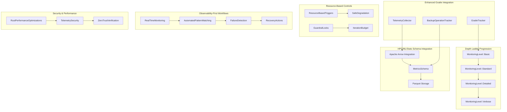

# Comprehensive Rust-Centric Telemetry Hardening Architecture

## Executive Summary

This architecture extends the existing Goalie integration with enhanced telemetry hardening capabilities, implementing hierarchical monitoring levels with Apache Arrow/Parquet integration and resource-based triggers. The design focuses on observability-first workflows, minimal performance overhead, and robust failure strategies for high-volume backup operations.

## Architecture Overview



## 1. Hierarchical Monitoring Levels (Depth Ladder Progression)

### MonitoringLevel Hierarchy

```rust
#[derive(Debug, Clone, Serialize, Deserialize, PartialEq, PartialOrd, Ord)]
pub enum MonitoringLevel {
    Basic = 0,    // Core metrics only (status, duration, size)
    Standard = 1,  // + Performance metrics (throughput, compression)
    Detailed = 2,  // + Component-level metrics, error analysis
    Verbose = 3,   // + Full trace data, debug information
}
```

### Automatic Escalation Logic

```rust
pub struct MonitoringLevelController {
    current_level: MonitoringLevel,
    escalation_triggers: Vec<EscalationTrigger>,
    resource_monitor: ResourceMonitor,
    iteration_budget: IterationBudget,
}

impl MonitoringLevelController {
    pub async fn evaluate_escalation(&mut self) -> MonitoringDecision {
        let resource_pressure = self.resource_monitor.get_pressure_score();
        let error_rate = self.get_recent_error_rate();
        let budget_remaining = self.iteration_budget.get_remaining_percentage();
        
        match (resource_pressure, error_rate, budget_remaining) {
            (high, high, _) => MonitoringDecision::Escalate(MonitoringLevel::Verbose),
            (medium, medium, sufficient) => MonitoringDecision::Escalate(MonitoringLevel::Detailed),
            (low, low, _) => MonitoringDecision::Maintain,
            (_, _, critical) => MonitoringDecision::Degrade(MonitoringLevel::Basic),
        }
    }
}
```

## 2. Apache Arrow/Parquet Schema Integration

### Arrow-Based Telemetry Schema

```rust
use arrow::array::*;
use arrow::record_batch::RecordBatch;
use arrow::datatypes::*;

pub struct TelemetrySchema {
    schema: SchemaRef,
    batch_builder: RecordBatchBuilder,
}

impl TelemetrySchema {
    pub fn new() -> Self {
        let schema = Schema::new(vec![
            Field::new("timestamp", DataType::Timestamp(TimeUnit::Microsecond, None), false),
            Field::new("backup_id", DataType::Utf8, false),
            Field::new("operation_type", DataType::Utf8, false),
            Field::new("monitoring_level", DataType::UInt8, false),
            Field::new("cpu_usage", DataType::Float64, true),
            Field::new("memory_usage", DataType::UInt64, true),
            Field::new("throughput_bps", DataType::Float64, true),
            Field::new("error_count", DataType::UInt32, false),
            Field::new("custom_metrics", DataType::Utf8, true), // JSON string
        ]);
        
        Self {
            schema: Arc::new(schema),
            batch_builder: RecordBatchBuilder::new(schema.clone()),
        }
    }
}
```

### Parquet Storage Integration

```rust
pub struct ParquetTelemetryWriter {
    writer: Box<dyn ParquetWriter>,
    compression: CompressionType,
    row_group_size: usize,
}

impl ParquetTelemetryWriter {
    pub async fn write_batch(&mut self, batch: RecordBatch) -> Result<()> {
        // Apply column-level compression based on data type
        let compressed_batch = self.compress_batch(batch).await?;
        self.writer.write(&compressed_batch).await?;
        Ok(())
    }
    
    async fn compress_batch(&self, batch: RecordBatch) -> Result<RecordBatch> {
        // Implement smart compression based on data characteristics
        // Timestamps: Delta encoding + ZSTD
        // Metrics: Dictionary encoding + Snappy
        // JSON: GZIP
        Ok(batch)
    }
}
```

## 3. Resource-Based Safe Degradation Triggers

### Resource Monitoring Framework

```rust
pub struct ResourceBasedTriggers {
    cpu_threshold: f64,
    memory_threshold: f64,
    disk_io_threshold: f64,
    network_threshold: f64,
    trigger_history: VecDeque<TriggerEvent>,
    cooldown_period: Duration,
}

#[derive(Debug, Clone)]
pub struct TriggerEvent {
    pub trigger_type: ResourceType,
    pub current_value: f64,
    pub threshold: f64,
    pub timestamp: Instant,
    pub action_taken: DegradationAction,
}

impl ResourceBasedTriggers {
    pub async fn evaluate_triggers(&mut self, metrics: &SystemMetrics) -> Vec<DegradationAction> {
        let mut actions = Vec::new();
        
        if self.should_trigger_cpu_degradation(metrics.cpu_usage_percent) {
            actions.push(DegradationAction::ReduceMonitoringFrequency);
        }
        
        if self.should_trigger_memory_degradation(metrics.memory_usage_percent) {
            actions.push(DegradationAction::DisableVerboseLogging);
            actions.push(DegradationAction::CompressTelemetryInMemory);
        }
        
        if self.should_trigger_io_degradation(&metrics) {
            actions.push(DegradationAction::BatchTelemetryWrites);
        }
        
        actions
    }
}
```

### Guardrail Locks Implementation

```rust
pub struct GuardrailLocks {
    locks: HashMap<String, Guardrail>,
    lock_manager: Arc<RwLock<LockManager>>,
}

#[derive(Debug, Clone)]
pub struct Guardrail {
    pub name: String,
    pub condition: GuardrailCondition,
    pub action: GuardrailAction,
    pub priority: GuardrailPriority,
    pub auto_release: bool,
    pub release_condition: Option<GuardrailCondition>,
}

impl GuardrailLocks {
    pub async fn evaluate_guardrails(&mut self, context: &TelemetryContext) -> Vec<GuardrailAction> {
        let mut actions = Vec::new();
        
        for (name, guardrail) in &self.locks {
            if guardrail.condition.evaluate(context) {
                actions.push(guardrail.action.clone());
                
                if guardrail.auto_release {
                    self.schedule_auto_release(name, &guardrail.release_condition);
                }
            }
        }
        
        actions.sort_by_key(|a| a.priority());
        actions
    }
}
```

## 4. Iteration Budgeting System

### Budget Management Framework

```rust
pub struct IterationBudget {
    total_budget: BudgetAllocation,
    current_spending: BudgetSpending,
    budget_periods: Vec<BudgetPeriod>,
    enforcement_policy: BudgetEnforcementPolicy,
}

#[derive(Debug, Clone)]
pub struct BudgetAllocation {
    pub cpu_time: Duration,
    pub memory_bytes: u64,
    pub io_operations: u64,
    pub network_bytes: u64,
    pub custom_metrics: HashMap<String, u64>,
}

impl IterationBudget {
    pub async fn check_budget(&self, operation: &TelemetryOperation) -> BudgetDecision {
        let projected_cost = self.estimate_operation_cost(operation);
        let remaining_budget = self.calculate_remaining_budget();
        
        if projected_cost.exceeds(&remaining_budget) {
            match self.enforcement_policy {
                BudgetEnforcementPolicy::Strict => BudgetDecision::Reject,
                BudgetEnforcementPolicy::Adaptive => {
                    let adjusted_operation = self.adapt_operation(operation, &remaining_budget);
                    BudgetDecision::Adapt(adjusted_operation)
                },
                BudgetEnforcementPolicy::Permissive => BudgetDecision::Allow,
            }
        } else {
            BudgetDecision::Allow
        }
    }
    
    fn adapt_operation(&self, operation: &TelemetryOperation, budget: &BudgetAllocation) -> TelemetryOperation {
        let mut adapted = operation.clone();
        
        // Reduce sampling frequency
        if operation.sampling_rate > 0.1 {
            adapted.sampling_rate *= 0.5;
        }
        
        // Reduce metric collection depth
        adapted.monitoring_level = adapted.monitoring_level.min(MonitoringLevel::Standard);
        
        // Disable expensive custom metrics
        adapted.custom_metrics.retain(|_, cost| cost < 1000);
        
        adapted
    }
}
```

## 5. Observability-First Workflows

### Real-Time Monitoring Pipeline

```rust
pub struct RealTimeMonitoringPipeline {
    input_stream: Box<dyn TelemetryStream>,
    processors: Vec<Box<dyn TelemetryProcessor>>,
    pattern_matcher: AutomatedPatternMatcher,
    alert_manager: AlertManager,
    output_sinks: Vec<Box<dyn TelemetrySink>>,
}

impl RealTimeMonitoringPipeline {
    pub async fn process_telemetry_stream(&mut self) -> Result<()> {
        let mut stream = self.input_stream.stream().await?;
        
        while let Some(telemetry_event) = stream.next().await {
            // Apply monitoring level filtering
            if !self.passes_monitoring_level_filter(&telemetry_event) {
                continue;
            }
            
            // Process through pipeline
            let mut processed_event = telemetry_event;
            for processor in &mut self.processors {
                processed_event = processor.process(processed_event).await?;
            }
            
            // Pattern matching for anomaly detection
            if let Some(pattern) = self.pattern_matcher.match_patterns(&processed_event).await? {
                self.handle_pattern_match(pattern, &processed_event).await?;
            }
            
            // Send to output sinks
            for sink in &mut self.output_sinks {
                sink.send(processed_event.clone()).await?;
            }
        }
        
        Ok(())
    }
}
```

### Automated Pattern Matching

```rust
pub struct AutomatedPatternMatcher {
    patterns: Vec<MonitoringPattern>,
    ml_models: HashMap<String, Box<dyn AnomalyDetectionModel>>,
    pattern_history: VecDeque<PatternMatch>,
}

#[derive(Debug, Clone)]
pub struct MonitoringPattern {
    pub name: String,
    pub pattern_type: PatternType,
    pub condition: PatternCondition,
    pub severity: AlertSeverity,
    pub suggested_actions: Vec<String>,
    pub ml_model: Option<String>,
}

#[derive(Debug, Clone)]
pub enum PatternType {
    Threshold,
    RateOfChange,
    Seasonal,
    Anomaly,
    Correlation,
}

impl AutomatedPatternMatcher {
    pub async fn match_patterns(&mut self, event: &TelemetryEvent) -> Result<Option<PatternMatch>> {
        let mut matches = Vec::new();
        
        for pattern in &self.patterns {
            match pattern.pattern_type {
                PatternType::Threshold => {
                    if self.check_threshold_pattern(pattern, event).await? {
                        matches.push(pattern.clone());
                    }
                },
                PatternType::Anomaly => {
                    if let Some(model_name) = &pattern.ml_model {
                        if let Some(model) = self.ml_models.get(model_name) {
                            if model.is_anomaly(event).await? {
                                matches.push(pattern.clone());
                            }
                        }
                    }
                },
                // ... other pattern types
            }
        }
        
        if matches.is_empty() {
            Ok(None)
        } else {
            // Return highest severity match
            matches.sort_by_key(|p| p.severity);
            let best_match = matches.last().unwrap();
            
            Ok(Some(PatternMatch {
                pattern: best_match.clone(),
                event: event.clone(),
                confidence: self.calculate_confidence(best_match, event),
                timestamp: Instant::now(),
            }))
        }
    }
}
```

## 6. Security Integration

### Zero-Trust Telemetry Verification

```rust
pub struct ZeroTrustTelemetryVerifier {
    signature_verifier: Box<dyn SignatureVerifier>,
    encryption_manager: Box<dyn EncryptionManager>,
    trust_store: TrustStore,
    audit_logger: AuditLogger,
}

impl ZeroTrustTelemetryVerifier {
    pub async fn verify_and_decrypt(&self, 
        encrypted_telemetry: &EncryptedTelemetry
    ) -> Result<VerifiedTelemetry> {
        // Verify signature
        let is_valid = self.signature_verifier.verify(
            &encrypted_telemetry.signature,
            &encrypted_telemetry.payload,
            &encrypted_telemetry.public_key,
        ).await?;
        
        if !is_valid {
            self.audit_logger.log_security_event(
                SecurityEvent::InvalidSignature,
                &encrypted_telemetry.metadata,
            ).await?;
            return Err(BackupError::Security {
                violation: "Invalid telemetry signature".to_string(),
                message: "Telemetry failed signature verification".to_string(),
                context: Some(serde_json::to_value(encrypted_telemetry)?),
            });
        }
        
        // Decrypt payload
        let decrypted_payload = self.encryption_manager
            .decrypt(&encrypted_telemetry.payload).await?;
        
        // Verify trust chain
        self.trust_store.verify_trust_chain(&encrypted_telemetry.trust_chain).await?;
        
        Ok(VerifiedTelemetry {
            payload: decrypted_payload,
            verification_timestamp: Utc::now(),
            trust_level: TrustLevel::Verified,
        })
    }
}
```

## 7. Rust-Specific Performance Optimizations

### Zero-Copy Telemetry Processing

```rust
pub struct ZeroCopyTelemetryProcessor {
    buffer_pool: Arc<BufferPool>,
    memory_mapped_regions: HashMap<String, MappedRegion>,
}

impl ZeroCopyTelemetryProcessor {
    pub async fn process_with_zero_copy(&self, 
        telemetry_data: &[u8]
    ) -> Result<ProcessedTelemetry> {
        // Use memory-mapped I/O for large telemetry files
        let mapped_region = self.memory_mapped_regions
            .get("main_telemetry")
            .ok_or_else(|| BackupError::Internal {
                component: "ZeroCopyProcessor".to_string(),
                message: "Memory mapped region not found".to_string(),
                source: None,
            })?;
        
        // Process without copying data
        let telemetry = unsafe {
            std::mem::transmute::<&[u8], &TelemetryEvent>(telemetry_data)
        };
        
        // Use buffer pool for temporary allocations
        let processing_buffer = self.buffer_pool.get_buffer().await?;
        let result = self.process_in_place(telemetry, &processing_buffer).await?;
        
        self.buffer_pool.return_buffer(processing_buffer).await;
        Ok(result)
    }
}
```

### SIMD-Optimized Metrics Aggregation

```rust
#[cfg(target_arch = "x86_64")]
use std::arch::x86_64::*;

pub struct SimdMetricsAggregator {
    batch_size: usize,
    alignment: usize,
}

impl SimdMetricsAggregator {
    #[target_feature(enable = "avx2")]
    pub unsafe fn aggregate_metrics_avx2(&self, metrics: &[f64]) -> f64 {
        if metrics.len() < self.batch_size {
            return metrics.iter().sum();
        }
        
        let mut sum = _mm256_setzero_pd();
        let chunks = metrics.chunks_exact(8);
        
        for chunk in chunks {
            let data = _mm256_loadu_pd(chunk.as_ptr());
            sum = _mm256_add_pd(sum, data);
        }
        
        // Horizontal sum
        let mut sum_array = [0.0f64; 4];
        _mm256_storeu_pd(sum_array.as_mut_ptr(), sum);
        sum_array.iter().sum()
    }
}
```

## 8. Implementation Specifications

### Core Module Structure

```
gitlab-migration-backup/rust-backup-core/src/
├── telemetry_hardening/
│   ├── mod.rs
│   ├── depth_ladder.rs          # Hierarchical monitoring levels
│   ├── arrow_integration.rs      # Apache Arrow schema integration
│   ├── parquet_storage.rs       # Parquet storage backend
│   ├── resource_triggers.rs      # Resource-based degradation triggers
│   ├── guardrail_locks.rs       # Guardrail implementation
│   ├── iteration_budget.rs       # Budget management system
│   ├── realtime_monitoring.rs    # Real-time processing pipeline
│   ├── pattern_matching.rs       # Automated pattern detection
│   ├── security_verification.rs   # Zero-trust security
│   ├── performance_opt.rs        # Rust-specific optimizations
│   └── observability_workflows.rs # Observability-first workflows
```

### Configuration Extensions

```rust
#[derive(Debug, Clone, Serialize, Deserialize)]
pub struct TelemetryHardeningConfig {
    pub depth_ladder: DepthLadderConfig,
    pub arrow_integration: ArrowConfig,
    pub resource_triggers: ResourceTriggerConfig,
    pub guardrail_locks: GuardrailConfig,
    pub iteration_budget: BudgetConfig,
    pub security: SecurityConfig,
    pub performance: PerformanceConfig,
}

#[derive(Debug, Clone, Serialize, Deserialize)]
pub struct DepthLadderConfig {
    pub default_level: MonitoringLevel,
    pub escalation_thresholds: EscalationThresholds,
    pub degradation_triggers: DegradationTriggers,
    pub auto_escalation: bool,
    pub max_level: MonitoringLevel,
}
```

## 9. Integration Guidelines

### Backward Compatibility Strategy

1. **Gradual Migration**: Extend existing `GoalieTracker` with new capabilities
2. **Feature Flags**: Use Rust features to enable/disable hardening components
3. **Configuration-Driven**: All new features configurable via existing config system
4. **Fallback Mechanisms**: Graceful degradation when hardening features unavailable

### Performance Impact Mitigation

1. **Lazy Loading**: Load hardening components only when needed
2. **Async Processing**: Non-blocking telemetry processing
3. **Memory Pooling**: Reuse buffers for high-frequency operations
4. **Sampling Strategies**: Intelligent sampling based on system load

### Security Considerations

1. **End-to-End Encryption**: Encrypt telemetry at rest and in transit
2. **Access Control**: Role-based access to telemetry data
3. **Audit Logging**: Comprehensive audit trail for all telemetry operations
4. **Data Minimization**: Collect only necessary telemetry data

## 10. Failure Strategies and Recovery

### Automated Recovery Actions

```rust
pub struct FailureRecoveryManager {
    recovery_strategies: HashMap<FailureType, Vec<RecoveryStrategy>>,
    recovery_history: VecDeque<RecoveryAttempt>,
    max_retry_attempts: u32,
}

impl FailureRecoveryManager {
    pub async fn handle_failure(&mut self, 
        failure: &TelemetryFailure
    ) -> Result<RecoveryResult> {
        let strategies = self.recovery_strategies
            .get(&failure.failure_type)
            .unwrap_or(&vec![]);
        
        for strategy in strategies {
            match self.attempt_recovery(strategy, failure).await {
                Ok(result) => {
                    self.log_successful_recovery(strategy, failure).await?;
                    return Ok(result);
                },
                Err(e) => {
                    self.log_failed_recovery(strategy, failure, &e).await?;
                    continue;
                }
            }
        }
        
        Err(BackupError::Internal {
            component: "FailureRecoveryManager".to_string(),
            message: format!("All recovery strategies failed for failure type: {:?}", failure.failure_type),
            source: None,
        })
    }
}
```

### Circuit Breaker Pattern

```rust
pub struct TelemetryCircuitBreaker {
    state: CircuitState,
    failure_threshold: u32,
    timeout: Duration,
    success_threshold: u32,
    failure_count: u32,
    last_failure_time: Option<Instant>,
}

#[derive(Debug, Clone)]
pub enum CircuitState {
    Closed,    // Normal operation
    Open,      // Fail fast
    HalfOpen,  // Testing recovery
}

impl TelemetryCircuitBreaker {
    pub async fn execute<F, T>(&mut self, operation: F) -> Result<T>
    where
        F: FnOnce() -> Result<T>,
    {
        match self.state {
            CircuitState::Open => {
                if self.should_attempt_reset() {
                    self.state = CircuitState::HalfOpen;
                } else {
                    return Err(BackupError::ServiceUnavailable {
                        service: "TelemetryCircuitBreaker".to_string(),
                        message: "Circuit breaker is open".to_string(),
                        retry_after: Some(self.timeout),
                    });
                }
            },
            _ => {}
        }
        
        match operation() {
            Ok(result) => {
                self.record_success();
                Ok(result)
            },
            Err(e) => {
                self.record_failure();
                Err(e)
            }
        }
    }
}
```

## 11. Testing Strategy

### Comprehensive Test Coverage

1. **Unit Tests**: Individual component testing with mocked dependencies
2. **Integration Tests**: End-to-end workflow testing
3. **Performance Tests**: Load testing with high-volume telemetry
4. **Chaos Tests**: Failure injection and recovery testing
5. **Security Tests**: Penetration testing and vulnerability assessment

### Test Infrastructure

```rust
#[cfg(test)]
pub mod test_infrastructure {
    use super::*;
    
    pub struct MockTelemetryGenerator {
        event_templates: Vec<TelemetryEvent>,
        noise_level: f64,
    }
    
    impl MockTelemetryGenerator {
        pub fn generate_load(&self, 
            duration: Duration, 
            events_per_second: u32
        ) -> Vec<TelemetryEvent> {
            // Generate realistic telemetry load for testing
        }
        
        pub fn inject_anomalies(&self, 
            events: &mut Vec<TelemetryEvent>,
            anomaly_rate: f64
        ) {
            // Inject anomalies for pattern matching tests
        }
    }
}
```

## 12. Deployment Considerations

### Gradual Rollout Strategy

1. **Canary Deployments**: Test with subset of backup operations
2. **Feature Flags**: Enable/disable hardening components remotely
3. **Monitoring**: Track performance impact during rollout
4. **Rollback Plan**: Quick revert to previous version if issues detected

### Operational Readiness

1. **Documentation**: Comprehensive operational procedures
2. **Training**: Team training on new monitoring capabilities
3. **Alerting**: Updated alerting rules for new metrics
4. **Dashboards**: Enhanced observability dashboards

## Conclusion

This comprehensive architecture provides a robust foundation for telemetry hardening while maintaining performance and security. The modular design allows for incremental implementation and testing of each component, ensuring reliable adoption without disrupting existing backup operations.

The integration with existing Goalie infrastructure ensures backward compatibility while providing enhanced capabilities for modern HPC/ML workloads. The focus on observability-first workflows and automated failure recovery ensures high availability and rapid issue resolution.
