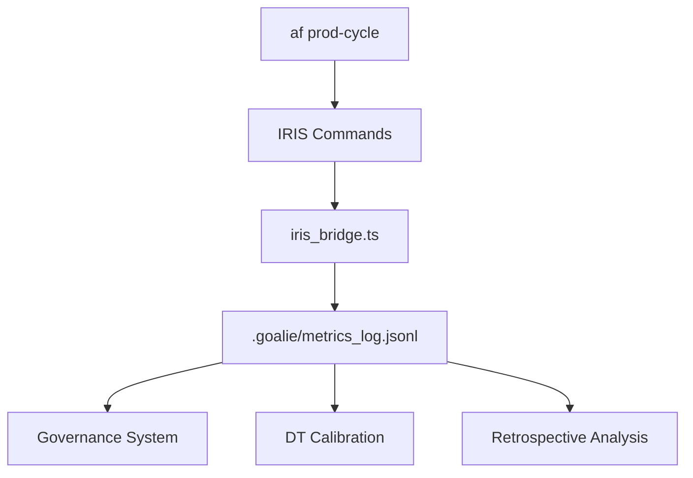

# IRIS Integration - Agentic Flow

## Overview

IRIS (@foxruv/iris) is a self-improving MCP orchestration framework with swarm intelligence that has been integrated into the agentic-flow ecosystem to provide automated pattern discovery, drift detection, and continuous optimization.

> **Looking for the fastest way to validate your setup?**
> See the [IRIS Validation Quickstart](./IRIS_VALIDATION_QUICKSTART.md) for a 10-minute stub-mode validation path that complements this guide.

## Table of Contents
1. [What is IRIS?](#what-is-iris)
2. [Integration Architecture](#integration-architecture)
3. [Enabling IRIS Metrics Logging](#enabling-iris-metrics-logging)
4. [Dependency Update Policy](#dependency-update-policy)
5. [Major Version Upgrade Procedures](#major-version-upgrade-procedures)
6. [Production Cycle Integration](#production-cycle-integration)
7. [Troubleshooting](#troubleshooting)

## What is IRIS?

IRIS is an autonomous agent framework that:
- **Discovers Expert Agents**: Automatically finds AI functions in your codebase
- **Evaluates Performance**: Monitors agent health and effectiveness
- **Detects Patterns**: Identifies recurring issues and optimization opportunities
- **Enables Federated Learning**: Coordinates multiple agents for swarm intelligence
- **Self-Improves**: Learns from execution patterns to optimize workflows

## Integration Architecture

### Components



1. **`tools/federation/iris_bridge.ts`**: TypeScript module that captures IRIS CLI outputs and transforms them into structured events
2. **`scripts/af`**: Extended with `--log-goalie` flag to enable IRIS metrics logging
3. **`.goalie/metrics_log.jsonl`**: Centralized metrics log where IRIS events are appended
4. **`config/iris/production_environments.yaml`**: Configuration for production environment monitoring

## Enabling IRIS Metrics Logging

### Method 1: Command-Line Flag

```bash
# Enable for single command
./scripts/af iris-health --log-goalie

# Enable for prod-cycle
./scripts/af prod-cycle 5 --log-goalie
```

### Method 2: Environment Variable

```bash
# Enable for entire session
export AF_ENABLE_IRIS_METRICS=1

./scripts/af iris-health
./scripts/af prod-cycle 10

### Production Cycle Integration with Environment Context

To run a governed production cycle with IRIS metrics and an explicit logical environment (for example `prod` or `staging`):

```bash
cd /Users/shahroozbhopti/Documents/code/investing/agentic-flow

AF_ENABLE_IRIS_METRICS=1 ./scripts/af prod-cycle --iterations 20 --environment prod --log-goalie
./scripts/af prod-cycle 2 --environment staging --log-goalie
```

**Environment propagation flow:**
- `scripts/af` parses `--environment <env>` from the `prod-cycle` invocation
- `scripts/policy/governance.py` stores `args.environment` and exports `AF_IRIS_ENVIRONMENT` and `AF_ENVIRONMENT` for each `af full-cycle` and IRIS hook
- `tools/federation/iris_bridge.ts` reads these env vars and populates `IrisMetricsEvent.environment`

Each IRIS event written to `.goalie/metrics_log.jsonl` therefore carries:
- `"type": "iris_evaluation"`
- `"environment": "prod" | "staging" | ...`
- An `execution_context` map containing `AF_RUN_ID`, `AF_RUN_ITERATION`, `AF_CIRCLE`, and `AF_DEPTH_LEVEL` when prod-cycle governance is active.

**Example queries:**

```bash
# Find all IRIS events
grep '"type":"iris_evaluation"' .goalie/metrics_log.jsonl

# Find IRIS events for production environment
grep '"environment":"prod"' .goalie/metrics_log.jsonl | grep '"type":"iris_evaluation"'

# Find IRIS events for a specific iteration
grep '"type":"iris_evaluation"' .goalie/metrics_log.jsonl | grep '"AF_RUN_ITERATION":"2"'
```

### Method 3: Persistent Configuration

Add to your shell profile (`.bash_profile`, `.zshrc`, etc.):

```bash
export AF_ENABLE_IRIS_METRICS=1
```

## IRIS Commands

### Available Commands

```bash
# Health check - Monitor drift, prompts, reflexions
./scripts/af iris-health

# Discovery - Find expert agents in codebase
./scripts/af iris-discover

# Evaluation - Evaluate project health
./scripts/af iris-evaluate

# Pattern Discovery - Find cross-project patterns
./scripts/af iris-patterns

# Telemetry - Check telemetry health
./scripts/af iris-telemetry

# Federated Learning - Control federated agents
./scripts/af iris-federated start|stop|status

# Configuration - View IRIS config
./scripts/af iris-config
```

### With Metrics Logging

When `--log-goalie` is enabled, each command appends an event to `.goalie/metrics_log.jsonl`:

```bash
# This will log to metrics
./scripts/af iris-health --log-goalie
```

## Integration with `af prod-cycle`

When IRIS metrics are enabled, `af prod-cycle` automatically runs IRIS evaluation and pattern discovery after each iteration:

```bash
AF_ENABLE_IRIS_METRICS=1 ./scripts/af prod-cycle 20
```

**What Happens Per Iteration:**
1. Normal BML cycle executes (status, board, metrics, etc.)
2. **IRIS Evaluation** runs (`npx iris evaluate`)
3. **IRIS metrics** logged to `.goalie/metrics_log.jsonl`
4. **IRIS Pattern Discovery** runs (`npx iris patterns`)
5. **Pattern metrics** logged to `.goalie/metrics_log.jsonl`

## Event Schema

IRIS events in `.goalie/metrics_log.jsonl` follow this schema:

```typescript
{
  type: "iris_evaluation",
  timestamp: "2025-11-25T14:30:00Z",
  iris_command: "health" | "discover" | "evaluate" | "patterns" | "telemetry" | "federated",
  circles_involved: ["assessor", "analyst", "innovator"],
  actions_taken: [
    {
      circle: "assessor",
      action: "Detected 2 drift alert(s)",
      priority: "urgent"
    }
  ],
  production_maturity: {
    starlingx_openstack: { status: "operational", issues: [] },
    hostbill: { status: "operational", issues: [] },
    // ... other environments
  },
  execution_context: {
    incremental: true,
    relentless: true,
    focused: true
  }
}
```

### Fields Explained

- **`type`**: Always `"iris_evaluation"` for IRIS events
- **`timestamp`**: ISO 8601 timestamp
- **`iris_command`**: Which IRIS command was executed
- **`circles_involved`**: Which circles (orchestrator, assessor, etc.) participated
- **`actions_taken`**: List of actions with priority levels
- **`production_maturity`**: Status of all monitored production environments
- **`execution_context`**: Execution strategy flags

## Circle-Based Execution Model

IRIS infers which circles are involved based on the command:

| Command | Circles Involved | Purpose |
|---------|------------------|---------|
| `health` | assessor | Assessment of system health |
| `discover` | seeker, analyst | Discovery and analysis of experts |
| `evaluate` | assessor, analyst | Evaluation and analysis |
| `patterns` | innovator, analyst | Pattern discovery for optimization |
| `telemetry` | orchestrator, assessor | Coordination and monitoring |
| `federated` | orchestrator, intuitive | High-level coordination and strategy |

## Production Maturity Monitoring

IRIS monitors these production environments (configured in `config/iris/production_environments.yaml`):

### Infrastructure
- **StarlingX OpenStack** (critical)
- **HostBill** (urgent)
- **Loki** (urgent)

### CMS Interfaces
- **Symfony** (important)
- **Oro** (important)
- **WordPress** (important)
- **Flarum** (important)

### Communication Stack
- **Telnyx** (critical)
- **Plivo** (critical)
- **SMS** (urgent)
- **IVR** (urgent)
- **TTS** (important)

### Messaging Protocols
- SMTP, WebSocket, gRPC, REST (normal)

## Priority Levels

Actions are tagged with priority levels:

- **Critical**: StarlingX, Telnyx, Plivo
- **Urgent**: HostBill, Loki, SMS, IVR
- **Important**: CMS interfaces, TTS, pattern analysis
- **Normal**: Routine operations

## Querying IRIS Metrics

### Count IRIS Events

```bash
grep '"type":"iris_evaluation"' .goalie/metrics_log.jsonl | wc -l
```

### Get Recent Evaluations

```bash
grep '"type":"iris_evaluation"' .goalie/metrics_log.jsonl | tail -n 10 | jq .
```

### Filter by Command

```bash
grep '"iris_command":"health"' .goalie/metrics_log.jsonl | jq '.actions_taken'
```

### Check Critical Actions

```bash
grep '"type":"iris_evaluation"' .goalie/metrics_log.jsonl | jq 'select(.actions_taken[]?.priority == "critical")'
```

### Production Maturity Status

```bash
grep '"type":"iris_evaluation"' .goalie/metrics_log.jsonl | tail -n 1 | jq '.production_maturity'
```

## Example Use Cases

### 1. Daily Health Check with Logging

```bash
# Morning health check
AF_ENABLE_IRIS_METRICS=1 ./scripts/af iris-health

# Review findings
grep '"iris_command":"health"' .goalie/metrics_log.jsonl | tail -n 1 | jq '.actions_taken'
```

### 2. Continuous Improvement Cycle

```bash
# Run 100 iterations with IRIS monitoring
AF_ENABLE_IRIS_METRICS=1 ./scripts/af prod-cycle 100

# Analyze patterns discovered
grep '"iris_command":"patterns"' .goalie/metrics_log.jsonl | jq '.actions_taken'
```

### 3. Expert Agent Discovery

```bash
# Find all AI functions
./scripts/af iris-discover --log-goalie

# Check how many lack telemetry
grep '"iris_command":"discover"' .goalie/metrics_log.jsonl | tail -n 1 | \
  jq '.actions_taken[] | select(.action | contains("without telemetry"))'
```

## Integration with Other Systems

### Governance

IRIS metrics can be consumed by `governance.py` for risk assessment:

```python
# In governance.py
with open('.goalie/metrics_log.jsonl') as f:
    for line in f:
        event = json.loads(line)
        if event['type'] == 'iris_evaluation':
            # Check for critical actions
            for action in event['actions_taken']:
                if action['priority'] == 'critical':
                    # Increase risk score
```

### Decision Transformer

IRIS evaluations can enhance DT calibration:

```bash
# Use IRIS metrics as training data
./scripts/af dt-dashboard

# IRIS events provide additional features:
# - drift_alerts
# - expert_count
# - telemetry_coverage
```

### Retrospective Analysis

IRIS patterns feed into retrospective analysis:

```bash
./scripts/af retro-analysis

# retrospecitve_analysis.py can read IRIS patterns:
# - Recurring issues
# - Optimization opportunities
# - Expert performance trends
```


## Dashboard Visualization

IRIS metrics are surfaced alongside existing governance and Decision Transformer signals in the analysis dashboards that read from `.goalie/metrics_log.jsonl`.

### DT Evaluation Dashboard (`dt_evaluation_dashboard.py`)

The DT dashboard HTML now contains an **IRIS governance & drift signals** section, which is rendered when any `iris_evaluation` events are present:

- **Command timeline** grouped by `iris_command`
- **Execution context flags** (`incremental`, `relentless`, `focused`) over time
- **Component health heatmap** for infrastructure, CMS interfaces, communication stack, and messaging protocols
- **Action backlog** by circle and priority with DT threshold correlation

Run it via the AF CLI:

```bash
./scripts/af dt-dashboard \
  --metrics-log .goalie/metrics_log.jsonl \
  --output-html .goalie/dt_evaluation_dashboard.html \
  --export-json .goalie/dt_evaluation_summary.json \
  --iris-command health --iris-command patterns \
  --iris-circle assessor --iris-circle innovator
```

Key JSON export fields:

- `iris_summary.iris_events` – number of IRIS evaluations in the window
- `iris_summary.command_counts` – counts per IRIS command
- `iris_summary.actions_by_priority` / `actions_by_circle` – governance action distribution
- `iris_summary.component_health` – latest status and counts per component
- `iris_summary.context_flags` – timeline of execution context settings
- `iris_summary.dt_correlation` – how often DT thresholds fail near IRIS alerts

If no IRIS metrics are available for the selected range or filters, the dashboard shows a friendly message:

> No IRIS metrics available. Run prod-cycle or IRIS commands with metrics logging enabled.

### Governance Evaluation Dashboard (`governance_evaluation_dashboard.py`)

The governance calibration dashboard consumes the same `iris_evaluation` events and exposes them in its JSON summary under the `iris` key. It aggregates:

- IRIS actions by priority and circle
- Circle participation counts
- Component health status and recent timestamps
- Correlation between degraded component health and governance risk scores

Example invocation:

```bash
python3 scripts/analysis/governance_evaluation_dashboard.py \
  --metrics-log .goalie/metrics_log.jsonl \
  --export-json .goalie/governance_evaluation_summary.json \
  --format table \
  --iris-command health --iris-command patterns \
  --iris-circle assessor
```

This prints a config impact table followed by a concise IRIS governance summary, while also writing a machine-readable JSON summary that downstream tools (CI, VS Code Goalie, retrospectives) can consume.

## Troubleshooting

### IRIS Metrics Not Logging

**Problem**: No `iris_evaluation` events in `.goalie/metrics_log.jsonl`

**Solutions**:
1. Check flag is set: `echo $AF_ENABLE_IRIS_METRICS` (should be `1`)
2. Verify iris_bridge.ts exists: `ls tools/federation/iris_bridge.ts`
3. Check for errors: `npx tsx tools/federation/iris_bridge.ts health`

### IRIS Commands Slow

**Problem**: IRIS commands take too long

**Solutions**:
1. Use `--log-goalie` selectively (not for every command)
2. Run IRIS evaluation only after key iterations
3. Disable with `export AF_ENABLE_IRIS_METRICS=0`

### TypeScript Errors

**Problem**: `iris_bridge.ts` throws TypeScript errors

**Solutions**:
1. Install dependencies: `npm install`
2. Check Node version: `node --version` (require Node 18+)
3. Rebuild TypeScript: `npx tsc`

## Advanced Configuration

### Custom Production Environments

Edit `config/iris/production_environments.yaml` to add/modify monitored systems:

```yaml
environments:
  custom_service:
    - name: my_service
      description: My custom service
      priority: critical
      components:
        - api
        - database
```

### Priority Thresholds

Modify priority levels in `config/iris/production_environments.yaml`:

```yaml
monitoring:
  sla_thresholds:
    critical:
      uptime: 99.95
      response_time_ms: 100
```

## Best Practices

1. **Enable Selectively**: Use `--log-goalie` for important runs, not every command
2. **Review Regularly**: Check IRIS metrics daily for critical/urgent actions
3. **Act on Patterns**: Use IRIS pattern discovery to identify recurring issues
4. **Monitor Drift**: Weekly drift analysis prevents quality degradation
5. **Track Coverage**: Aim for 100% telemetry coverage of expert agents

## Dependency Update Policy

### Automated Update Schedule

The `@foxruv/iris` dependency is monitored through automated dependency update checks:

#### Daily Security & Critical Patch Checks
- **Schedule**: Monday–Friday at 04:00 UTC
- **Cron Expression**: `0 4 * * 1-5`
- **Behavior**: Dependabot automatically creates PRs for security patches and critical updates
- **CI Validation**: All PRs trigger comprehensive test suite:
  - IRIS governance integration tests (`tests/policy/test_governance_iris_integration.py`)
  - IRIS prod-cycle E2E tests (`tests/analysis/test_iris_prod_cycle_integration.py`)
  - DT calibration tests (`tests/analysis/test_prepare_dt_dataset.py`, `tests/analysis/test_dt_e2e_check.py`)
  - DT quality gates tests (`tests/analysis/test_publish_dt_gates_summary.py`)
    - Dashboard validation checks
    - ReasoningBank TS public API consumer test (`agentic-flow/tests/reasoningbank/public-api-consumer.test.ts`) to ensure `agentic-flow/reasoningbank` remains stable for external TypeScript consumers

#### Weekly Feature/Minor Update Checks
- **Schedule**: Every Monday at 06:00 UTC
- **Cron Expression**: `0 6 * * 1`
- **Scope**: Feature and minor version bumps
- **Rationale**: Reduces PR noise while keeping dependencies reasonably current
- **Same CI Validation**: All tests listed above must pass before merge

### Major Version Update Policy

**IMPORTANT**: Major version updates of `@foxruv/iris` are **NOT automated** and require manual intervention.

#### Major Update Procedure

1. **Review Upstream Changes**
   ```bash
   # Check IRIS release notes
   npm view @foxruv/iris versions
   npm view @foxruv/iris@latest
   ```

2. **Re-calibrate DT Quality Gates**
   - Review `scripts/analysis/publish_dt_gates_summary.py`
   - Update severity thresholds if IRIS behavior changes
   - Adjust noise floor for "Top Improvements" section
   - Test with historical data to ensure backward compatibility

3. **Update Governance Dashboards**
   - Review governance metrics baselines in `.goalie/metrics_log.jsonl`
   - Update dashboard queries if IRIS event schema changes
   - Verify all IRIS commands still produce expected output format

4. **Run Extended Validation**
   ```bash
   # Shadow mode evaluation (parallel old/new versions)
   npm install @foxruv/iris@latest --save-dev
   ./scripts/af prod-cycle 5 --log-goalie --environment staging

   # Compare metrics between versions
   jq 'select(.type == "iris_evaluation")' .goalie/metrics_log.jsonl | \
     jq -s 'group_by(.iris_command) | map({command: .[0].iris_command, count: length})'
   ```

5. **Canary Deployment**
   - Deploy to staging environment first
   - Run for 24-48 hours
   - Monitor for regressions in:
     - Circle participation patterns
     - Action priority distributions
     - Production maturity scores
     - Execution context flags

6. **Document Calibration Changes**
   - Update this file (`docs/integrations/IRIS_INTEGRATION.md`)
   - Document any schema changes in `tools/federation/iris_bridge.ts`
   - Update test fixtures if event structure changes

7. **Create Manual PR**
   - Include detailed upgrade notes
   - Link to upstream release notes
   - Document all calibration changes
   - Require approval from governance team

### Dependency Update CI/CD

#### GitHub Actions
- **Workflow**: `.github/workflows/dependency-update-validation.yml`
- **Triggers**: All PRs that modify `package.json` or `package-lock.json`
- **Jobs**:
  1. Detect dependency changes
  2. Run IRIS governance integration tests
  3. Run DT calibration tests
  4. Validate dashboards
  5. Security vulnerability scan
  6. Major update approval gate (manual)

#### GitLab CI
- **Configuration**: `.gitlab-ci.yml`
- **Stages**: detect → test-iris → test-dt → test-dashboard → security → validate
- **Manual Gate**: Major IRIS updates require manual approval before merge

### Monitoring Dependency Health

#### Daily Upstream Check
```bash
# Run automated upstream check
./scripts/check_upstream_updates.sh

# View latest report
cat logs/upstream_updates_latest.md
```

#### Install Cron Job (Optional)
```bash
# Install daily cron job at 9 AM
./scripts/check_upstream_updates.sh install-cron
```

## Next Steps

- [ ] Enable IRIS metrics for prod-cycle: `export AF_ENABLE_IRIS_METRICS=1`
- [ ] Run daily health check: `./scripts/af iris-health --log-goalie`
- [ ] Discover expert agents: `./scripts/af iris-discover --log-goalie`
- [ ] Integrate with governance risk scoring
- [ ] Add IRIS metrics to DT training data
- [ ] Configure custom production environments
- [ ] Review Dependabot configuration: `.github/dependabot.yml`
- [ ] Verify CI/CD pipelines: `.github/workflows/dependency-update-validation.yml`

## References

- **IRIS Package**: [https://www.npmjs.com/package/@foxruv/iris](https://www.npmjs.com/package/@foxruv/iris)
- **Implementation Plan**: `docs/plans/iris_bridge_implementation_plan.md`
- **Configuration**: `config/iris/production_environments.yaml`
- **Source Code**: `tools/federation/iris_bridge.ts`
- **Tests**: `tests/federation/test_iris_bridge.ts`
- **Dependency Update Policy**: `.github/dependabot.yml`
- **CI/CD Validation**: `.github/workflows/dependency-update-validation.yml`
- **GitLab Migration**: `docs/GITLAB_MIGRATION_RUNBOOK.md`
