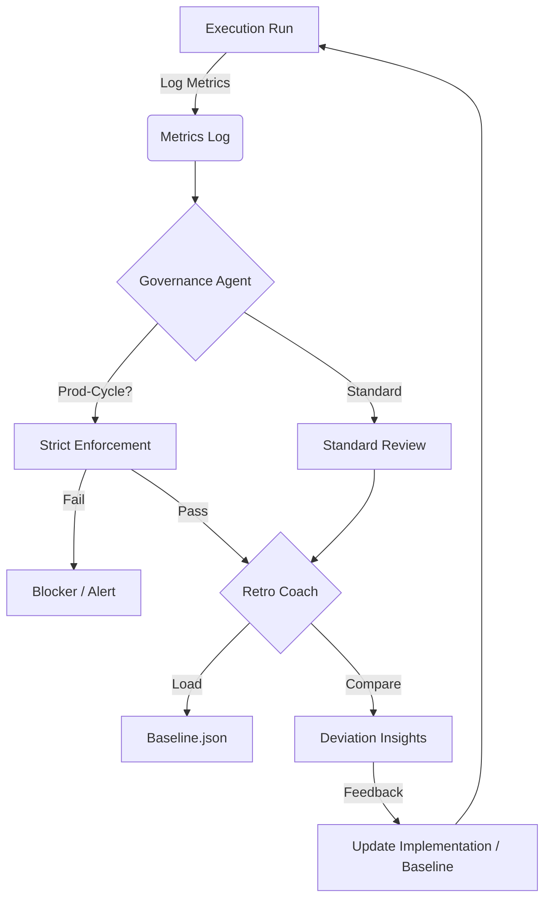

# Implementation Plan: Recursive Review & Agentic Flow Hardening

## Overview
This plan outlines the "Recursive Review" strategy to harden the Agentic Flow system. It focuses on closing gaps in the Goalie VSCode extension, enforcing stricter governance during "prod-cycle" execution, and generating deeper retrospective insights by comparing runs against established baselines.

## 1. Goalie Gaps (VSCode Extension)

**Context:** The `goalie-vscode` package lacks a robust development lifecycle. Currently, it only supports `build` and `watch`.

**Design:**
We will upgrade `investing/agentic-flow/tools/goalie-vscode/package.json` to support a full CI/CD-ready lifecycle.

### Proposed Updates (`package.json`)
*   **Scripts:**
    *   `"lint"`: `eslint src --ext .ts`
    *   `"test"`: `jest`
    *   `"gap-check"`: `ts-node src/scripts/gap_analysis.ts` (New script to check for missing distinct gap analysis logic)
    *   `"package"`: `vsce package`
*   **Dependencies (Dev):**
    *   `eslint`, `@typescript-eslint/parser`, `@typescript-eslint/eslint-plugin`
    *   `jest`, `ts-jest`, `@types/jest`
    *   `vsce` (for packaging)
    *   `ts-node` (for running gap-check scripts)

### Gap Analysis Script (`src/scripts/gap_analysis.ts`)
*   **Purpose:** Static analysis to ensure "Goalie" patterns (e.g., metrics views, kanban columns) are correctly wired in `package.json` `contributes`.
*   **Logic:**
    1.  Read `package.json`.
    2.  Verify all `views` have corresponding `activationEvents`.
    3.  Verify specific "Gap" views (like `goalieGapsView`) are present.

## 2. Governance Agent Refinements

**Context:** `governance_agent.ts` currently provides suggestions but lacks strict enforcement for high-rigor modes like `prod-cycle`.

**Design:**
Modify `investing/agentic-flow/tools/federation/governance_agent.ts` to recognize execution context and enforce policies.

### Logic Flow
1.  **Context Detection:**
    *   Scan `pattern_metrics.jsonl` for an event with `run: "prod-cycle"`.
    *   If found, set `mode = "PROD_CYCLE"` (High Rigor).
2.  **Enforcement (`observability-first`):**
    *   **Rule:** If `mode === "PROD_CYCLE"`, the `observability-first` pattern **MUST** be present in the logs.
    *   **Failure:** If missing, flag as a `CRITICAL GOVERNANCE FAILURE`.
    *   **Output:** Explicitly log `[BLOCKER] Prod-Cycle requires Observability First pattern.`
3.  **Depth Enforcement:**
    *   **Rule:** `prod-cycle` requires `depth >= 3`.
    *   **Check:** Verify events show `depth: 3` or `depth: 4`.

## 3. Retro Coach Refinements

**Context:** `retro_coach.ts` summarizes data but does not contextualize it against historical performance (`baseline.json`).

**Design:**
Update `investing/agentic-flow/tools/federation/retro_coach.ts` to load baselines and calculate deviations.

### Logic Flow
1.  **Load Baseline:**
    *   Read `investing/agentic-flow/metrics/baseline.json`.
    *   Extract `average_score` and `risk_distribution`.
2.  **Calculate Current Metrics:**
    *   Compute average score from current run's `metrics_log.jsonl`.
3.  **Deviation Analysis:**
    *   Compare `current_score` vs `baseline_average_score`.
    *   **Insight Generation:**
        *   If `current < baseline - 10%`: "Performance Regression: Score dropped significantly below baseline."
        *   If `risk_P0 > baseline_P0`: "Critical Risk Spike: New P0 risks detected compared to baseline."
4.  **Baseline Update Recommendation:**
    *   If `current > baseline + 5%`: Suggest updating the baseline with new higher standard.

## 4. Recursive Review Strategy

The "Recursive Review" ensures that every execution feeds into the next cycle's improvement.

### Strategy for Enterprise Scale (TensorFlow/PyTorch Context)
*   **Scalable Patterns:** The `observability-first` pattern ensures that as models/agents grow (like in large ML pipelines), we always have visibility before scaling execution.
*   **Baseline-Driven:** Using JSON baselines allows us to version-control performance expectations, critical for managing regression in large-scale tensor operations or agentic swarms.
*   **Governance as Code:** Implementing policies in TypeScript (`governance_agent.ts`) rather than manual checks allows this to run in CI/CD pipelines for thousands of agents.